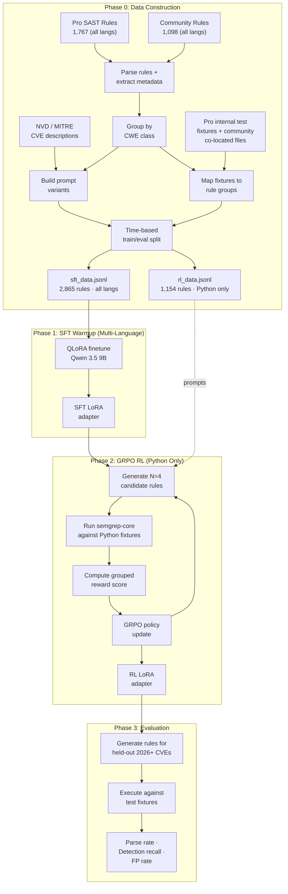
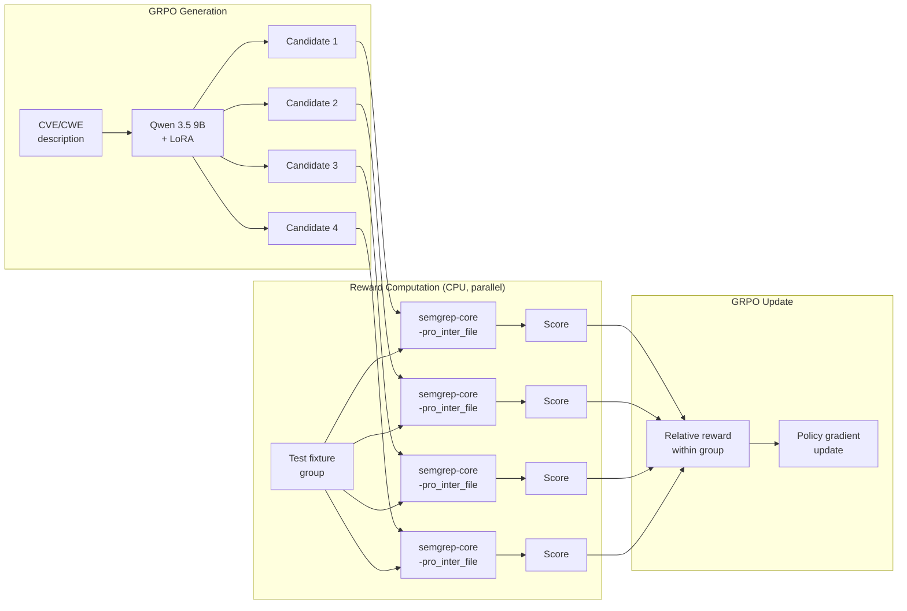

# RL-Finetuned Model for Security-Incident-Driven Semgrep Rule Generation

**Author:** Joe McGinley
**Status:** Draft
**Created:** 2026-03-28
**See also:** [ADR 001: Bazel Semgrep](001-bazel-semgrep.md), [Pipeline Design Doc](../../plans/2026-03-28-semgrep-rl-pipeline-design.md)

---

## Problem

When a security incident occurs — a CVE is published, a vulnerability is
disclosed, or an internal audit surfaces a new attack pattern — the immediate
question is: **"are we affected?"** Answering that requires a Semgrep rule that
detects the specific vulnerability pattern in code. Today, writing that rule is
expensive and slow.

A single taint-mode rule with sources, sinks, propagators, and sanitizers can
take hours to author. The engineer must understand the vulnerability class, the
target framework's API surface, and Semgrep's pattern language. The gap between
disclosure and a working detection rule is a window of exposure — filled today
by human rule authors at Semgrep or by security engineers writing custom rules.

**The goal is a model that takes a security incident description as input and
produces a working Semgrep detection rule as output.** The model is specifically
rewarded for generating rules that catch the vulnerability pattern described in
the incident, not just any syntactically valid rule.

The homelab already has the infrastructure to support this:

- **Semgrep Pro rules** vendored via OCI/Bazel with daily auto-updates
  ([ADR 001](001-bazel-semgrep.md)) — each rule maps to a specific CWE/CVE,
  providing natural (incident description → detection rule) training pairs
- **semgrep-core-proprietary** OCaml binary invoked directly, bypassing the
  Python wrapper (0.12s vs 2s per invocation) — enables programmatic reward
  computation during RL training
- **RTX 4090** on the worker node with 24GB VRAM — sufficient for QLoRA
  training of a 9B parameter model
- **Pro engine test fixtures** available internally (Semgrep employee access)
  — provide ground-truth test cases for each security rule

The missing piece is a training pipeline that turns these assets into a model
that can read a security incident and produce a detection rule.

---

## Proposal

Finetune **Qwen 3.5 9B** to generate Semgrep detection rules from security
incident descriptions (CVE advisories, CWE descriptions, vulnerability
disclosures) using a two-phase approach: supervised finetuning (SFT) for syntax
acquisition, followed by Group Relative Policy Optimization (GRPO) where the
reward signal is **whether the generated rule actually detects the described
vulnerability** — measured by executing the rule against known-vulnerable and
known-safe code via semgrep-core.

Start with **Python-only** (largest corpus, richest taint coverage), designed
for multi-language expansion via LoRA adapter bank.



### What changes

| Aspect                     | Today                                         | Proposed                                                           |
| -------------------------- | --------------------------------------------- | ------------------------------------------------------------------ |
| Security incident response | Manual rule authoring (hours per rule)        | Feed incident description to model, get detection rule in seconds  |
| CVE-to-detection gap       | Hours to days of exposure                     | Seconds (generation) + minutes (human review)                      |
| Taint rule coverage        | Limited to rules authored for known incidents | Model generalizes to detect new incidents within known CWE classes |
| Infrastructure             | Semgrep engine + rules only                   | Add training pipeline on existing GPU node                         |

---

## Architecture

### Training Data Pipeline

#### Sources and Volumes

Data from the authenticated Semgrep scan config API (117,168 total rules), after
excluding 114,303 SCA supply-chain advisory rules (`ssc-*` IDs with `sca_info`
metadata):

**Python corpus (RL target):**

| Source                                    | Python Rules | Test Fixtures                          | Overlap                                   |
| ----------------------------------------- | ------------ | -------------------------------------- | ----------------------------------------- |
| Semgrep Pro rules (authenticated API)     | 881          | Internal test suite (multi-file taint) | —                                         |
| Community rules (`semgrep/semgrep-rules`) | 273          | Co-located `.py` files (344 have them) | Zero with Pro                             |
| OpenGrep (`opengrep/opengrep-rules`)      | 263          | Co-located `.py` files                 | 99% duplicate of community — **excluded** |
| **Total**                                 | **1,154**    | **~1,154 with validated test cases**   |                                           |

**Full SAST corpus (all languages, for multi-language SFT):**

| Language   | Pro       | Community | Total     | Taint     | Taint % |
| ---------- | --------- | --------- | --------- | --------- | ------- |
| Python     | 881       | 273       | 1,154     | 852       | 74%     |
| TypeScript | 170       | 158       | 328       | 219       | 67%     |
| JavaScript | 171       | 156       | 327       | 219       | 67%     |
| Java       | 178       | 118       | 296       | 155       | 52%     |
| C#         | 138       | 33        | 171       | 130       | 76%     |
| Go         | 69        | 85        | 154       | 69        | 45%     |
| Ruby       | 23        | 73        | 96        | 40        | 42%     |
| PHP        | 29        | 39        | 68        | 44        | 65%     |
| Kotlin     | 63        | 18        | 79        | 21        | 27%     |
| Rust       | 49        | 4         | 53        | 39        | 74%     |
| Swift      | 53        | 2         | 55        | 16        | 29%     |
| C/C++      | 51        | 5         | 56        | 27        | 48%     |
| Other      | 11        | 134       | 145       | 1         | 1%      |
| **Total**  | **1,767** | **1,098** | **2,865** | **1,832** | **64%** |

OpenGrep was evaluated and excluded: 263 of 266 rule IDs are identical to the
community repo. It's a fork, not an independent source.

The authenticated API also returned 114,303 "custom" origin rules — these are
**entirely SCA/supply-chain advisory rules** (every one has `sca_info` metadata
and `ssc-` UUID prefixes). They check for vulnerable dependency versions, not
code patterns, and are excluded from training.

#### Pro Rule Characteristics (Python)

The Pro Python corpus is overwhelmingly taint-mode, requiring cross-file
analysis for correct reward computation:

| Property                        | Count | % of Pro Python |
| ------------------------------- | ----- | --------------- |
| Taint mode (`mode: taint`)      | 794   | 90%             |
| Cross-file / interproc analysis | ~730  | ~83%            |
| With propagators                | ~700  | ~80%            |
| With sanitizers                 | ~710  | ~81%            |
| Pattern mode (non-taint)        | 87    | 10%             |

This distribution means the model must learn to produce taint rules with
sources, sinks, propagators, and sanitizers — not just pattern-matching rules.
The reward function must use the Pro engine with `-pro_inter_file` to correctly
evaluate cross-file taint rules.

#### Multi-Language SFT Strategy

Taint rule structure is **language-agnostic YAML**: sources, sinks, propagators,
and sanitizers compose the same way in Python, Java, Go, and JavaScript. The
language-specific parts (pattern syntax within `pattern:` fields) use a common
grammar with language-specific AST node names.

This means training SFT on **all 2,865 SAST rules across all languages** teaches
the model the compositional structure of Semgrep rules — the "grammar" of taint
analysis — without needing language-specific reward computation. Python-only RL
(Phase 2) then teaches detection semantics within that structure.

| Phase | Data scope                  | Rationale                                                                            |
| ----- | --------------------------- | ------------------------------------------------------------------------------------ |
| SFT   | All languages (2,865 rules) | Taint structure is language-agnostic; 2.5× more training signal for rule composition |
| RL    | Python only (1,154 rules)   | Reward requires semgrep-core execution against Python test fixtures                  |

Benefits of multi-language SFT:

- **2.5× more training examples** for learning rule structure (2,865 vs 1,154)
- **Cross-language transfer**: a taint rule pattern learned from a Java SSRF rule
  helps generate a Python SSRF rule — the source/sink/sanitizer composition is
  identical, only the pattern strings differ
- **Reduced overfitting risk**: larger dataset with structural diversity prevents
  the model from memorizing Python-specific patterns during SFT

#### CWE Vulnerability Class Grouping

Rules are grouped by CWE class, not individual rule ID. The model learns to
detect vulnerability _classes_, not to reproduce specific rules.

| CWE     | Description                        | Pro | Community | Total |
| ------- | ---------------------------------- | --- | --------- | ----- |
| CWE-918 | Server-Side Request Forgery        | 278 | 5         | 283   |
| CWE-89  | SQL Injection                      | 169 | 23        | 192   |
| CWE-73  | External Control of File Name/Path | 108 | —         | 108   |
| CWE-502 | Deserialization of Untrusted Data  | 73  | 12        | 85    |
| CWE-78  | OS Command Injection               | 42  | 33        | 75    |
| CWE-327 | Use of Broken Crypto Algorithm     | 34  | 26        | 60    |
| CWE-79  | Cross-Site Scripting               | 11  | 30        | 41    |
| CWE-798 | Hard-coded Credentials             | 38  | —         | 38    |
| CWE-94  | Code Injection                     | 35  | —         | 35    |
| CWE-22  | Path Traversal                     | 34  | 5         | 39    |

Pro and community corpora are complementary: Pro is heavy on SSRF, SQLi, and
path traversal (framework-specific taint rules); community is stronger on XSS,
OS command injection, and weak crypto (pattern-matching rules).

Each CWE group contains:

```
CWE-89: SQL Injection
├── pro_rules/                  # 169 taint rules across Django, Flask, SQLAlchemy, ...
├── community_rules/            # 23 pattern-matching rules
├── test_fixtures/
│   ├── core_positive/          # Canonical vulnerable code (must catch)
│   ├─��� variant_positive/       # Subtle variations (should catch)
│   ├── core_negative/          # Safe parameterized queries (must NOT flag)
│   └── edge_negative/          # Tricky safe patterns (bonus)
└── prompts/
    ├── CWE-89 MITRE description
    ├── CVE-2024-XXXXX advisory text
    └── Rule message field variants
```

#### Train/Eval Split Strategy

Time-based split using **CVE publication date from NVD** to prevent data
contamination from the base model's pretraining data:

| Split             | CVE Window     | Count (est.) | Purpose                              |
| ----------------- | -------------- | ------------ | ------------------------------------ |
| **Train**         | Pre-2025       | ~1,100       | Within Qwen 3.5's pretraining window |
| **Validation**    | Jan – Dec 2025 | ~100         | Grey zone — hyperparameter tuning    |
| **Held-out eval** | 2026+          | ~98          | Guaranteed unseen by base model      |

The eval tests true generalization: given a brand-new CVE in a CWE class the
model trained on, can it produce a working rule for an unseen library/pattern?

The daily Pro rule update pipeline (`.github/workflows/update-semgrep-pro.yaml`)
automatically delivers fresh rules for new CVEs, creating an ever-growing eval
set.

### Reward Architecture

The reward function is the core innovation — it uses **semgrep-core execution**
to measure behavioral correctness, not just syntactic validity.



#### semgrep-core Invocation

The same approach used in the Bazel test pipeline
(`bazel/semgrep/defs/semgrep-test.sh`), calling the OCaml binary directly:

```bash
# Stage Pro + OSS binaries in same directory (Pro requires co-located OSS)
PRO_DIR="/tmp/semgrep-engines"
cp semgrep-core "$PRO_DIR/"
cp semgrep-core-proprietary "$PRO_DIR/"

# Invoke with cross-file taint analysis
SEMGREP_APP_TOKEN=offline \
SEMGREP_URL=http://127.0.0.1:0 \
"$PRO_DIR/semgrep-core-proprietary" \
    -rules /tmp/candidate_rule.yaml \
    -pro_inter_file \
    -lang python \
    /tmp/test_fixtures/ \
    -json -json_nodots
```

Key configuration:

| Setting                   | Value                | Why                                                           |
| ------------------------- | -------------------- | ------------------------------------------------------------- |
| `SEMGREP_APP_TOKEN`       | `offline`            | Pro engine checks for presence, not validity                  |
| `SEMGREP_URL`             | `http://127.0.0.1:0` | Prevents phoning home; engine works fully offline             |
| `-pro_inter_file`         | —                    | Enables cross-file taint analysis (required for 76% of rules) |
| `-json -json_nodots`      | —                    | Machine-readable output, no progress dots                     |
| Co-located `semgrep-core` | Same directory       | Pro binary requires OSS binary as runtime dependency          |

**Performance:** 0.12s per invocation (vs 2.0s through pysemgrep). The 1.88s
difference is entirely Python wrapper startup — the OCaml engine's actual parse

- match time is ~11ms.

| Scenario                     | Time   |
| ---------------------------- | ------ |
| pysemgrep (Python wrapper)   | 2.0s   |
| semgrep-core (OCaml, direct) | 0.12s  |
| Actual parse + match work    | 0.011s |

#### Grouped Reward Scoring

Reward is computed **per CWE group**, not per individual test snippet. This
prevents reward noise from over-indexing on any single test case and explicitly
penalizes over-matching.

| Component                            | Weight                   | Signal                            |
| ------------------------------------ | ------------------------ | --------------------------------- |
| Parses as valid Semgrep YAML         | **Gate** (0 or continue) | Syntactic validity                |
| Catches all `core_positive` fixtures | **0.4**                  | Understands the vulnerability     |
| Catches `variant_positive` fixtures  | **0.2**                  | Generalizes beyond the obvious    |
| Avoids all `core_negative` fixtures  | **0.3**                  | Precision — doesn't over-match    |
| Handles `edge_negative` correctly    | **0.1**                  | Nuanced precision on tricky cases |

The 0.3 weight on `core_negative` avoidance is deliberate: without it, the
model would learn to write maximally broad rules that catch everything —
technically high recall, but useless in practice due to false positive noise.

GRPO computes relative rewards within each group of 4 candidates. No absolute
reward model or value network is needed — this is simpler and more stable than
PPO for programmatically-verifiable tasks.

### Training Configuration

#### Hardware

Single worker node in the homelab cluster:

| Component | Spec                       | Role                                      |
| --------- | -------------------------- | ----------------------------------------- |
| GPU       | NVIDIA RTX 4090, 24GB VRAM | SFT + GRPO training, candidate generation |
| CPU       | AMD Ryzen 5800X3D, 8C/16T  | Parallel semgrep-core reward computation  |
| RAM       | 64GB DDR5                  | Test fixture caching, data loading        |

#### VRAM Budget (GRPO Phase)

| Component                                    | Estimate     |
| -------------------------------------------- | ------------ |
| Qwen 3.5 9B base (4-bit quantized)           | 5–6 GB       |
| LoRA adapters (rank 64–128)                  | 1–2 GB       |
| Optimizer states (AdamW)                     | 2–3 GB       |
| KV cache (batch of 4 candidates)             | 3–4 GB       |
| Activations + gradients (with checkpointing) | 3–4 GB       |
| **Total**                                    | **14–19 GB** |

Fits within 24GB with margin. If tight: reduce GRPO group size from 4 to 3,
reduce LoRA rank, or enable more aggressive gradient checkpointing.

#### Training Phases

| Phase                | Method                      | Data                                     | Duration (est.) |
| -------------------- | --------------------------- | ---------------------------------------- | --------------- |
| 0: Data construction | CPU-only                    | 2,865 rules (all langs) → grouped JSONL  | ~3 hours        |
| 1: SFT warmup        | QLoRA, 3–5 epochs           | ~8–14K prompt/rule pairs (all languages) | ~4–6 hours      |
| 2: GRPO RL           | QLoRA + semgrep-core reward | ~1,000 Python train prompts, 3 epochs    | ~6–10 hours     |
| 3: Evaluation        | Inference + semgrep-core    | ~98 held-out 2026+ CVEs                  | ~30 minutes     |
| **Total**            |                             |                                          | **~1–2 days**   |

#### Semgrep Execution Budget

With direct semgrep-core invocation and 8-way CPU parallelism:

```
Per GRPO step:  4 candidates × 0.12s = 0.48s serial → 0.06s parallel
Full RL run:    1,100 prompts × 3 epochs × 0.06s ≈ 3.3 minutes
```

Semgrep execution is negligible. Training is entirely GPU-bound.

**Future optimization (not needed at this scale):** candidate rules with
structurally identical ASTs could be deduplicated via hashing to skip redundant
semgrep-core invocations. The `-parse_rules` flag exists for syntax-only
validation but takes the same 0.12s (OCaml binary startup dominates), so it's
not a useful fast gate. These optimizations only matter if scaling to continuous
training with millions of invocations.

---

## Key Decisions

| Decision                                | Rationale                                                                                                                                         |
| --------------------------------------- | ------------------------------------------------------------------------------------------------------------------------------------------------- |
| **Qwen 3.5 9B** (not 7B or 14B)         | 9B fits in 4-bit on 24GB VRAM with room for GRPO; strong code generation baseline; larger models OOM during RL                                    |
| **QLoRA** (not full finetune)           | Full finetune of 9B requires ~72GB VRAM (bf16); QLoRA fits in 14–19GB while preserving 90%+ of full finetune quality                              |
| **GRPO** (not PPO)                      | No value network needed — simpler, less VRAM, more stable for tasks with programmatic reward signals. Proven by DeepSeek-R1 for code generation   |
| **SFT → RL** (not RL-only)              | SFT warmup teaches Semgrep YAML syntax; RL on top teaches behavioral correctness. Direct RL from base model is too unstable for structured output |
| **Multi-language SFT, Python-only RL**  | SFT on all 2,865 rules (taint structure is language-agnostic); RL on Python only (requires semgrep-core execution). 2.5× more SFT signal          |
| **Python-first for RL**                 | Largest corpus (881 Pro rules), richest taint coverage (90%), most CWE classes. Designed for LoRA-per-language expansion                          |
| **CWE-grouped reward** (not per-rule)   | Trains the model to reason about vulnerability classes, not memorize specific rule patterns. Produces more generalizable rules                    |
| **CVE date-based eval split**           | Prevents data contamination from base model pretraining. 2026+ CVEs are guaranteed unseen                                                         |
| **semgrep-core direct** (not pysemgrep) | 16× faster (0.12s vs 2.0s). Matches existing Bazel pipeline approach ([ADR 001](001-bazel-semgrep.md)). Makes reward computation negligible       |
| **Pro engine for reward** (not OSS)     | 76% of Pro rules use cross-file taint; OSS engine would give wrong reward signals for the majority of training data                               |
| **Exclude OpenGrep**                    | 99% overlap with community rules (263/266 identical IDs). Adds noise, not signal                                                                  |
| **Frontier benchmark required**         | Finetuned model must justify itself against Claude Opus/Sonnet with good prompting. If frontier wins on all axes, use prompting instead           |

---

## Implementation

### Phase 0: Data Construction

- [ ] Write rule parser: extract id, message, metadata (CWE, OWASP, severity),
      pattern YAML from Pro + community rule files **across all languages**
- [ ] Filter out SCA rules (114,303 `ssc-*` supply-chain advisory rules with
      `sca_info` metadata) — retain only SAST rules (2,865 total)
- [ ] Build CWE grouping: map rules to vulnerability classes using metadata CWE
      fields
- [ ] Obtain Pro internal test fixtures (Semgrep employee access)
- [ ] Map test fixtures to CWE groups: categorize as core_positive,
      variant_positive, core_negative, edge_negative
- [ ] Integrate community test fixtures (co-located files already available)
- [ ] Fetch CVE/CWE descriptions from NVD API for prompt construction
- [ ] Build prompt variants: CWE description, CVE advisory text, rule message
      field, combined variants
- [ ] Apply time-based split using CVE publication dates (train: pre-2025,
      val: 2025, eval: 2026+)
- [ ] Output `sft_data.jsonl` — all 2,865 rules across all languages for
      multi-language SFT
- [ ] Output `rl_data.jsonl` — 1,154 Python-only rules with test fixtures for
      GRPO reward computation

### Phase 1: SFT Warmup (Multi-Language)

- [ ] Download Qwen 3.5 9B base weights
- [ ] Set up training environment (TRL or similar) on worker node
- [ ] Configure QLoRA: 4-bit quantization, LoRA rank 64–128, target modules
      (q_proj, k_proj, v_proj, o_proj, gate_proj, up_proj, down_proj)
- [ ] Train SFT on **all 2,865 rules across all languages** — taint rule
      structure is language-agnostic YAML; multi-language training provides 2.5×
      more signal for learning rule composition
- [ ] Save checkpoints at each epoch
- [ ] Validate: measure parse rate and basic CWE coverage on validation split
      **at each epoch** — track train loss vs validation loss divergence
- [ ] Run eval on validation set per epoch to find the optimal stopping point
      (overfitting risk lower with 2,865 multi-language examples vs 1,154
      Python-only)
- [ ] Track per-CWE-class metrics across epochs — sparse classes (e.g. CWE-79
      with 41 rules) will overfit faster than dense classes (CWE-918 with 283)
- [ ] Save best SFT LoRA adapter checkpoint (by validation detection recall,
      not train loss)

### Phase 2: GRPO RL

- [ ] Build reward function: write candidate rule → call semgrep-core → parse
      JSON results → compute grouped score
- [ ] Stage semgrep-core-proprietary + semgrep-core binaries for reward
      computation
- [ ] Configure GRPO: group size 4, gradient checkpointing, sequence length cap
      1024 tokens
- [ ] Train GRPO on top of SFT checkpoint, save checkpoints at each epoch
- [ ] Monitor reward curves: parse rate should plateau early, detection recall
      should climb steadily — watch for reward plateau or decline (overfitting
      to specific test fixtures)
- [ ] **Reward overfitting check**: hold out a subset of test fixtures from the
      reward function and evaluate the model against them separately. If the
      model scores well on reward fixtures but poorly on held-out fixtures for
      the same CWE, it's gaming the tests rather than learning the vulnerability
      pattern
- [ ] Save best RL LoRA adapter checkpoint (by held-out fixture detection
      recall)

### Phase 3: Evaluation

- [ ] Run inference on held-out 2026+ CVE eval set
- [ ] Execute generated rules against test fixtures via semgrep-core
- [ ] Compute metrics: parse rate, detection recall per CWE class, false
      positive rate, taint correctness
- [ ] Compare against Pro rule oracle on same fixtures
- [ ] **Frontier model benchmark**: run the same eval prompts through Claude
      (Opus/Sonnet via Max subscription) with identical system prompt and
      scoring methodology — this is the bar the finetuned model must beat or
      match at lower cost/latency
- [ ] Compare finetuned 9B vs frontier across all metrics, document where each
      wins
- [ ] Document results and identify weak CWE classes for potential data
      augmentation

### Phase 4: Multi-Language RL Expansion (Future)

SFT already covers all languages. This phase adds **language-specific RL** with
semgrep-core execution against each language's test fixtures:

- [ ] Build Go reward pipeline (69 Pro taint rules + 85 community rules)
- [ ] Build JavaScript/TypeScript reward pipeline (327 rules, 219 taint)
- [ ] Build Java reward pipeline (296 rules, 155 taint)
- [ ] Train per-language LoRA adapters via GRPO on language-specific fixtures
- [ ] Build lightweight language router from CVE description
- [ ] Implement LoRA hot-swap at inference time on single base model

---

## Frontier Model Benchmark

### Why benchmark against frontier

The finetuned 9B model must justify its existence against the alternative:
prompting a frontier model (Claude Opus/Sonnet) with the same CVE description
and asking for a Semgrep rule. Tokens are cheap on a Max subscription — if
frontier+prompting achieves 90%+ quality, the finetuned model needs to
demonstrably win on at least one axis to be worth the training investment.

### Evaluation axes

| Axis                   | Frontier advantage                                                           | Finetuned 9B advantage                                                                    |
| ---------------------- | ---------------------------------------------------------------------------- | ----------------------------------------------------------------------------------------- |
| **Detection quality**  | Broader world knowledge, better reasoning about novel vulnerability patterns | RL reward signal directly optimizes for detection; may outperform on taint rule structure |
| **Parse rate**         | Likely high (frontier models are good at YAML)                               | SFT explicitly trains on Semgrep syntax; should be near 100%                              |
| **Latency**            | 2–10s per rule (API round-trip)                                              | <1s locally on 4090 via llama.cpp                                                         |
| **Cost at scale**      | ~$0.05–0.15 per rule (token costs)                                           | Free after training (~$0 marginal cost)                                                   |
| **Offline capability** | Requires internet                                                            | Fully local, air-gapped capable                                                           |
| **Taint rule quality** | General code understanding                                                   | Specifically trained on 850 taint rules with propagators/sanitizers                       |

### Benchmark methodology

Run the **identical eval pipeline** for both models on the held-out 2026+ CVE
set:

1. Same prompts (CVE/CWE description + "generate a Python Semgrep rule")
2. Same scoring (semgrep-core execution against grouped test fixtures)
3. Same metrics (parse rate, detection recall, false positive rate per CWE)

For frontier, use a system prompt that includes Semgrep pattern syntax
documentation and 2–3 few-shot examples of Pro-quality taint rules. This
represents the best realistic prompting effort — not a strawman.

```
Eval matrix:

                      Parse    Detection   FP      Latency   Cost/rule
                      rate     recall      rate    (p50)     (marginal)
───────────────────────────────────────────────────────────────────────
Claude Opus            ?%       ?%         ?%      ~5s       ~$0.10
Claude Sonnet          ?%       ?%         ?%      ~2s       ~$0.03
Qwen 9B (base)         ?%       ?%         ?%      <1s       $0
Qwen 9B (SFT only)    ?%       ?%         ?%      <1s       $0
Qwen 9B (SFT+RL)      ?%       ?%         ?%      <1s       $0
Pro rule oracle       100%     100%        0%       —         —
```

The **base → SFT → SFT+RL** progression is as important as the absolute
numbers. Each phase should show measurable improvement:

- **Base → SFT delta**: proves the model learned Semgrep syntax and rule
  structure from supervised examples
- **SFT → RL delta**: proves the reward signal teaches behavioral correctness
  beyond imitation
- **Any delta**: even if the final model doesn't match frontier, a clear
  staircase of improvement validates the pipeline and signals that scaling
  up (larger model, more data) would close the gap

### Success criteria

The finetuned model is a success if **any** of these hold:

1. **Quality parity at zero marginal cost** — matches frontier detection recall
   within 5 percentage points, making bulk rule generation free
2. **Outperforms frontier on taint rules** — RL specialization produces better
   source/sink/propagator/sanitizer structure than general-purpose prompting
3. **Latency advantage matters** — sub-second generation enables interactive
   use cases (IDE integration, real-time CVE response) where API round-trips
   are too slow
4. **Offline/private operation** — the model runs entirely locally with no
   external dependencies, important for sensitive security work

### Outcome paths

The benchmark produces one of three outcomes, each with a clear next step:

```
                           Detection recall
                           vs frontier (%)
                                │
                    ┌───────────┼───────────┐
                    │           │           │
                ≥ 95%       70–94%       < 70%
                    │           │           │
                    ▼           ▼           ▼
              ┌─────────┐ ┌─────────┐ ┌─────────┐
              │ SUCCESS │ │ SCALE   │ │ PIVOT   │
              │         │ │ UP      │ │         │
              │ Ship it │ │ Larger  │ │ Use     │
              │ locally │ │ model + │ │frontier │
              │ on 4090 │ │ cloud   │ │+prompts │
              └─────────┘ └─────────┘ └─────────┘
```

1. **Ship it** (≥95% of frontier quality) — the 9B model matches frontier on
   this narrow domain. Deploy locally on the 4090 via llama.cpp. Zero marginal
   cost, sub-second latency, offline capable.

2. **Scale up** (70–94% of frontier quality) — the pipeline works and the task
   is learnable, but the 9B model lacks capacity. This is strong signal to
   invest in a larger training run: same pipeline, bigger model (32B–70B),
   more data (community rules, synthetic augmentation), on cloud GPUs. The
   4090 run was a successful feasibility study that de-risks the investment.

3. **Pivot to prompting** (<70% of frontier quality) — the finetuned model
   doesn't justify itself. Use frontier with good prompting instead. The data
   pipeline and eval infrastructure become a prompt engineering + eval harness.

Outcome (2) is arguably the most valuable result — it proves the approach works
and provides a clear scaling roadmap. The training data, reward function, and
eval framework built in Phases 0–3 transfer directly to a larger run with no
rework.

---

## Security

### Data Sensitivity

- **Pro rules** are licensed under Semgrep Rules License v1.0. Training a model
  on them may have licensing implications — verify internally before any
  external distribution of the model or its outputs.
- **Pro test fixtures** are internal Semgrep assets. The finetuned model should
  be treated as containing proprietary signal.
- **Community rules** are MIT-licensed — no restrictions on training use.

### Model Access

The finetuned model (base weights + LoRA adapter) will run locally on the
worker node. No model weights or outputs are exposed externally.

### Generated Rule Review

Model-generated rules must be **human-reviewed** before deployment to
production scanning. The model is a drafting tool, not an autonomous scanner.

---

## Risks

| Risk                                                                  | Likelihood | Impact   | Mitigation                                                                                                                                                  |
| --------------------------------------------------------------------- | ---------- | -------- | ----------------------------------------------------------------------------------------------------------------------------------------------------------- |
| 1,154 Python rules insufficient for RL                                | Medium     | Medium   | Multi-language SFT (2,865 rules) mitigates; prompt augmentation (3–5 variants per rule)                                                                     |
| GRPO OOM on 4090 with 9B model                                        | Low        | High     | Reduce group size to 2–3, reduce LoRA rank, enable gradient checkpointing. Fallback: use 4B model                                                           |
| Model produces syntactically valid but semantically wrong taint rules | Medium     | High     | Grouped reward with 0.3 weight on false positive penalty; taint-specific eval metrics                                                                       |
| Pro test fixtures lack sufficient negative examples                   | Medium     | Medium   | Generate additional negatives with LLM, validate against Pro rule oracle                                                                                    |
| Semgrep Pro license restricts model training                          | Low        | Critical | Verify internally — employee access may have different terms. Worst case: train on community-only (266 rules)                                               |
| Model memorizes specific Pro rules instead of generalizing            | Medium     | Medium   | CWE-grouped training encourages class-level reasoning; eval on unseen CVEs catches memorization                                                             |
| Base model's pretraining data contaminates eval                       | Low        | High     | Time-based split on CVE publication date; 2026+ eval set is guaranteed unseen                                                                               |
| Reward signal too sparse for taint rules                              | Medium     | Medium   | Start with 10–15 fixtures per rule group; expand for CWE classes where reward is noisy                                                                      |
| Frontier model already solves the task well enough                    | Medium     | High     | Benchmark early (Phase 3); if frontier dominates, pivot to prompt engineering + eval harness                                                                |
| Overfitting to small dataset or specific test fixtures                | Medium     | High     | Multi-language SFT (2,865 rules) reduces SFT risk; per-epoch validation eval; per-CWE tracking; held-out fixture subset for RL reward overfitting detection |

---

## Open Questions

1. **Semgrep Pro licensing for model training** — Does internal/employee access
   permit using Pro rules as training data? This is a prerequisite blocker.

2. **Test fixture generation for Pro rules without tests** — If some Pro rules
   lack internal test fixtures, should we LLM-generate them? The community
   rules' existing fixtures can validate the approach.

3. **GRPO framework choice** — TRL, OpenRLHF, and verl all support GRPO. TRL
   is simplest but may lack advanced features. OpenRLHF has better multi-GPU
   support but is heavier. verl is purpose-built for RL on code tasks. Need to
   evaluate which fits best on single-GPU QLoRA.

4. **Serving infrastructure** — Once trained, how is the model served? Options:
   llama.cpp on the 4090 (already planned for other workloads), vLLM, or
   direct HuggingFace inference. Depends on latency requirements and whether
   it integrates with the existing agent platform.

5. **Multi-rule output** — Should the model generate a single rule or multiple
   rules per CVE? A CVE affecting Django and Flask might warrant two separate
   rules. Training on single-rule output is simpler; multi-rule output is
   more useful but harder to evaluate.

6. **Continuous training** — As new Pro rules arrive via the daily update
   pipeline, should the model be periodically re-finetuned? If so, what
   cadence (weekly? monthly?) and how do we prevent catastrophic forgetting?

---

## References

| Resource                                                                                  | Relevance                                                                   |
| ----------------------------------------------------------------------------------------- | --------------------------------------------------------------------------- |
| [ADR 001: Bazel Semgrep](001-bazel-semgrep.md)                                            | semgrep-core direct invocation, OCI vendoring, Bazel caching                |
| [DeepSeek-R1 (2025)](https://arxiv.org/abs/2501.12948)                                    | GRPO methodology for code generation with programmatic rewards              |
| [Qwen 3.5 Technical Report](https://qwenlm.github.io/)                                    | Base model architecture and capabilities                                    |
| [Semgrep pattern syntax](https://semgrep.dev/docs/writing-rules/pattern-syntax/)          | Target output format for generated rules                                    |
| [Semgrep taint analysis](https://semgrep.dev/docs/writing-rules/data-flow/taint-mode/)    | Sources, sinks, propagators, sanitizers — the core of Pro rules             |
| [TRL GRPO Trainer](https://huggingface.co/docs/trl/main/en/grpo_trainer)                  | Training framework for GRPO with programmatic rewards                       |
| [NVD API](https://nvd.nist.gov/developers/vulnerabilities)                                | CVE descriptions and publication dates for prompt construction + eval split |
| [semgrep/semgrep-rules](https://github.com/semgrep/semgrep-rules)                         | Community rule corpus (266 Python rules with test fixtures)                 |
| [semgrep-core CLI overview](https://semgrep.dev/docs/contributing/semgrep-core-overview/) | OCaml engine invoked directly for reward computation                        |
| [QLoRA (Dettmers et al., 2023)](https://arxiv.org/abs/2305.14314)                         | 4-bit quantization + LoRA for efficient finetuning on consumer GPUs         |
