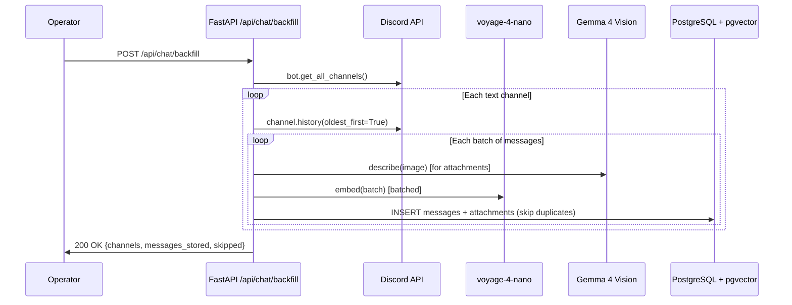

# ADR 001: Discord History Backfill

**Author:** jomcgi
**Status:** Draft
**Created:** 2026-04-04

---

## Problem

The Discord chatbot (`projects/monolith/chat/`) only stores messages that arrive after deployment via the gateway. All historical conversation context — text, images, and attachments — is lost. The bot's semantic search and context window are therefore limited to post-deployment messages.

A one-time historical backfill would populate the `chat.messages` and `chat.attachments` tables with the full channel history, giving the bot richer recall from day one.

---

## Proposal

Add a **FastAPI endpoint** (`POST /api/chat/backfill`) to the monolith that iterates all channels the bot can see and backfills their message history into PostgreSQL with embeddings and attachments.

| Aspect              | Today                                  | Proposed                            |
| ------------------- | -------------------------------------- | ----------------------------------- |
| Historical messages | Not stored                             | Backfilled via Discord API          |
| Trigger mechanism   | N/A                                    | HTTP endpoint (ad-hoc)              |
| Image handling      | Real-time only                         | Backfilled with vision descriptions |
| Duplicate handling  | `discord_message_id` unique constraint | Same — re-run safely skips existing |

**Why an endpoint (not a Kubernetes Job):**

- The monolith already has the Discord client, DB session, embedding client, and vision client in-process — no duplication of config or secrets.
- Logs flow to SigNoz automatically via existing OTEL instrumentation.
- Easy to trigger ad-hoc (`curl -X POST`) without creating Kubernetes resources.
- Resumable by design: the unique constraint on `discord_message_id` means re-running skips already-stored messages.

---

## Architecture

### Key Design Decisions

**Batched embeddings:** The embedding client currently handles single texts. The backfill should batch messages (e.g. 50 at a time) into a single `/v1/embeddings` request with array input, since voyage-4-nano via llama.cpp supports this. This is the primary throughput bottleneck.

**Rate limiting:** discord.py's built-in rate limiter automatically respects Discord's `X-RateLimit-*` headers — no custom throttling needed. `channel.history()` fetches 100 messages per API call.

**Image backfill:** Each image attachment is downloaded, described via Gemma 4 vision (`VisionClient.describe()`), and stored as a `chat.attachments` row — identical to the real-time path in `bot.py`.

**Idempotency:** The `discord_message_id` unique constraint ensures re-runs are safe. Failed mid-backfill? Just hit the endpoint again.

**Background execution:** The endpoint should kick off the backfill as a background task (`asyncio.create_task`) and return immediately with a task ID, since a full backfill could take minutes. Progress can be logged to SigNoz.

---

## Implementation

### Phase 1: Backfill Endpoint

- [ ] Add `embed_batch(texts: list[str]) -> list[list[float]]` to `EmbeddingClient` — sends array input to `/v1/embeddings`
- [ ] Create `chat/backfill.py` with `async def run_backfill(bot: ChatBot)` that:
  - Iterates `bot.get_all_channels()`, filtering to text channels
  - Pages through `channel.history(limit=None, oldest_first=True)`
  - Batches messages (50-100) for embedding
  - Downloads and describes image attachments via `VisionClient`
  - Inserts via `MessageStore.save_message()` (skips duplicates via `IntegrityError`)
  - Logs progress per channel (messages stored, skipped, errors)
- [ ] Add `POST /api/chat/backfill` route in `chat/router.py` that:
  - Accepts optional `channel_ids` filter (default: all channels)
  - Launches backfill as background task
  - Returns task status / channel count
- [ ] Wire `chat/router.py` into `app/main.py` and pass bot reference
- [ ] Add structured logging for SigNoz observability (channel progress, batch timing, error counts)

### Phase 2: Monitoring & Polish

- [ ] Add `GET /api/chat/backfill/status` to check progress of running backfill
- [ ] Add SigNoz dashboard panel for backfill metrics (messages/sec, errors, duration)

---

## Security

- The endpoint should be **internal-only** — not exposed via Cloudflare tunnel. Since the monolith's Envoy Gateway routes are explicit, this is the default.
- No new secrets required — reuses existing `DISCORD_BOT_TOKEN` from 1Password.
- Image data stored in PostgreSQL is limited to what's already accessible via the bot's Discord permissions.

---

## Risks

| Risk                                                        | Likelihood | Impact                         | Mitigation                                               |
| ----------------------------------------------------------- | ---------- | ------------------------------ | -------------------------------------------------------- |
| Backfill overwhelms GPU with embedding requests             | Medium     | Bot response latency increases | Configurable batch size + optional delay between batches |
| Large channels with many images slow down vision processing | Low        | Backfill takes a long time     | Progress logging; can filter by channel_id               |
| Pod restart mid-backfill                                    | Low        | Partial data                   | Idempotent by design — re-run skips existing             |
| Discord rate limiting on image downloads                    | Low        | Backfill stalls temporarily    | discord.py handles automatically                         |

---

## Open Questions

1. Should the backfill endpoint require an API key or other auth, even if internal-only?
2. Maximum image size cutoff — should we skip very large attachments (e.g. >10MB)?

---

## References

| Resource                                                                                                            | Relevance                                                  |
| ------------------------------------------------------------------------------------------------------------------- | ---------------------------------------------------------- |
| [discord.py TextChannel.history()](https://discordpy.readthedocs.io/en/stable/api.html#discord.TextChannel.history) | Core pagination API                                        |
| `projects/monolith/chat/bot.py`                                                                                     | Existing real-time message handling and image download     |
| `projects/monolith/chat/store.py`                                                                                   | `MessageStore.save_message()` with duplicate handling      |
| `projects/monolith/chat/embedding.py`                                                                               | Current single-text embedding client (needs batch support) |
| `projects/monolith/chat/vision.py`                                                                                  | Image description via Gemma 4                              |
