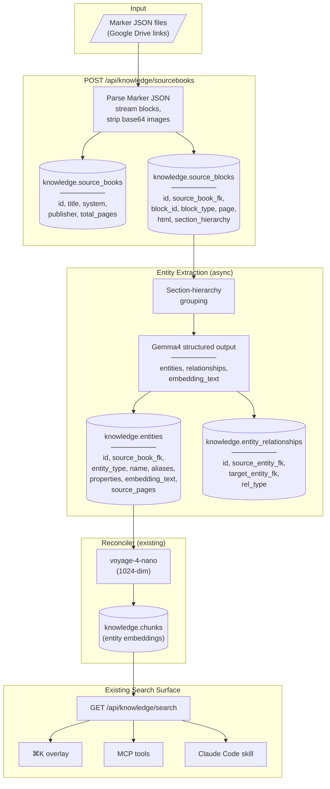

# ADR 004: D&D Sourcebook Knowledge Graph Integration

**Author:** jomcgi
**Status:** Draft
**Created:** 2026-04-10

---

## Problem

We have a growing collection of D&D sourcebooks parsed via [Marker](https://github.com/VikParuchuri/marker) into structured JSON (page trees with typed blocks, section hierarchies, spatial coordinates, and embedded base64 images). Xanathar's Guide to Everything (196 pages, 147 images, ~24 MB) is representative — and there are many more.

The monolith knowledge service (`projects/monolith/knowledge/`) currently handles personal Obsidian notes — Markdown files with frontmatter, processed by the gardener into typed atoms/facts. It has no concept of structured document ingestion at the scale of a 196-page sourcebook with 2,600+ text blocks, 1,100+ section headers, and 350+ tables.

Grimoire (`projects/grimoire/`) has a [detailed data architecture](../../../projects/grimoire/data-architecture.md) for this exact problem, but it runs on GCP (Firestore, Gemini API, Cloud Storage) — a separate stack from the homelab knowledge graph. Maintaining two knowledge stores, two embedding pipelines, and a bridge between them adds complexity without clear benefit.

The question: how do we ingest D&D sourcebook content into the knowledge graph without duplicating infrastructure or over-engineering the initial pass?

---

## Proposal

Add a **sourcebook ingestion pipeline** within the existing monolith knowledge service. New tables in the `knowledge` schema store raw blocks and extracted entities alongside the existing notes/chunks tables. Gemma4 handles entity extraction (free, local, consistent with [ADR 013](../../decisions/agents/013-knowledge-gardener-gemma4-only.md)). Voyage-4-nano embeds everything into the same pgvector store.

The key constraint: **build the raw entity graph first, defer atom/fact decomposition.** The gardener can learn to process sourcebook entities into the same typed notes it produces from personal content — but that's a later concern. The initial pipeline just needs to get structured, searchable D&D content into the knowledge graph.

| Aspect           | Today (personal notes)                                       | Proposed (sourcebooks)                                                                                           |
| ---------------- | ------------------------------------------------------------ | ---------------------------------------------------------------------------------------------------------------- |
| Input format     | Markdown + YAML frontmatter                                  | Marker JSON (page trees, typed blocks)                                                                           |
| Storage          | `knowledge.notes`, `knowledge.chunks`                        | New: `knowledge.source_books`, `knowledge.source_blocks`, `knowledge.entities`, `knowledge.entity_relationships` |
| Extraction model | Gemma4 gardener (atom/fact decomposition)                    | Gemma4 (entity/relationship extraction)                                                                          |
| Embeddings       | voyage-4-nano (1024-dim)                                     | Same                                                                                                             |
| Search surface   | `⌘K` overlay, MCP tools, Claude Code skill                   | Same — unified search across personal notes and sourcebook entities                                              |
| API              | `GET /api/knowledge/search`, `GET /api/knowledge/notes/{id}` | New: `POST /api/knowledge/sourcebooks`, `GET /api/knowledge/entities`                                            |

### Why unified in monolith?

- **One embedding space**: personal notes and D&D entities live in the same pgvector index. A search for "magic resistance" returns both your session prep notes and the Aeorian Absorber stat block.
- **One model pipeline**: Gemma4 for extraction, voyage-4-nano for embeddings. No Gemini Flash, no GCP costs, no cross-cloud bridge.
- **One search surface**: `⌘K`, MCP tools, and the Claude Code skill work without changes — they already query the knowledge schema.
- **Fewer components**: no bridge sync, no GCP dependency for knowledge data, no second Postgres instance.

### What Grimoire's role becomes

Grimoire remains the **campaign manager** — sessions, KnowledgeGrants, player-facing query filtering, voice transcription. It _reads_ from the knowledge graph (via the monolith API) rather than owning its own extraction pipeline. The Grimoire data architecture doc's Pipeline 1-3 designs inform this ADR but are implemented in monolith, not in Grimoire's Go backend.

### Deferred: atom/fact decomposition

Sourcebook entities initially live as `type: "entity"` in the knowledge graph — richer than raw text but not yet decomposed into the gardener's atom/fact/active taxonomy. This is intentional:

- The raw entity graph is immediately useful for search and campaign prep
- The gardener's structured output schema ([`frontmatter.py`](../../../projects/monolith/knowledge/frontmatter.py)) would need D&D-specific type extensions before it can meaningfully process sourcebook content
- Decomposition can happen incrementally — the gardener's rolling reprocess window (ADR 013) can learn to refine entities into atoms over time

---

## Architecture

### Marker JSON schema

Analysis of Xanathar's Guide (representative file):

| Marker field           | Storage                    | Notes                                                                            |
| ---------------------- | -------------------------- | -------------------------------------------------------------------------------- |
| Top-level `children[]` | One `source_books` row     | `total_pages` = 196                                                              |
| Nested blocks          | `source_blocks` rows       | `block_id`, `block_type`, `page`, `html`, `bbox`, `section_hierarchy`            |
| `images` dict          | Stripped at parse time     | Alt-text preserved in `html`; base64 payloads discarded (16.8 MB of 24 MB total) |
| `metadata.page_stats`  | `source_books.extra` jsonb | Page-level block counts                                                          |

### Block types and extraction roles

| Block type                  | Count (Xanathar's) | Role                                             |
| --------------------------- | ------------------ | ------------------------------------------------ |
| `Text`                      | 2,627              | Primary extraction target                        |
| `SectionHeader`             | 1,128              | Chunking boundaries                              |
| `Table`                     | 359                | Stat blocks, spell lists → structured properties |
| `PageFooter` / `PageHeader` | 357                | Ignored                                          |
| `Page`                      | 196                | Container only                                   |
| `Picture`                   | 137                | Alt-text as supplementary context                |
| `ListGroup`                 | 81                 | Feature/equipment lists → entity properties      |
| `Caption`                   | 29                 | Associated with adjacent Pictures                |
| `TableOfContents`           | 1                  | Section structure validation                     |

### Entity extraction with Gemma4

Blocks are grouped by section hierarchy (consecutive blocks under the same section → one extraction chunk). Each chunk is sent to Gemma4 with structured output enforcing the entity/relationship schema. This follows the same PydanticAI + `OpenAIChatModel` pattern used by the gardener ([ADR 013](../../decisions/agents/013-knowledge-gardener-gemma4-only.md)) and the chat agent ([`projects/monolith/chat/agent.py`](../../../projects/monolith/chat/agent.py)).

The extraction prompt produces:

- **Entities**: name, type, aliases, properties (jsonb), embedding_text (natural language description for search)
- **Relationships**: source entity → target entity, typed (LOCATED_IN, MEMBER_OF, etc.)
- **Embedding text**: LLM-generated natural language description per Grimoire's [data architecture guidelines](../../../projects/grimoire/data-architecture.md#embedding-text-generation-pipeline-2-prompt-instructions)

Entity types follow the Grimoire data architecture: `creature`, `spell`, `location`, `npc`, `faction`, `deity`, `item`, `class_feature`, `subclass`, `race`, `background`, `feat`.

### Search integration

Extracted entities are embedded by the existing reconciler into `knowledge.chunks` with a reference back to the entity. This means:

- `GET /api/knowledge/search?q=magic+resistance` returns both personal notes about magic resistance AND the Aeorian Absorber entity
- Results include a `source` field (`"obsidian"` vs `"sourcebook"`) so the UI can distinguish them
- No changes needed to the `⌘K` overlay, MCP tools, or Claude Code skill — they already query the search endpoint

---

## Implementation

### Phase 1: Schema + ingestion endpoint

- [ ] Migration: `knowledge.source_books` table (id, title, system, publisher, total_pages, extra jsonb)
- [ ] Migration: `knowledge.source_blocks` table (id, source_book_fk, block_id, block_type, page, html, bbox, section_hierarchy jsonb, images_meta jsonb)
- [ ] Marker JSON parser in `knowledge/sourcebook_ingest.py` — stream blocks, strip base64 images, preserve alt-text in html
- [ ] `POST /api/knowledge/sourcebooks` endpoint accepting Marker JSON upload
- [ ] Ingest Xanathar's Guide as validation

### Phase 2: Entity extraction

- [ ] Migration: `knowledge.entities` table (id, source_book_fk, entity_type, name, aliases text[], properties jsonb, embedding_text, source_pages int[])
- [ ] Migration: `knowledge.entity_relationships` table (id, source_entity_fk, target_entity_fk, rel_type, source_book_fk)
- [ ] Section-hierarchy grouping logic (consecutive blocks under same section → chunks)
- [ ] Gemma4 extraction via PydanticAI structured output (entity/relationship/embedding_text schema)
- [ ] Pydantic models for extraction output, matching entity types from Grimoire data architecture
- [ ] Adjacent image alt-text injection as supplementary context
- [ ] Async extraction triggered after ingestion completes

### Phase 3: Embedding + search

- [ ] Extend reconciler to embed `knowledge.entities` → `knowledge.chunks` (voyage-4-nano, 1024-dim)
- [ ] Add `source` field to search results to distinguish personal notes from sourcebook entities
- [ ] `GET /api/knowledge/entities/{id}` endpoint for full entity detail (properties, relationships, source pages)
- [ ] Verify entities appear in `⌘K` vault search

### Phase 4: Cross-book entity resolution

- [ ] Trigram-based candidate blocking within entity types
- [ ] Pairwise similarity scoring (name fuzzy match + shared relationships)
- [ ] Gemma4 tiebreaker for ambiguous matches
- [ ] Merge strategy: canonical name, alias union, property union, relationship union
- [ ] Run after each new book ingestion against all existing entities

### Future: Gardener integration

- [ ] Extend gardener to process `type: "entity"` records into atoms/facts
- [ ] D&D-specific type extensions in frontmatter schema
- [ ] Cross-link personal session notes with sourcebook entities via edges

---

## Security

- Marker JSON files are sourced from personal Google Drive links — no untrusted input
- Base64 image payloads are discarded at parse time — never stored or rendered
- Gemma4 extraction is internal cluster traffic (monolith → llama.cpp endpoint)
- No new secrets required — uses existing monolith Postgres credentials and Gemma4 endpoint
- New API endpoints are behind existing Cloudflare Access authentication

See [`docs/security.md`](../../../docs/security.md) for baseline. No deviations.

---

## Risks

| Risk                                                              | Likelihood | Impact                            | Mitigation                                                                                               |
| ----------------------------------------------------------------- | ---------- | --------------------------------- | -------------------------------------------------------------------------------------------------------- |
| Gemma4 extraction quality lower than Gemini Flash for D&D content | Medium     | Missed entities, wrong properties | Structured output mode constrains output; self-critique pass (ADR 013 pattern); manual sampling per book |
| Sourcebook entities dilute personal note search results           | Medium     | Personal notes harder to find     | `source` field in search results; UI type filter; consider score boosting for personal notes             |
| Single Marker JSON upload blocks the API (24 MB, 196 pages)       | Low        | Request timeout                   | Async processing: endpoint accepts upload, returns job ID, extraction runs in background                 |
| Entity extraction prompt too large for Gemma4 context window      | Medium     | Truncated/failed extraction       | Section-level chunking keeps prompts manageable; split oversized sections                                |
| Cross-book entity resolution false positives                      | Low        | Corrupted entity data             | Conservative thresholds; Gemma4 tiebreaker; defer to Phase 4 after initial ingestion proves value        |

---

## Open Questions

1. **Image storage**: discard base64 entirely (as proposed), or store in a volume for future multimodal use (maps, diagrams)?
2. **Entity granularity**: extract every creature stat block, or focus on named/notable entities first?
3. **Grimoire consumption**: how does Grimoire (campaign manager, KnowledgeGrants) query the monolith knowledge API? Direct HTTP, or shared Postgres read replica?

---

## References

| Resource                                                                                      | Relevance                                                                                          |
| --------------------------------------------------------------------------------------------- | -------------------------------------------------------------------------------------------------- |
| [Grimoire data architecture](../../../projects/grimoire/data-architecture.md)                 | Entity types, extraction prompts, embedding text guidelines — informs the Gemma4 extraction schema |
| [ADR 013: Gemma4-only gardener](../../decisions/agents/013-knowledge-gardener-gemma4-only.md) | Same model pipeline pattern (PydanticAI + structured output + self-critique)                       |
| [Monolith knowledge models](../../../projects/monolith/knowledge/models.py)                   | Existing schema this extends (Note, Chunk, NoteLink)                                               |
| [Monolith frontmatter schema](../../../projects/monolith/knowledge/frontmatter.py)            | Future gardener integration target for entity → atom decomposition                                 |
| [Marker](https://github.com/VikParuchuri/marker)                                              | PDF-to-structured-JSON tool producing the input files                                              |
| [ADR 003: Knowledge search overlay](003-knowledge-search-overlay.md)                          | `⌘K` search UI — sourcebook entities must be discoverable here                                     |
