# ADR 004: D&D Sourcebook Knowledge Graph Integration

**Author:** jomcgi
**Status:** Draft
**Created:** 2026-04-10

---

## Problem

We have a growing collection of D&D sourcebooks parsed via [Marker](https://github.com/VikParuchuri/marker) into structured JSON (page trees with typed blocks, section hierarchies, spatial coordinates, and embedded base64 images). Xanathar's Guide to Everything (196 pages, 147 images, ~24 MB) is representative — and there are many more links like it.

Two knowledge systems exist today, each with different purposes:

1. **Grimoire** (`projects/grimoire/`) — a D&D campaign manager with a [fully designed data architecture](../../../projects/grimoire/data-architecture.md) for Marker JSON ingestion, Gemini Flash entity extraction, entity resolution, and campaign-scoped knowledge grants. Runs on GCP (Firestore, Cloud Storage, Gemini API).

2. **Obsidian knowledge graph** (`projects/monolith/knowledge/` + `projects/obsidian_vault/`) — a personal knowledge base with typed notes, semantic edges, pgvector embeddings (voyage-4-nano, 1024-dim), and a Gemma4 gardening pipeline ([ADR 013](../../decisions/agents/013-knowledge-gardener-gemma4-only.md)). Runs on the homelab cluster.

Neither system currently ingests Marker JSON. Grimoire's Pipeline 1 (PDF → SourceBook + RawBlock) is designed but not implemented. The Obsidian knowledge graph has no concept of sourcebook-scale structured documents — it processes individual Markdown notes.

The question: where does D&D sourcebook content land, and how does it flow between systems?

---

## Proposal

Build the ingestion pipeline in Grimoire (where the data architecture already describes it in detail), and expose a read-only bridge so the Obsidian knowledge graph can reference Grimoire entities as first-class knowledge nodes without duplicating the extraction pipeline.

| Aspect            | Grimoire (primary)                                  | Obsidian KG (bridge)                                        |
| ----------------- | --------------------------------------------------- | ----------------------------------------------------------- |
| Raw storage       | SourceBook + RawBlock tables (Marker JSON verbatim) | Not stored                                                  |
| Entity extraction | Gemini Flash structured output (Pipeline 2)         | Not duplicated                                              |
| Entity resolution | Trigram blocking + Flash tiebreaker (Pipeline 2.5)  | Not duplicated                                              |
| Embeddings        | gemini-embedding-001 (3072-dim) for campaign RAG    | voyage-4-nano (1024-dim) for personal KG search             |
| Query path        | Campaign-scoped with KnowledgeGrants                | Vault-wide semantic search                                  |
| Bridge            | —                                                   | Grimoire entities synced as `type: "grimoire-entity"` notes |

### Why not build ingestion in the Obsidian KG directly?

The Obsidian knowledge graph is designed for **personal notes** — Markdown files with frontmatter, processed one at a time by the gardener. D&D sourcebooks are a fundamentally different shape:

- **Scale**: a single book produces 1,000+ entities and 2,500+ text blocks. The gardener processes ~10% of the vault per cycle.
- **Structure**: Marker JSON has spatial coordinates, section hierarchies, and typed blocks. The gardener expects flat Markdown with YAML frontmatter.
- **Entity resolution**: D&D content requires cross-book deduplication ("King Dwendal" in Wildemount ≠ "King Dwendal" homebrew NPC). The gardener has no entity resolution concept.
- **Campaign scoping**: KnowledgeGrants control what players can see. The Obsidian KG has no access control.

Grimoire's data architecture was designed specifically for this problem. Rebuilding it in the monolith would be duplication.

### Why bridge at all?

The Obsidian vault is the **single search surface** for personal knowledge queries (via `⌘K` overlay, Claude Code skill, MCP tools). If D&D content lives only in Grimoire, it's invisible to vault search. The bridge makes Grimoire entities discoverable alongside personal notes without duplicating the extraction pipeline.

### What the bridge looks like

A lightweight sync job creates Obsidian-compatible notes for high-value Grimoire entities:

```yaml
---
id: grimoire-entity-aeorian-absorber
title: "Aeorian Absorber"
type: grimoire-entity
source: grimoire
tags: [dnd, creature, wildemount]
edges:
  derives_from: [grimoire-entity-aeor]
  related: [grimoire-entity-eiselcross]
---

Aeorian Absorber. Large monstrosity from the ancient ruins of Aeor beneath
Eiselcross. Challenge rating 10. A predatory creature with innate magic
resistance that pounces on prey and absorbs magical energy.

> Source: Explorer's Guide to Wildemount, p.284
```

These notes are thin wrappers around `embedding_text` from Grimoire — enough for vault semantic search to find them, with edges that connect to other Grimoire entities. The full entity (properties, stat blocks, relationships) lives in Grimoire's Postgres and is accessed via the Grimoire API when needed.

---

## Architecture

```mermaid
graph LR
    subgraph Input
        PDF[/"Marker JSON<br>(from Google Drive links)"/]
    end

    subgraph Grimoire["Grimoire (GCP)"]
        PDF --> P1["Pipeline 1<br>SourceBook + RawBlock"]
        P1 --> P2["Pipeline 2<br>Gemini Flash extraction"]
        P2 --> P25["Pipeline 2.5<br>Entity resolution"]
        P25 --> P275["Pipeline 2.75<br>Chunking + mentions"]
        P275 --> P3["Pipeline 3<br>Embedding (3072-dim)"]
        P3 --> GDB[("Postgres + pgvector<br>Entities, Chunks,<br>Relationships")]
    end

    subgraph Bridge["Bridge Sync"]
        GDB --> Sync["Entity sync job<br>(scheduled)"]
        Sync --> Notes[/"Obsidian notes<br>type: grimoire-entity"/]
    end

    subgraph Homelab["Obsidian KG (homelab)"]
        Notes --> Vault[("Obsidian vault<br>_processed/grimoire/")]
        Vault --> Reconciler["Reconciler<br>embed (1024-dim)<br>+ upsert"]
        Reconciler --> PGV[("pgvector<br>knowledge.chunks")]
    end
```



### Marker JSON ingestion (Pipeline 1)

The Marker output schema (as extracted from the Xanathar's file) maps directly to the `SourceBook` + `RawBlock` tables defined in Grimoire's data architecture:

| Marker JSON field       | → Grimoire table       | Notes                                                                              |
| ----------------------- | ---------------------- | ---------------------------------------------------------------------------------- |
| Top-level `children[]`  | `SourceBook` (one row) | `total_pages` = len(children)                                                      |
| Each child block        | `RawBlock`             | `block_id` = block `id`, `block_type`, `page`, `html`, `bbox`, `section_hierarchy` |
| `images` dict on blocks | Stripped at ingestion  | Base64 payloads stored in Cloud Storage, referenced by `block_id`                  |
| `metadata.page_stats`   | `SourceBook.metadata`  | Page-level block counts                                                            |

**Image handling**: the base64 payloads in the `images` dict are extracted and stored separately in Cloud Storage (keyed by `{source_book_id}/{image_filename}`). The `RawBlock` row stores only the image filename reference. This keeps the database lean — the Xanathar's file is 24 MB, of which 16.8 MB is base64 image data.

### Block type mapping

Marker produces 10 block types. Their role in entity extraction:

| Block type        | Count (Xanathar's) | Extraction role                                                |
| ----------------- | ------------------ | -------------------------------------------------------------- |
| `Text`            | 2,627              | Primary extraction target — rules, descriptions, lore          |
| `SectionHeader`   | 1,128              | Section hierarchy for chunking boundaries                      |
| `Table`           | 359                | Stat blocks, spell lists, class tables → structured properties |
| `PageFooter`      | 355                | Ignored (page numbers)                                         |
| `Page`            | 196                | Container only, not extracted                                  |
| `Picture`         | 137                | Alt-text used as supplementary context per data architecture   |
| `ListGroup`       | 81                 | Feature lists, equipment lists → entity properties             |
| `Caption`         | 29                 | Associated with adjacent Picture blocks                        |
| `PageHeader`      | 2                  | Ignored (running headers)                                      |
| `TableOfContents` | 1                  | Used for section structure validation, not extracted           |

### Bridge sync design

The sync job runs on a schedule (e.g., after each Grimoire ingestion run) and:

1. Queries Grimoire for all resolved entities with `source_type: "extracted"`
2. For each entity, generates a Markdown note with frontmatter matching the Obsidian schema
3. Maps Grimoire `Relationship` rows to Obsidian `edges` (e.g., `LOCATED_IN` → `related`, `MEMBER_OF` → `related`)
4. Writes to `_processed/grimoire/{entity_type}/{slug}.md` in the vault
5. The existing reconciler embeds and upserts them like any other processed note

**Edge type mapping** (Grimoire → Obsidian):

| Grimoire `rel_type`                    | Obsidian edge  | Rationale                                                       |
| -------------------------------------- | -------------- | --------------------------------------------------------------- |
| `CONTAINS`, `LOCATED_IN`, `FOUND_IN`   | `related`      | Spatial relationships are loose associations in the personal KG |
| `MEMBER_OF`, `WORSHIPS`, `ALLIED_WITH` | `related`      | Organizational relationships                                    |
| `CREATED_BY`, `RULES`                  | `derives_from` | Causal/authority relationships map to logical dependency        |
| `HOSTILE_TO`, `CONTRADICTS`            | `contradicts`  | Conflict relationships                                          |
| `APPEARS_IN`                           | Not synced     | Cross-book references are Grimoire-internal                     |

---

## Implementation

### Phase 1: Marker JSON ingestion (Pipeline 1)

- [ ] Create `projects/grimoire/api/ingest/` package with `source_book.go` and `raw_block.go`
- [ ] Implement Marker JSON parser that streams blocks without loading full `images` dict into memory
- [ ] Store base64 images in Cloud Storage, store filename references in RawBlock
- [ ] Add `POST /api/ingest/sourcebook` endpoint accepting Marker JSON (or a GCS URL to one)
- [ ] Schema migration for `source_books` and `raw_blocks` tables (Postgres, matching data architecture)
- [ ] Ingest Xanathar's Guide as the first test book

### Phase 2: Entity extraction (Pipeline 2)

- [ ] Implement section-hierarchy grouping (consecutive blocks under same section → chunks)
- [ ] Adjacent image alt-text injection per data architecture's image handling rules
- [ ] Gemini Flash structured output with entity/relationship/chunk schema
- [ ] Embedding text generation and validation (named entity check, 2 retries, template fallback)
- [ ] Post-book coverage check (capitalized phrase scan for missed entities)

### Phase 3: Entity resolution (Pipeline 2.5)

- [ ] Trigram blocking by entity type
- [ ] Pairwise similarity scoring (name fuzzy match + shared relationships + source proximity)
- [ ] Flash tiebreaker for ambiguous matches
- [ ] Merge strategy (canonical name, alias union, property union, relationship union)
- [ ] Cross-book resolution for subsequent book ingestions

### Phase 4: Bridge sync

- [ ] Grimoire API endpoint: `GET /api/entities?source_type=extracted&updated_since=...`
- [ ] Bridge sync job in monolith knowledge service (scheduled, idempotent)
- [ ] Frontmatter generation with edge type mapping
- [ ] Write to `_processed/grimoire/` in vault, reconciler picks up automatically
- [ ] Verify entities appear in `⌘K` vault search

### Phase 5: Remaining Grimoire pipelines

- [ ] Pipeline 2.75: Chunking + ChunkEntityMention linking
- [ ] Pipeline 3: gemini-embedding-001 (3072-dim) embedding generation
- [ ] Pipeline 5: Query & context assembly with KnowledgeGrant filtering

---

## Security

- Marker JSON files are sourced from personal Google Drive links — no untrusted input
- Base64 image payloads are stored in Cloud Storage, never executed or rendered server-side
- Gemini Flash API calls use existing GCP service account credentials
- Bridge sync uses internal cluster traffic (Grimoire API → monolith) — no new external exposure
- No new secrets required beyond existing GCP and homelab credentials

See [`docs/security.md`](../../../docs/security.md) for baseline. No deviations.

---

## Risks

| Risk                                                                   | Likelihood | Impact                            | Mitigation                                                                |
| ---------------------------------------------------------------------- | ---------- | --------------------------------- | ------------------------------------------------------------------------- |
| Gemini Flash extraction quality varies by book layout                  | Medium     | Missed entities, wrong properties | Post-book coverage check + manual sampling per book                       |
| Bridge sync creates thousands of thin notes that dilute vault search   | Medium     | Personal notes harder to find     | Separate `grimoire-entity` type filter in search UI; boost personal notes |
| Cross-book entity resolution false positives (merge distinct entities) | Low        | Corrupted entity data             | Conservative thresholds; Flash tiebreaker; homebrew entities excluded     |
| Marker JSON schema changes between versions                            | Low        | Ingestion parser breaks           | Pin Marker version; schema validation on ingest                           |
| GCP ↔ homelab bridge latency or availability                           | Low        | Stale vault entities              | Bridge is async; staleness is acceptable for reference data               |

---

## Open Questions

1. **Bridge granularity**: sync all extracted entities, or only "notable" ones (e.g., named NPCs, locations, deities — not every generic creature stat block)?
2. **Image bridge**: should Grimoire entity images (alt-text descriptions) be included in the vault notes, or kept Grimoire-only?
3. **Bidirectional linking**: should personal Obsidian notes be able to create `edges` to Grimoire entities (e.g., a session prep note that `refines` a sourcebook NPC)?

---

## References

| Resource                                                                                      | Relevance                                                     |
| --------------------------------------------------------------------------------------------- | ------------------------------------------------------------- |
| [Grimoire data architecture](../../../projects/grimoire/data-architecture.md)                 | Complete pipeline design (Pipelines 1-6) this ADR implements  |
| [ADR 013: Gemma4-only gardener](../../decisions/agents/013-knowledge-gardener-gemma4-only.md) | Obsidian KG gardening pipeline — bridge notes bypass this     |
| [Monolith knowledge models](../../../projects/monolith/knowledge/models.py)                   | Obsidian KG schema (Note, Chunk, NoteLink)                    |
| [Monolith frontmatter schema](../../../projects/monolith/knowledge/frontmatter.py)            | Frontmatter format bridge notes must conform to               |
| [Marker](https://github.com/VikParuchuri/marker)                                              | PDF-to-structured-JSON tool producing the input files         |
| [ADR 003: Knowledge search overlay](../services/003-knowledge-search-overlay.md)              | `⌘K` search UI that bridge notes must be discoverable through |
