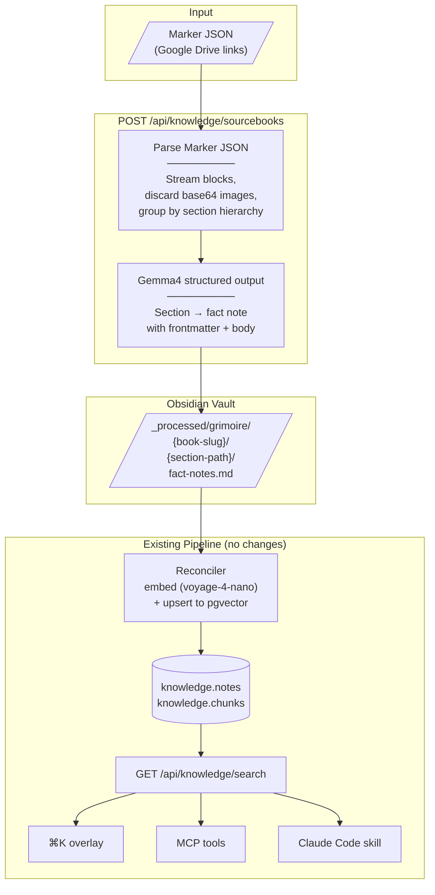

# ADR 004: D&D Sourcebook Knowledge Graph Integration

**Author:** jomcgi
**Status:** Draft
**Created:** 2026-04-10

---

## Problem

We have a growing collection of D&D sourcebooks parsed via [Marker](https://github.com/VikParuchuri/marker) into structured JSON (page trees with typed blocks, section hierarchies, spatial coordinates, and embedded base64 images). Xanathar's Guide to Everything (196 pages, 147 images, ~24 MB) is representative — and there are many more.

The monolith knowledge service (`projects/monolith/knowledge/`) currently handles personal Obsidian notes — Markdown files with frontmatter, processed by the gardener into typed atoms/facts. It has no concept of structured document ingestion at the scale of a 196-page sourcebook with 2,600+ text blocks, 1,100+ section headers, and 350+ tables.

Grimoire (`projects/grimoire/`) has a [detailed data architecture](../../../projects/grimoire/data-architecture.md) for D&D content, but it runs on GCP — a separate stack from the homelab knowledge graph. Maintaining two knowledge stores, two embedding pipelines, and a bridge between them adds complexity without clear benefit.

The question: how do we get D&D sourcebook content into the unified knowledge graph with minimal new infrastructure?

---

## Proposal

Ingest D&D sourcebooks as **fact notes** in the existing knowledge schema, using a dedicated folder (`_processed/grimoire/`) and a new endpoint in the monolith knowledge service. No new tables — sourcebook content becomes regular notes with `type: fact` and `source: grimoire`, processed by Gemma4 and embedded by the existing reconciler.

The key constraints:

1. **Facts, not entities.** D&D sourcebook content is reference material — facts structured hierarchically like the books themselves. Not atoms (those are personal insights that come later).
2. **Folder separation.** `_processed/grimoire/` keeps sourcebook content out of the gardener's path. The current Sonnet-based gardener skips `_processed/` entirely, avoiding expensive processing of thousands of D&D pages.
3. **Same schema, same search.** Fact notes use the existing `knowledge.notes`/`knowledge.chunks` tables, frontmatter format, and edge types. They appear in `⌘K` search, MCP tools, and the Claude Code skill without changes.
4. **Images ignored.** Base64 payloads (16.8 MB of 24 MB for Xanathar's) are discarded at parse time. Alt-text descriptions are preserved in the fact note body where useful.

| Aspect         | Personal notes                         | D&D sourcebook facts                    |
| -------------- | -------------------------------------- | --------------------------------------- |
| Input          | Markdown + YAML frontmatter            | Marker JSON → Gemma4 → fact notes       |
| Vault location | `_processed/` (gardener output)        | `_processed/grimoire/{book-slug}/`      |
| Type           | `atom`, `fact`, `active`               | `fact`                                  |
| Source         | `obsidian`                             | `grimoire`                              |
| Processing     | Gardener (Sonnet → Gemma4 per ADR 013) | Dedicated ingest endpoint (Gemma4 only) |
| Embeddings     | voyage-4-nano (1024-dim)               | Same                                    |
| Search         | `⌘K`, MCP, Claude Code skill           | Same — unified results                  |

### Hierarchical fact structure

Sourcebook content is organized hierarchically, mirroring the book's section structure. Each section becomes a fact note. The hierarchy is expressed through two edge types:

- **`derives_from`** → the source book. Provenance: "this fact comes from Xanathar's Guide."
- **`related`** → the immediate parent section. Context: "this fact sits under Barbarian."

```
xanathars (book-level fact)
├── xanathars-character-options (chapter)        derives_from: xanathars, related: xanathars
│   ├── xanathars-barbarian (class section)      derives_from: xanathars, related: xanathars-character-options
│   │   ├── xanathars-path-ancestral-guardian    derives_from: xanathars, related: xanathars-barbarian
│   │   ├── xanathars-path-storm-herald          derives_from: xanathars, related: xanathars-barbarian
│   │   └── xanathars-path-zealot               derives_from: xanathars, related: xanathars-barbarian
│   ├── xanathars-bard                           derives_from: xanathars, related: xanathars-character-options
│   │   └── ...
```

Every fact has exactly two structural edges. No chains — `derives_from` always points to the book root. Navigation works: follow `related` to the parent, then find all facts `related` to the same parent to see siblings.

### Example fact note

```yaml
---
id: xanathars-path-ancestral-guardian
title: "Path of the Ancestral Guardian"
type: fact
source: grimoire
tags: [dnd, xanathars, barbarian, subclass]
edges:
  derives_from: [xanathars]
  related: [xanathars-barbarian]
---
Path of the Ancestral Guardian. A Barbarian Primal Path from Xanathar's Guide
to Everything. Barbarians who follow this path revere their ancestors and draw
on ancestral spirits to shield allies in battle.

At 3rd level, the Spirit Shield feature allows the barbarian to use a reaction
to reduce damage dealt to an ally within 30 feet. The spectral warriors
interpose themselves between the ally and the attack.

At 6th level, Consult the Spirits lets the barbarian cast Augury or Clairoyance
as rituals using the ancestral spirits as intermediaries.

At 10th level, Vengeful Ancestors causes the Spirit Shield to deal force damage
back to the attacker equal to the damage prevented.

At 14th level, the damage reduced by Spirit Shield increases to 4d6.
```

### What Grimoire's role becomes

Grimoire remains the **campaign manager** — sessions, KnowledgeGrants, player-facing query filtering, voice transcription. It reads D&D content from the monolith knowledge API rather than owning its own extraction pipeline. The Grimoire data architecture's entity type taxonomy and extraction prompt guidelines inform the Gemma4 prompts here.

### Future: personal atoms

Once sourcebook facts exist in the graph, personal atoms can reference them:

```yaml
---
id: ancestral-guardian-tanking-insight
type: atom
edges:
  refines: [xanathars-path-ancestral-guardian]
---
Path of the Ancestral Guardian is the strongest "tanking" subclass in 5e
because Spirit Shield doesn't require the barbarian to be adjacent — 30ft
range means you can protect the backline while still engaging in melee.
```

The atom `refines` the fact. The fact `derives_from` the book. The provenance chain is clean.

---

## Architecture



### Marker JSON parsing

The parser streams through the Marker JSON block tree, grouping blocks by section hierarchy:

| Block type                  | Count (Xanathar's) | Handling                                               |
| --------------------------- | ------------------ | ------------------------------------------------------ |
| `Text`                      | 2,627              | Content for fact notes                                 |
| `SectionHeader`             | 1,128              | Defines hierarchy levels and fact note boundaries      |
| `Table`                     | 359                | Included in fact note body (stat blocks, spell tables) |
| `Page`                      | 196                | Container only, skipped                                |
| `PageFooter` / `PageHeader` | 357                | Ignored                                                |
| `Picture`                   | 137                | Discarded (alt-text already in `html` if useful)       |
| `ListGroup`                 | 81                 | Included in fact note body                             |
| `Caption`                   | 29                 | Discarded with associated pictures                     |
| `TableOfContents`           | 1                  | Skipped                                                |

### Gemma4 extraction

Each section group (a SectionHeader + its child Text/Table/ListGroup blocks) is sent to Gemma4 with a prompt that produces:

- **Title**: section heading
- **Body**: natural language description of the section content — readable, searchable, embedding-friendly
- **Tags**: D&D-relevant classification (book name, chapter, content type)
- **Section path metadata**: for `extra` jsonb, enabling breadcrumb display

This follows the same PydanticAI + `OpenAIChatModel` pattern used by the gardener ([ADR 013](../../decisions/agents/013-knowledge-gardener-gemma4-only.md)) and chat agent ([`projects/monolith/chat/agent.py`](../../../projects/monolith/chat/agent.py)).

### Folder structure

```
_processed/grimoire/
├── xanathars/
│   ├── xanathars.md                          (book-level fact)
│   ├── character-options/
│   │   ├── character-options.md              (chapter fact)
│   │   ├── barbarian/
│   │   │   ├── barbarian.md                  (class section fact)
│   │   │   ├── path-of-the-ancestral-guardian.md
│   │   │   ├── path-of-the-storm-herald.md
│   │   │   └── path-of-the-zealot.md
│   │   ├── bard/
│   │   │   └── ...
│   │   └── ...
│   ├── dungeon-masters-tools/
│   │   └── ...
│   └── spells/
│       └── ...
├── wildemount/
│   └── ...
└── monster-manual/
    └── ...
```

The gardener never touches `_processed/` — the `_EXCLUDED_TOP_LEVEL` set in [`raw_ingest.py`](../../../projects/monolith/knowledge/raw_ingest.py) already excludes it. Sonnet costs stay at zero for sourcebook content.

---

## Implementation

### Phase 1: Marker JSON parsing + fact generation

- [ ] `knowledge/sourcebook_ingest.py` — Marker JSON parser that streams blocks and groups by section hierarchy
- [ ] Gemma4 prompt for section → fact note conversion (PydanticAI structured output)
- [ ] Write fact notes to `_processed/grimoire/{book-slug}/` with proper frontmatter (id, title, type, source, tags, edges)
- [ ] `POST /api/knowledge/sourcebooks` endpoint accepting Marker JSON upload (async processing, returns job ID)
- [ ] Ingest Xanathar's Guide as validation — verify fact notes have correct hierarchy and edges

### Phase 2: Search integration

- [ ] Verify existing reconciler picks up `_processed/grimoire/` notes and embeds them
- [ ] Add `source` field to search results to distinguish `grimoire` from `obsidian`
- [ ] Verify facts appear in `⌘K` vault search with correct edges
- [ ] `GET /api/knowledge/entities/{id}` for full fact detail (or reuse existing `GET /api/knowledge/notes/{id}`)

### Phase 3: Multi-book ingestion

- [ ] Cross-book `related` edges for shared concepts (e.g., Barbarian class referenced in both PHB and Xanathar's)
- [ ] Deduplication: if two books describe the same section, keep the more detailed one
- [ ] Batch ingest endpoint for multiple Marker JSON files

### Future: gardener integration

- [ ] Extend gardener to generate personal atoms that `refines` sourcebook facts
- [ ] D&D-specific type extensions in frontmatter schema if needed
- [ ] Campaign-scoped search filtering (when Grimoire consumes the API)

---

## Security

- Marker JSON files are sourced from personal Google Drive links — no untrusted input
- Base64 image payloads are discarded at parse time — never stored
- Gemma4 extraction is internal cluster traffic (monolith → llama.cpp endpoint)
- No new secrets required
- New API endpoint is behind existing Cloudflare Access authentication

See [`docs/security.md`](../../../docs/security.md) for baseline. No deviations.

---

## Risks

| Risk                                                                                    | Likelihood | Impact                                     | Mitigation                                                                                     |
| --------------------------------------------------------------------------------------- | ---------- | ------------------------------------------ | ---------------------------------------------------------------------------------------------- |
| Gemma4 produces low-quality fact descriptions for complex content (stat blocks, tables) | Medium     | Poor search results for mechanical content | Structured output constraints; include raw table HTML as fallback; manual review of first book |
| Thousands of fact notes dilute personal note search results                             | Medium     | Personal notes harder to find              | `source` field filter in search UI; consider score boosting for personal notes                 |
| Section hierarchy grouping misaligns with Marker's block structure                      | Medium     | Facts at wrong granularity                 | Validate against Xanathar's table of contents; tune grouping heuristics per book               |
| Marker JSON schema changes between versions                                             | Low        | Parser breaks                              | Pin Marker version; schema validation on ingest                                                |
| Gemma4 context window too small for large sections                                      | Medium     | Truncated facts                            | Split oversized sections; most D&D sections are short (1-3 paragraphs)                         |

---

## Open Questions

1. **Fact granularity**: one fact per section heading, or finer (e.g., one fact per spell, per creature)?
2. **Cross-book references**: how to link the Barbarian section in Xanathar's to the Barbarian class in the PHB?
3. **Grimoire consumption**: how does Grimoire (campaign manager) query the monolith knowledge API for campaign-scoped filtering?

---

## References

| Resource                                                                                      | Relevance                                                                 |
| --------------------------------------------------------------------------------------------- | ------------------------------------------------------------------------- |
| [Grimoire data architecture](../../../projects/grimoire/data-architecture.md)                 | Entity types, extraction prompt guidelines — informs Gemma4 prompt design |
| [ADR 013: Gemma4-only gardener](../../decisions/agents/013-knowledge-gardener-gemma4-only.md) | Same model pipeline pattern (PydanticAI + structured output)              |
| [Monolith knowledge models](../../../projects/monolith/knowledge/models.py)                   | Schema: Note, Chunk, NoteLink — fact notes use these directly             |
| [Monolith frontmatter schema](../../../projects/monolith/knowledge/frontmatter.py)            | Frontmatter format fact notes must conform to                             |
| [Monolith raw_ingest.py](../../../projects/monolith/knowledge/raw_ingest.py)                  | `_EXCLUDED_TOP_LEVEL` set that keeps gardener away from `_processed/`     |
| [Marker](https://github.com/VikParuchuri/marker)                                              | PDF-to-structured-JSON tool producing the input files                     |
| [ADR 003: Knowledge search overlay](003-knowledge-search-overlay.md)                          | `⌘K` search UI — facts must be discoverable here                          |
