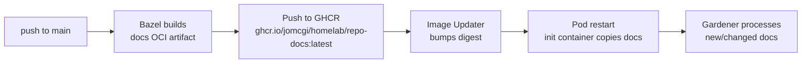
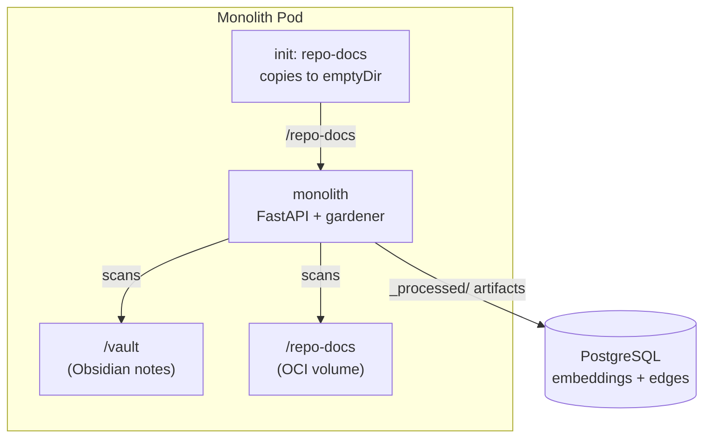
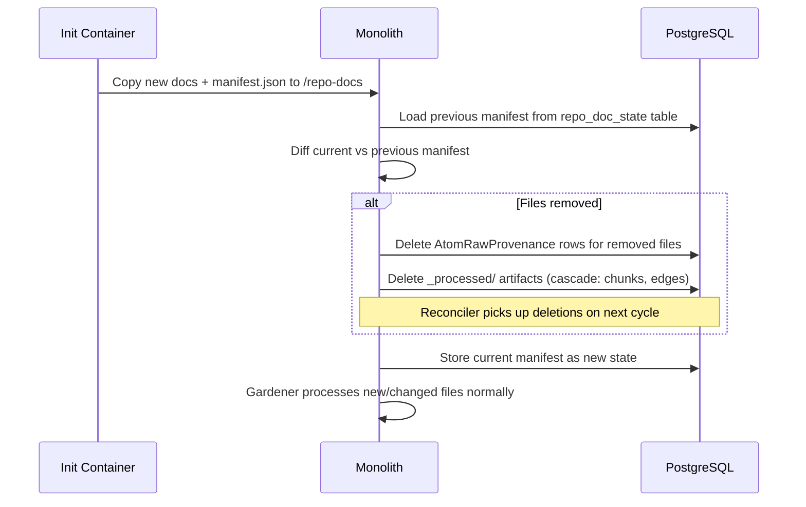

# ADR 005: Repo Docs Knowledge Graph Sync via OCI Volume

**Author:** jomcgi
**Status:** Draft
**Created:** 2026-04-11

---

## Problem

The homelab repo contains ~30 ADRs, ~30 design plans, and operational docs (`security.md`, `observability.md`, `contributing.md`, etc.) that capture architectural decisions, design rationale, and operational knowledge. None of this is visible to the knowledge graph.

This means:

1. **Semantic search misses repo context** — asking "what decisions have we made about auth?" only surfaces personal vault notes, not the ADR that drove the middleware rewrite
2. **No cross-linking** — ADR-derived knowledge can't form `derives_from` or `related` edges with personal knowledge atoms
3. **Stale knowledge persists** — when an ADR is superseded or a design plan is abandoned, the knowledge graph has no mechanism to detect or remove outdated artifacts

The gardener already decomposes raw vault notes into typed knowledge artifacts (atoms, facts, active items). The gap is getting repo docs into its input pipeline — and cleaning up when docs are removed or superseded.

---

## Proposal

Build repo markdown files into a lightweight OCI artifact at CI time. Mount it as an init container volume in the monolith pod. The gardener treats the mount path as a second input directory alongside the vault, processing docs into the knowledge graph with full decomposition, edge creation, and embedding.

A **manifest file** (`manifest.json`) in the OCI artifact lists all included files. On startup, the monolith compares the manifest against previously-processed repo docs and deletes `_processed/` artifacts whose source files no longer exist.

| Aspect                | Today            | Proposed                                                |
| --------------------- | ---------------- | ------------------------------------------------------- |
| **Repo docs in KG**   | Not indexed      | Decomposed into typed artifacts with edges              |
| **Update trigger**    | N/A              | CI rebuild on push to main → Image Updater bumps digest |
| **Deletion handling** | N/A              | Manifest diff removes orphaned artifacts                |
| **Runtime deps**      | N/A              | None — docs baked into OCI artifact at build time       |
| **Gardener changes**  | Scans vault only | Scans vault + repo docs mount                           |

---

## Architecture

### Build Pipeline



### OCI Artifact Contents

```
/repo-docs/
├── manifest.json          # {"files": ["decisions/agents/001-background-agents.md", ...], "built_at": "..."}
├── decisions/
│   ├── agents/
│   │   ├── 001-background-agents.md
│   │   └── ...
│   ├── services/
│   │   └── ...
│   └── ...
├── plans/
│   └── ...
├── observability.md
├── security.md
└── ...
```

### Pod Integration



The init container uses the OCI artifact image and copies its contents to a shared `emptyDir` volume at `/repo-docs`. The gardener scans this path as a second raw input source.

### Deletion Flow



### Change Detection

The gardener's existing provenance system handles most of the lifecycle:

- **New file:** No provenance row → gardener decomposes it
- **Unchanged file:** Provenance row with current `GARDENER_VERSION` → skip
- **Changed file:** Content hash in `RawInput` changes → gardener re-ingests (existing behavior via `_ensure_raw_inputs`)
- **Deleted file:** Manifest diff detects removal → cleanup job deletes provenance + artifacts
- **Gardener version bump:** All repo docs re-processed (same as vault notes)

The only new logic is the manifest-based deletion — everything else rides on existing gardener infrastructure.

---

## Implementation

### Phase 1: OCI Artifact Build

- [ ] Create `bazel/images/repo-docs/` with an apko config (minimal busybox image + `/repo-docs` directory)
- [ ] Add Bazel rule to copy `docs/**/*.md` into the image at `/repo-docs/`
- [ ] Generate `manifest.json` at build time listing all included files with content hashes
- [ ] Add `oci_push` target pushing to `ghcr.io/jomcgi/homelab/repo-docs`
- [ ] Wire into CI (`buildbuddy.yaml`) to build + push on main branch

### Phase 2: Monolith Integration

- [ ] Add init container to monolith deployment template using the repo-docs image
- [ ] Add `emptyDir` volume mounted at `/repo-docs` shared between init container and monolith
- [ ] Add `REPO_DOCS_ROOT` env var to monolith container (default: `/repo-docs`)
- [ ] Add ArgoCD Image Updater annotation for the repo-docs image (digest tracking)

### Phase 3: Gardener Multi-Source

- [ ] Extend `_ensure_raw_inputs` in `gardener.py` to scan `REPO_DOCS_ROOT` in addition to vault
- [ ] Tag repo-doc `RawInput` rows with `source='repo'` to distinguish from vault notes
- [ ] Add `repo_doc_state` table (or reuse existing config table) to store the previous manifest
- [ ] Implement manifest diff on startup: compare current `manifest.json` vs stored state
- [ ] For removed files: delete `AtomRawProvenance` rows and corresponding `_processed/` artifacts
- [ ] Store updated manifest after successful diff + cleanup
- [ ] Gardener prompt: include `source: repo` context so decomposition can reference the repo path in edges

### Phase 4: Observability

- [ ] Add SigNoz metric: `knowledge.repo_docs.processed` (counter of repo docs ingested per cycle)
- [ ] Add SigNoz metric: `knowledge.repo_docs.deleted` (counter of orphaned artifacts cleaned up)
- [ ] Log manifest diff results at INFO level on each startup

---

## Security

Baseline per `docs/security.md`. No deviations.

The OCI artifact contains only markdown files already public in the GitHub repo. No secrets, no credentials. The init container runs as uid 65532 (non-root) and only copies files to an `emptyDir`.

---

## Risks

| Risk                                                                           | Likelihood | Impact                                    | Mitigation                                                                                             |
| ------------------------------------------------------------------------------ | ---------- | ----------------------------------------- | ------------------------------------------------------------------------------------------------------ |
| Gardener decomposes ADRs poorly (too long/structured for atomic decomposition) | Medium     | Low — bad atoms, not data loss            | Tune gardener prompt for repo doc structure; add `source: repo` hint so model adapts                   |
| Manifest diff deletes artifacts for a temporarily-missing file (build race)    | Low        | Medium — knowledge gap until re-processed | Manifest is generated deterministically at build time; only diffs against stored state, not filesystem |
| Init container blocks pod startup if image pull fails                          | Low        | Medium — monolith doesn't start           | Use `imagePullPolicy: IfNotPresent`; repo-docs absence shouldn't block startup (make mount optional)   |
| Large number of docs overwhelms gardener cycle                                 | Low        | Low — gardener already rate-limits        | Gardener processes N raws per cycle with existing budget cap; repo docs queued like any other raw      |

---

## Open Questions

1. **Scope of docs to include** — should we sync all of `docs/` (including plans) or only `docs/decisions/` and top-level operational docs? Plans are often ephemeral and may not warrant knowledge graph persistence.
2. **Superseded ADR handling** — when an ADR status changes to "Superseded by NNN", should the gardener emit a `supersedes` edge and mark old artifacts, or just let the natural decomposition handle it?

---

## References

| Resource                                                             | Relevance                                             |
| -------------------------------------------------------------------- | ----------------------------------------------------- |
| `projects/monolith/knowledge/gardener.py`                            | Existing gardener that will scan repo docs            |
| `projects/monolith/knowledge/reconciler.py`                          | Hash-based reconciler that handles artifact lifecycle |
| `projects/monolith/knowledge/models.py`                              | `AtomRawProvenance` model for provenance tracking     |
| `docs/decisions/agents/012-knowledge-gardener-model-pipeline.md`     | Gardener's two-tier model architecture                |
| `docs/decisions/agents/013-knowledge-gardener-gemma4-only.md`        | Current gardener model (supersedes 012)               |
| `docs/plans/2026-04-09-vault-git-sync.md`                            | Vault git clone pattern (related but separate)        |
| [apko](https://github.com/chainguard-dev/apko)                       | Image build tool used for OCI artifact                |
| [ArgoCD Image Updater](https://argocd-image-updater.readthedocs.io/) | Digest-based auto-update for the docs image           |
