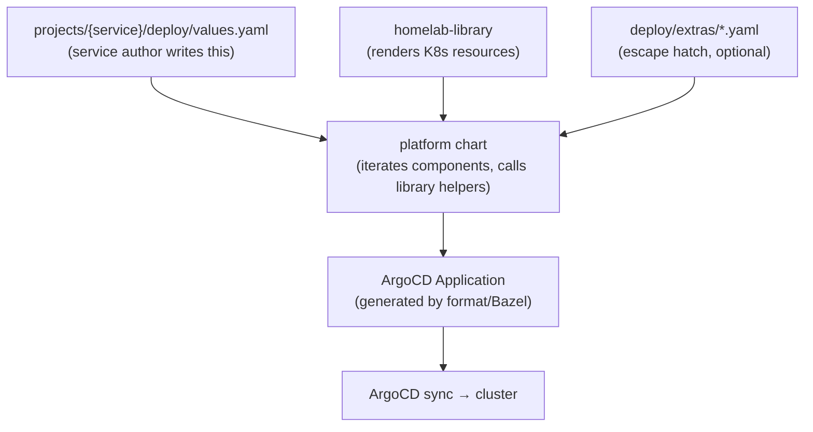

# ADR 003: Platform Chart — Services as Plain YAML

**Author:** Joe McGinley
**Status:** Draft
**Created:** 2026-03-21
**Depends on:** homelab-library expansion (in progress)
**Supersedes:** ADR 002 "Out of Scope" decision against a generic chart

---

## Problem

Despite the repo reorganisation (colocated `projects/`) and the introduction of `homelab-library`, adding or maintaining a service still requires authoring Helm templates. In practice, most service charts are thin wrappers — a `templates/` directory where each file is a one-liner calling a library helper:

```yaml
# templates/api-deployment.yaml
{ { - include "homelab.deployment" (dict "context" . "component" "api") } }
```

This means:

1. **Every service carries template boilerplate that adds no information.** The real configuration lives in `values.yaml`; the templates are just wiring.
2. **Multi-component services multiply the boilerplate.** A service with 3 components needs 3 near-identical template files (plus Chart.yaml, \_helpers.tpl, etc.).
3. **Three deployment patterns coexist** (OCI dual-source, local chart, deploy-as-chart), each with different `application.yaml` shapes. Contributors must know which pattern their service uses.
4. **Convention drift is structural.** Each chart can wire helpers differently, skip helpers, or add ad-hoc templates — the library _enables_ consistency but doesn't _enforce_ it.

ADR 002 declared a generic chart out of scope because per-service charts provided better isolation. That tradeoff has shifted: `homelab-library` now abstracts the resource generation, so the per-service chart layer adds ceremony without isolation benefit.

---

## Proposal

Replace per-service Helm charts with a single **platform chart** that renders complete service deployments from values alone. Service authors write a `values.yaml` — no `Chart.yaml`, no `templates/`, no `_helpers.tpl`.

| Aspect                 | Today                                                                                                                        | Proposed                                                                 |
| ---------------------- | ---------------------------------------------------------------------------------------------------------------------------- | ------------------------------------------------------------------------ |
| **Service definition** | `chart/` dir with Chart.yaml, templates/, values.yaml + `deploy/` dir with application.yaml, kustomization.yaml, values.yaml | `deploy/values.yaml` only (+ optional `deploy/extras/` for escape hatch) |
| **Adding a component** | Create a new template file calling `homelab.deployment`                                                                      | Add a key to `values.yaml` under `components:`                           |
| **Chart maintenance**  | Per-service Chart.yaml versions, per-service targetRevision sync                                                             | Single platform chart version, one targetRevision for all services       |
| **Deployment pattern** | 3 patterns (OCI dual-source, local chart, deploy-as-chart)                                                                   | 1 pattern: all services use the platform chart                           |
| **Escape hatch**       | Full Helm template authorship                                                                                                | `deploy/extras/` directory for raw templates                             |

### What a service looks like

```yaml
# projects/marine/deploy/values.yaml

components:
  ingest:
    image:
      repository: ghcr.io/jomcgi/homelab/projects/ships/ingest
    port: 8000
    env:
      NATS_URL: nats://nats.ships.svc:4222
    resources:
      requests:
        cpu: 20m
        memory: 100Mi

  api:
    image:
      repository: ghcr.io/jomcgi/homelab/projects/ships/backend
    port: 8080
    httpRoute:
      hostname: ships.jomcgi.dev
    probes:
      liveness:
        initialDelaySeconds: 120
    resources:
      requests:
        cpu: 100m
        memory: 900Mi

  frontend:
    image:
      repository: ghcr.io/jomcgi/homelab/projects/ships/frontend
    port: 80
    resources:
      requests:
        cpu: 10m
        memory: 100Mi

secrets:
  ghcr:
    onepassword:
      itemPath: vaults/k8s-homelab/items/ghcr-read-permissions

imageUpdater:
  enabled: true
```

No Chart.yaml. No templates directory. The `application.yaml` and `kustomization.yaml` are generated by tooling (the `format` command or a Bazel rule).

---

## Architecture

### Dependency: homelab-library expansion

This ADR **depends on** the ongoing homelab-library work to provide comprehensive named templates. The platform chart is a thin iteration loop over library helpers — it only works if the library covers the full surface area.

Library helpers required (current state noted):

| Helper                    | Status       | Purpose                                 |
| ------------------------- | ------------ | --------------------------------------- |
| `homelab.deployment`      | Exists       | Deployment from component values        |
| `homelab.service`         | Needs adding | Service resource per component          |
| `homelab.httpRoute`       | Needs adding | HTTPRoute from component.httpRoute      |
| `homelab.imagepullsecret` | Exists       | 1Password GHCR pull secret              |
| `homelab.imageupdater`    | Exists       | ArgoCD Image Updater CRD                |
| `homelab.serviceaccount`  | Exists       | ServiceAccount + RBAC                   |
| `homelab.pvc`             | Needs adding | PVC from storage config                 |
| `homelab.configmap`       | Needs adding | ConfigMap from config values            |
| `homelab.cronjob`         | Needs adding | CronJob from component values           |
| `homelab.networkpolicy`   | Needs adding | NetworkPolicy (when not Linkerd-meshed) |

Once the library provides these, the platform chart's core logic is straightforward:

```gotemplate
{{- range $name, $spec := .Values.components }}
{{- include "homelab.deployment" (dict "context" $ "component" $name) }}
---
{{- include "homelab.service" (dict "context" $ "component" $name) }}
---
{{- if $spec.httpRoute }}
{{- include "homelab.httpRoute" (dict "context" $ "component" $name) }}
{{- end }}
{{- if $spec.cronjob }}
{{- include "homelab.cronjob" (dict "context" $ "component" $name) }}
{{- end }}
{{- end }}
```

### Data flow



### The escape hatch

For the 1% of cases that need custom resources (a niche CRD, a one-off Job, a complex sidecar), services can place raw Helm templates in `deploy/extras/`. The platform chart includes everything in that directory:

```gotemplate
{{ range $path, $_ := .Files.Glob "extras/*.yaml" }}
{{ $.Files.Get $path | nindent 0 }}
{{ end }}
```

This keeps the simple path simple while allowing full Helm power when genuinely needed.

### Application.yaml generation

Today each service hand-writes `application.yaml` and `kustomization.yaml`. With a single platform chart, these become fully derivable from the service name and namespace. The `format` command (or a Bazel rule) generates them:

```yaml
# Auto-generated — do not edit
apiVersion: argoproj.io/v1alpha1
kind: Application
metadata:
  name: marine
  namespace: argocd
spec:
  project: default
  source:
    repoURL: https://github.com/jomcgi/homelab.git
    path: projects/shared/helm/homelab-platform/chart
    targetRevision: HEAD
    helm:
      releaseName: marine
      valueFiles:
        - ../../../../../projects/ships/marine/deploy/values.yaml
  destination:
    server: https://kubernetes.default.svc
    namespace: ships
  syncPolicy:
    automated:
      prune: true
      selfHeal: true
    syncOptions:
      - CreateNamespace=true
      - ServerSideApply=true
```

One chart, one targetRevision (`HEAD` since it's in-repo), per-service values via relative path.

---

## Implementation

### Prerequisites (in progress, not part of this ADR)

- [ ] homelab-library provides `homelab.service` helper
- [ ] homelab-library provides `homelab.httpRoute` helper
- [ ] homelab-library provides `homelab.pvc` helper
- [ ] homelab-library provides `homelab.configmap` helper
- [ ] homelab-library component iteration handles all current service patterns

### Phase 1: Platform chart MVP

- [ ] Create `projects/shared/helm/homelab-platform/chart/` with Chart.yaml depending on homelab-library
- [ ] Implement component iteration in `templates/components.yaml` — loops over `.Values.components`, calls library helpers
- [ ] Implement `extras/` glob include for escape hatch templates
- [ ] Migrate one simple service (e.g., stargazer or grimoire) as proof of concept
- [ ] Validate: `helm template` output matches the service's current rendered manifests

### Phase 2: Application generation

- [ ] Extend `format` (or add Bazel rule) to generate `application.yaml` + `kustomization.yaml` from the presence of `deploy/values.yaml`
- [ ] Define a minimal metadata block in values.yaml (name, namespace) or derive from directory path
- [ ] Update `generate-home-cluster.sh` to discover platform-chart services

### Phase 3: Migration

- [ ] Migrate remaining simple services (single-component, no custom templates)
- [ ] Migrate multi-component services (marine, agent-platform subsystems)
- [ ] Remove emptied per-service `chart/` directories
- [ ] Document the new service authoring workflow in `docs/services.md`

### Phase 4: Stretch — schema validation

- [ ] Define a JSON Schema for the platform chart values
- [ ] Integrate schema validation into `format` or CI
- [ ] IDE autocompletion for service authors via schema

---

## Security

No changes to the security model. The platform chart renders the same resources as per-service charts — it's a structural change, not a policy change. Security defaults (non-root uid 65532, read-only rootfs, dropped capabilities) are enforced by `homelab-library` helpers, which the platform chart calls unchanged.

---

## Risks

| Risk                                                             | Likelihood | Impact | Mitigation                                                                                                     |
| ---------------------------------------------------------------- | ---------- | ------ | -------------------------------------------------------------------------------------------------------------- |
| Platform chart becomes a "god chart" that's hard to reason about | Medium     | Medium | Keep the chart thin — it's a loop + library calls, not business logic. Complexity lives in the library.        |
| Edge cases that don't fit the component model                    | Low        | Low    | `deploy/extras/` escape hatch. If a pattern recurs, promote it to a library helper.                            |
| Library expansion takes longer than expected, blocking this work | Medium     | Low    | This ADR is explicitly sequenced after library work. No wasted effort — the library is valuable regardless.    |
| Single chart version creates blast radius for bugs               | Low        | High   | Platform chart changes go through PR + CI like any other code. `helm template` diff in CI catches regressions. |
| Migration breaks existing services                               | Medium     | Medium | Migrate one service at a time, validate rendered output matches before switching.                              |

---

## Open Questions

1. **Should the platform chart live in OCI or stay in-repo?** In-repo (with `targetRevision: HEAD`) is simpler and avoids the version-pinning ceremony. OCI gives immutable releases. Recommendation: start in-repo, consider OCI later if versioning becomes important.
2. **How do subchart dependencies work?** Services like agent-platform depend on NATS (a third-party chart). The platform chart would need to support `dependencies:` in values or the subchart stays as a separate ArgoCD Application. Likely the latter — keep the platform chart focused on homelab-authored components.
3. **Where does the metadata live?** Service name and namespace could be derived from the directory path (`projects/{service}/deploy/`) or declared explicitly in values.yaml. Directory-derived is DRY but implicit.

---

## References

| Resource                                                                      | Relevance                                                                           |
| ----------------------------------------------------------------------------- | ----------------------------------------------------------------------------------- |
| [ADR 002: Service Deployment Tooling](./002-service-deployment-tooling.md)    | Previous decision that declared generic chart out of scope — this ADR revisits that |
| [homelab-library chart](../../../projects/shared/helm/homelab-library/chart/) | The library this depends on — must be feature-complete before Phase 1               |
| [ADR 001: OCI Tool Distribution](./001-oci-tool-distribution.md)              | Tooling context                                                                     |
