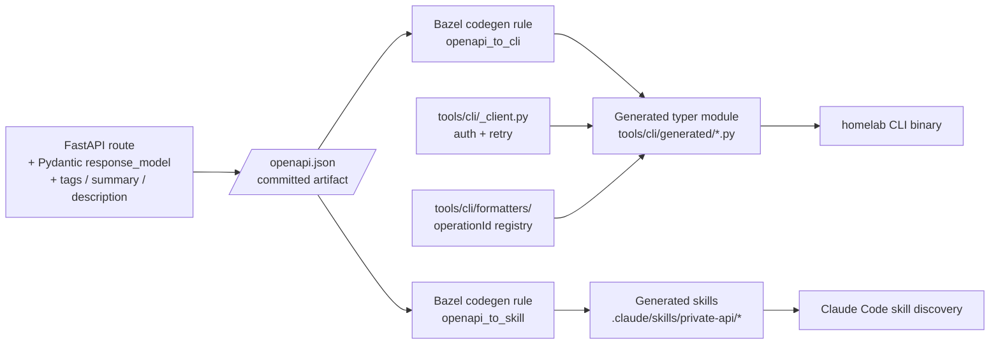

# ADR 003: Spec-First CLI and Skills

**Author:** Joe McGinley
**Status:** Draft
**Created:** 2026-04-25

---

## Problem

The homelab CLI (`tools/cli/`) is the human and Claude-Code interface to the
private API surface (`https://private.jomcgi.dev`). Today it is hand-written:
each backend route gets a corresponding typer subcommand in a per-domain file
(`knowledge_cmd.py`, `tasks_cmd.py`, …), with its own copy of the auth + retry
boilerplate, its own request/response parsing, and its own bespoke output
formatter.

This produces three concrete frictions:

**1. The CLI is a perpetual lagging indicator of the backend.** Adding a route
to FastAPI requires a separate ~30–60-LOC PR against `tools/cli/` to make it
reachable from a workstation. The two PRs can drift indefinitely; nothing
fails if the CLI is missing a command for an endpoint that already ships in
production.

**2. Auth, retry, and CF-Access re-auth logic are duplicated.** Every command
file copies `_client()` and `_request()` (see `knowledge_cmd.py:20-46` vs.
`tasks_cmd.py:20-46`). Bug fixes to the re-auth flow have to be applied N
times, and they have already drifted in small ways (`compact_line` formatter
import in one file, not the other).

**3. There are no Claude Code skills for using the CLI.** Skills ship as
markdown files at `.claude/skills/<name>/SKILL.md` and let Claude discover
when and how to invoke a CLI command from natural language. We have skills
for `knowledge` (debug-knowledge-ingest, knowledge) but they are written by
hand and reference only a small subset of available endpoints. Most of the
private API surface is invisible to Claude unless someone hand-writes a
skill for it.

The forcing function for this ADR is the addition of scheduler API endpoints
(see `docs/plans/2026-04-25-scheduler-api-design.md`). That work is shipping
in the existing hand-written style to avoid blocking on this larger refactor,
but it is the third domain in a row that has paid the duplication tax. The
next domain should not.

---

## Proposal

Treat the FastAPI OpenAPI schema as the single source of truth for the
CLI surface and the per-endpoint Claude skills. Both artifacts become
_derived_ from `openapi.json`, regenerated whenever the contract changes.

| Aspect                | Today                                                                                     | Proposed                                                                                                                                          |
| --------------------- | ----------------------------------------------------------------------------------------- | ------------------------------------------------------------------------------------------------------------------------------------------------- |
| Source of truth       | Hand-written CLI command + hand-written skill, both copied from a sibling                 | FastAPI route definition (Pydantic `response_model`, `summary`, `description`, `tags`)                                                            |
| Adding a new endpoint | Three PRs in sequence (backend → CLI → skill) and humans diff them by eye                 | One PR: backend + regen artifact; CLI and skills land in the same commit via codegen                                                              |
| Auth + retry          | Re-implemented per command file                                                           | A single shared `tools/cli/_client.py` injected into every generated command                                                                      |
| Output formatting     | Bespoke per command (`task_line`, `search_line`, `compact_line`) — terse, token-efficient | Generic JSON/table renderer by default; opt-in registry of named formatters keyed by `operationId` for the routes where the bespoke shape matters |
| Skill coverage        | Hand-written, sparse, drifts                                                              | Per-tag `SKILL.md` generated from `tags`/`summary`/`description` with example invocations baked in                                                |
| CI gate               | None — drift is invisible                                                                 | Codegen runs in CI; a stale generated artifact fails the build                                                                                    |

The "auto-inherit" property the user wants — _a new endpoint
automatically becomes a CLI command and a Claude skill_ — is delivered
by generating from the OpenAPI spec at build time, with the spec
itself derived from the live FastAPI app and committed as a build
input.

---

## Architecture

### Key components

**1. The committed `openapi.json` artifact.** A Bazel target
(`//projects/monolith:openapi_json`) imports the FastAPI app, calls
`app.openapi()`, and writes the result to a stable JSON file at
`projects/monolith/openapi.json`. CI runs this in a check mode that fails
if the committed file is out of date — same pattern as `gazelle` BUILD
files today.

**2. `openapi_to_cli` codegen.** A Python script (probably under
`bazel/tools/openapi/`) walks the spec and emits one typer file per OpenAPI
tag, plus an `__init__.py` that wires them into the root app. Conventions:

- Tag → subcommand group (`scheduler`, `knowledge`, `tasks`, …)
- `operationId` → command name (kebab-cased)
- Path parameters → typer arguments (positional)
- Query / body parameters → typer options (named flags)
- `summary` → typer `help` text
- `response_model` → output schema; default formatter pretty-prints JSON,
  registry overrides take a parsed Pydantic instance and return a string
- `x-cli-formatter: <name>` extension on the route → look up named formatter
  from `tools/cli/formatters/` (allows hand-tuned output for specific routes
  without leaving the codegen path)

**3. `openapi_to_skill` codegen.** Walks tags and emits one skill per tag at
`.claude/skills/private-api-<tag>/SKILL.md`. Each skill has:

- Frontmatter `name: private-api-<tag>` and `description: <tag-level-doc>`
- A "When to use" section enumerating the operations under the tag
- Per-operation example invocations (`homelab <tag> <command> --flag value`),
  expected output shape, and the natural-language triggers that should fire it
- A pointer to the generated CLI module so future contributors know not to
  edit the skill directly

**4. Shared `tools/cli/_client.py`.** Owns CF-Access auth, redirect-driven
re-auth, JSON decoding, and HTTP error formatting. Generated commands import
this and never construct httpx clients themselves. Replaces the duplicated
`_client()`/`_request()` pairs in current per-domain files.

**5. Build vs. runtime tradeoff.** Codegen runs at _build_ time, not
runtime. The CLI image still contains plain typer code with no openapi
dependency at runtime — important for the `homelab_cli_tar` image footprint.
The cost is that an API change requires the monolith to be rebuilt + the
`openapi.json` regenerated + the CLI rebuilt; the auto-inherit is "next
build" not "next request." This is acceptable for our cadence.

### Edge cases that need explicit handling

- **Streaming / SSE responses** (e.g., chat) — codegen emits a stub that
  defers to a hand-written formatter; we keep an explicit allowlist of
  routes that opt out of generic codegen.
- **File upload (multipart) and download** — same pattern: generator detects
  `multipart/form-data` request bodies or non-JSON response content types
  and emits a stub.
- **Routes with redirect chains** (CF-Access 302s) — handled in the shared
  `_client.py`, not per-route.
- **Routes intentionally omitted from the CLI** (internal health checks,
  Discord webhooks) — `x-cli-skip: true` extension.

---

## Implementation

The ADR captures the full canonical task list. Work is deferred until at
least one more domain is added in the existing style (the scheduler PR is
the immediate trigger; if the next domain after that is also painful, that's
the signal to start Phase 1).

### Phase 1: Spec-as-source

- [ ] Add Bazel target `//projects/monolith:openapi_json` that imports
      the FastAPI app and writes `projects/monolith/openapi.json`. Wire
      into `format` so `format` regenerates it.
- [ ] Add a CI check that fails if `openapi.json` is stale (same pattern
      as gazelle drift). Document the `format` command in `docs/contributing.md`.
- [ ] Backfill `summary`, `description`, `tags`, and `response_model` on
      every existing FastAPI route. Audit and fix routes that are missing
      these fields. The codegen rules in Phases 2–3 depend on this metadata
      being present and correct.

### Phase 2: CLI codegen pilot

- [ ] Implement `bazel/tools/openapi/cli_gen.py` that emits typer modules
      from `openapi.json`. Output goes to `tools/cli/generated/`.
- [ ] Implement `tools/cli/_client.py` (shared auth + retry + redirect re-auth).
- [ ] Implement `tools/cli/formatters/` registry with `operationId` lookup.
- [ ] Pilot the codegen on the _scheduler_ domain (smallest surface, two
      operations) without removing the hand-written domains. Both styles
      coexist — if the generated commands work in practice, proceed; if
      not, the ADR moves to Deprecated and we keep the hand-written style.
- [ ] Generate a single pilot skill `.claude/skills/private-api-scheduler/`
      using the same `openapi_to_skill` rule (Phase 3 generalizes it).
- [ ] Decide on convention for the `x-cli-skip`, `x-cli-formatter`, and
      `x-cli-positional` extensions. Document in `docs/contributing.md`.

### Phase 3: Migrate existing domains

- [ ] Migrate `knowledge` (largest hand-written domain — biggest payoff).
      Preserve the existing terse output via the formatter registry, keyed
      by the operationIds that need bespoke shaping (`search`, `notes`,
      `dead_letter`).
- [ ] Migrate `tasks` (smaller, similar shape).
- [ ] Migrate `home/schedule` (read-only, trivial).
- [ ] Migrate `chat` (deferred — streaming responses need the stub path).
- [ ] Delete the hand-written `*_cmd.py` files and their per-file auth
      duplication. Keep the test files and migrate them to test the
      generated modules.

### Phase 4: Skill generalization

- [ ] Generalize `openapi_to_skill` to emit one skill per tag, covering
      every non-skipped operation.
- [ ] Add a skill discovery doc at `.claude/skills/private-api/README.md`
      that points to the generated skills and explains they are derived,
      not hand-edited.
- [ ] Add a CI check that fails if a route lacks `summary` or `description`
      so generated skills are never empty.

---

## Security

The CLI continues to authenticate via Cloudflare Access (`CF_Authorization`
cookie), inheriting the existing trust boundary. No security posture changes:

- All generated commands hit the same `private.jomcgi.dev` host that
  hand-written commands do today; the HTTPRoute and CF-Access policy is the
  authoritative gate.
- The codegen pipeline does not embed secrets in generated artifacts. The
  `openapi.json` exposes route shapes but no auth material — equivalent to
  what FastAPI's `/openapi.json` already serves to authorized clients.
- Generated skills carry no credentials; they describe how to invoke the
  CLI, which then performs auth.

See `docs/security.md` for baseline. No deviations.

---

## Risks

| Risk                                                                                                         | Likelihood | Impact | Mitigation                                                                                                                                                                                                                                         |
| ------------------------------------------------------------------------------------------------------------ | ---------- | ------ | -------------------------------------------------------------------------------------------------------------------------------------------------------------------------------------------------------------------------------------------------- |
| Bespoke output formatters degrade under codegen and the CLI feels worse to use                               | Medium     | Medium | Formatter registry with `x-cli-formatter` extension keeps hand-tuned output for the routes that matter (`knowledge search`, `tasks list`); pilot on scheduler first to validate the seam before migrating any domain that has bespoke output today |
| `openapi.json` drift gets ignored if the CI check is too noisy                                               | Low        | Medium | Make the regeneration a `format`-time pass (same UX as gazelle), so the inner loop fixes drift automatically before push                                                                                                                           |
| Codegen tool itself becomes a maintenance burden larger than the duplication it removes                      | Medium     | High   | Keep the generator small (~300 LOC target). If the generator grows past 600 LOC or sprouts plugins, that's the signal that hand-writing was actually fine — revisit the ADR                                                                        |
| New CLI contributors confused by "where do I edit?" — generated vs. shared client vs. formatter              | Medium     | Low    | Top-of-file generator banners (`# Generated from openapi.json — do not edit`); contributing doc explains the three places code lives (route, formatter, client)                                                                                    |
| Streaming / multipart routes never get cleanly generated and the "escape hatch" path becomes the common case | Low        | Medium | Track the count of `x-cli-skip` routes; if it grows beyond ~20% of the surface, the codegen abstraction is leaky and we should reconsider                                                                                                          |
| Generated skills are noisy and pollute Claude's skill discovery                                              | Medium     | Low    | One skill per _tag_, not per _operation_; tag-level skills enumerate operations in the body. Audit during Phase 4 — if Claude consistently picks the wrong skill, restructure or revert                                                            |

---

## Open Questions

1. **Where does `openapi.json` live in the tree?** Options: `projects/monolith/openapi.json` (colocated with the API it describes — simplest) vs. `bazel/contracts/monolith.openapi.json` (centralized contracts directory — better if other services later need the same treatment). Default to colocated for now; revisit if a second service exposes a private API.
2. **Should the codegen tool be in this repo or vendored from upstream?** `datamodel-code-generator` and `openapi-python-client` exist but have opinionated output that doesn't match our typer + bespoke-formatter shape. A small in-repo generator is probably cleaner. Leave the build/buy decision to Phase 2 implementation.
3. **Do we want a `homelab` shell completion pipeline?** Generated commands can also feed `typer-completion` to ship zsh/bash/fish completions in the CLI image. Out of scope for the ADR but a natural follow-on.
4. **Skills granularity.** Per-tag is the proposed default, but for some tags (e.g., `knowledge` with ~10 operations) per-operation skills might be more discoverable for Claude. Decide during Phase 4 with empirical data.

---

## References

| Resource                                                                                          | Relevance                                                                                   |
| ------------------------------------------------------------------------------------------------- | ------------------------------------------------------------------------------------------- |
| [`tools/cli/`](../../../tools/cli/)                                                               | Current hand-written CLI; the duplication this ADR removes                                  |
| [`tools/cli/knowledge_cmd.py`](../../../tools/cli/knowledge_cmd.py)                               | Reference for current command shape (auth, retry, output formatting)                        |
| [`projects/monolith/app/main.py`](../../../projects/monolith/app/main.py)                         | FastAPI app wiring; openapi.json source                                                     |
| [`docs/plans/2026-04-25-scheduler-api-design.md`](../../plans/2026-04-25-scheduler-api-design.md) | The forcing function — third domain paying duplication tax                                  |
| [FastAPI OpenAPI customization](https://fastapi.tiangolo.com/how-to/extending-openapi/)           | Mechanism for `x-cli-*` extensions on routes                                                |
| [Claude Code skills format](https://docs.claude.com/en/docs/claude-code/skills)                   | Frontmatter + body structure for `.claude/skills/<name>/SKILL.md`                           |
| [ADR 002: Service Deployment Tooling](./002-service-deployment-tooling.md)                        | Sister ADR — same "scaffolding from a single source" philosophy applied to service creation |
