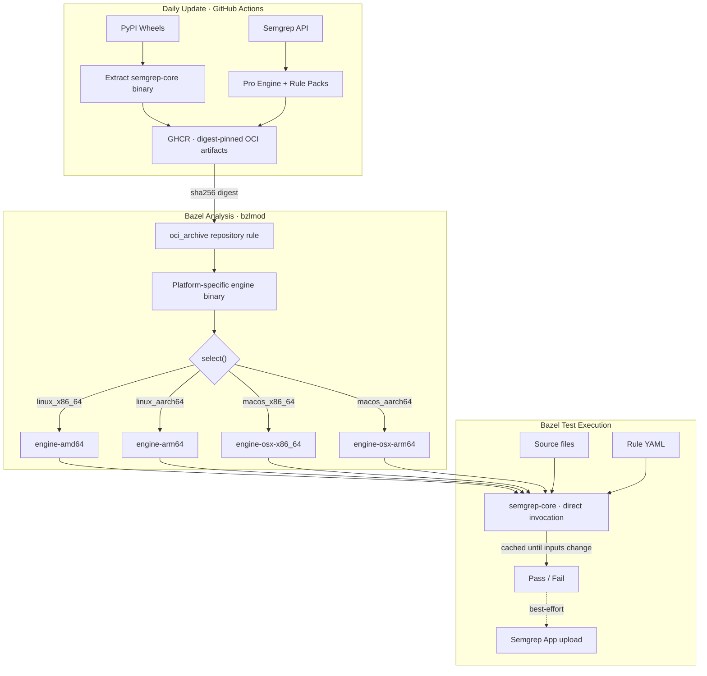
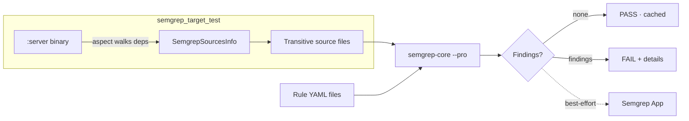
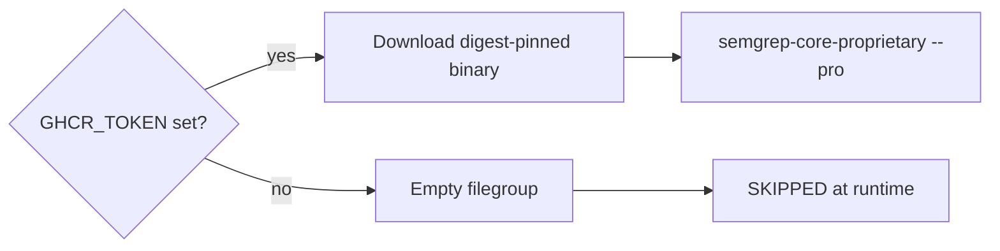

# rules_semgrep Documentation Implementation Plan

> **For Claude:** REQUIRED SUB-SKILL: Use superpowers:executing-plans to implement this plan task-by-task.

**Goal:** Create two concise, diagram-rich documents: an ADR explaining why rules_semgrep exists, and a README documenting the API.

**Architecture:** Documentation-only — two markdown files with mermaid diagrams. ADR follows the convention in `architecture/decisions/` (see `004-autonomous-agents.md`). README lives in `rules_semgrep/`.

**Tech Stack:** Markdown, Mermaid diagrams, Conventional Commits

**Worktree:** `/tmp/claude-worktrees/semgrep-docs` (branch: `docs/semgrep-documentation`)

---

### Task 1: Create ADR — `architecture/decisions/security/001-bazel-semgrep.md`

**Files:**
- Create: `architecture/decisions/security/001-bazel-semgrep.md`

**Step 1: Create the security decisions directory**

```bash
mkdir -p architecture/decisions/security
```

**Step 2: Write the ADR**

Follow the existing ADR convention (title, author/status/created header, `---` separator, sections). Content:

**Header:**
```markdown
# Hermetic Semgrep via Bazel

**Author:** Joe McGinley
**Status:** Accepted
**Created:** 2026-03-04

---
```

**Problem section** — 3 tight paragraphs:

1. Agentic coding workflows (Claude Code, autonomous agents) need CI feedback in seconds, not minutes. Semgrep on managed CI infrastructure took **2m+ for diff scans** and **5m+ for full scans** — too slow for tight agent iteration loops.

2. Beyond speed, the standard Semgrep integration (`pip install semgrep` + registry rule fetches) breaks **determinism**. pip resolution is non-hermetic. Rule registry pulls vary across runs. The Python wrapper adds 2-4s startup overhead per invocation. Agents need identical results from identical inputs.

3. Bazel's content-addressed cache model is the answer: tests re-run only when their inputs change. But Semgrep has no native Bazel integration, and the engine ships as a Python wheel — not a standalone binary.

**Proposal section** — one paragraph + architecture mermaid diagram:

Three-layer solution: (1) vendor `semgrep-core` OCaml binary as OCI artifacts on GHCR, bypassing the Python wrapper entirely; (2) Bazel rules that wire engine + rules + sources into cacheable `sh_test` targets; (3) a Gazelle extension that auto-generates scan targets from the dependency graph.

Mermaid diagram — the full pipeline from daily artifact update through Bazel analysis to test execution:



**Key Decisions section** — compact table:

| Decision | Rationale |
|---|---|
| Bypass Python wrapper, invoke `semgrep-core` directly | Eliminates 2-4s Python startup per invocation |
| Vendor engine as OCI artifact (not pip) | Content-addressed digest pinning; platform-specific binaries; no pip resolution |
| `no-sandbox` Bazel tag | semgrep-core needs real filesystem paths; sandbox adds ~100x overhead |
| Aspect for transitive source collection | Walks the real dependency graph for cross-file `--pro` analysis |
| Graceful degradation (empty filegroup → SKIP) | Missing GHCR credentials produce SKIP, not FAIL — local dev works without registry access |
| Gazelle auto-generation | Zero-maintenance BUILD files; orphan detection ensures no coverage gaps |
| Per-rule-file execution with post-scan ID filtering | File-level exclusion is O(1); rule-ID exclusion handles granular suppressions |

**Results section** — before/after table:

| Metric | Before (managed CI) | After (Bazel + BuildBuddy) |
|---|---|---|
| Diff scan (cached) | 2m+ | **30s** |
| Full scan (new rules) | 5m+ | **50s** |
| Cold cache (all tests + images + semgrep) | N/A | **4m** |
| Determinism | Non-deterministic (registry fetches) | **Hermetic** (digest-pinned) |
| Cache invalidation | Time-based / none | **Content-addressed** (source + rule hash) |

**Step 3: Commit**

```bash
git add architecture/decisions/security/001-bazel-semgrep.md
git commit -m "docs(semgrep): add ADR for hermetic Bazel Semgrep integration"
```

---

### Task 2: Create README — `rules_semgrep/README.md`

**Files:**
- Create: `rules_semgrep/README.md`

**Step 1: Write the README**

Sections in order:

**Pitch** (3 lines max):
> Hermetic Semgrep scanning as native Bazel tests. Pro rules on your own infrastructure. Cache invalidation on your own terms.
>
> Scans re-run only when source files or rule definitions change. No pip install, no registry fetches, no Python wrapper — just a digest-pinned OCaml binary.

**How It Works** — scan flow mermaid diagram:



Brief explanation (2-3 sentences): The test scripts invoke `semgrep-core` directly (bypassing the Python wrapper). Source files are copied to a temp directory preserving relative paths. The engine, rules, and sources are all Bazel dependencies — changing any of them invalidates the cache.

**Rules** — table with 3 rule types:

| Rule | Purpose | Best For |
|---|---|---|
| `semgrep_test` | Scan a flat list of source files | Libraries, individual files, packages without a binary target |
| `semgrep_manifest_test` | Render Helm chart with `helm template`, scan the YAML | ArgoCD overlays (auto-generated by `argocd_app` macro) |
| `semgrep_target_test` | Scan a target's full transitive source tree via aspect | Binary targets — enables cross-file `--pro` analysis |

Then a usage example for each (compact, one `load()` + one rule call each):

`semgrep_test`:
```starlark
load("//rules_semgrep:defs.bzl", "semgrep_test")

semgrep_test(
    name = "semgrep_test",
    srcs = ["main.py", "utils.py"],
    rules = ["//semgrep_rules:python_rules"],
)
```

`semgrep_manifest_test`:
```starlark
load("//rules_semgrep:defs.bzl", "semgrep_manifest_test")

semgrep_manifest_test(
    name = "semgrep_test",
    chart = "charts/myapp",
    chart_files = "//charts/myapp:chart",
    release_name = "myapp",
    namespace = "prod",
    values_files = ["//charts/myapp:values.yaml", "values.yaml"],
)
```

`semgrep_target_test`:
```starlark
load("//rules_semgrep:defs.bzl", "semgrep_target_test")

semgrep_target_test(
    name = "semgrep_test",
    target = ":server",
    rules = ["//semgrep_rules:python_rules"],
)
```

**Common Attributes** — table:

| Attribute | Type | Default | Description |
|---|---|---|---|
| `rules` | `label_list` | (required) | Filegroups containing Semgrep rule YAML files |
| `exclude_rules` | `string_list` | `[]` | Rule filenames or `check_id` suffixes to exclude |
| `pro_engine` | `label` | `//third_party/semgrep_pro:engine` | Pro engine binary (set to `None` to disable) |

**Gazelle** section:

One-liner: The Gazelle extension auto-generates `semgrep_test` and `semgrep_target_test` targets when you run `bazel run gazelle`.

Directive table:

| Directive | Example | Effect |
|---|---|---|
| `# gazelle:semgrep disabled` | | Stop generating semgrep targets in this directory tree |
| `# gazelle:semgrep_exclude_rules` | `no-requests,no-eval` | Set `exclude_rules` on all generated targets |
| `# gazelle:semgrep_target_kinds` | `py_venv_binary,py3_image=binary` | Which rule kinds trigger `semgrep_target_test` |
| `# gazelle:semgrep_languages` | `py,go` | Which language rule configs to apply |

All directives inherit from parent directories.

**Rule Files** — table:

| Category | Target | Contents |
|---|---|---|
| Python | `//semgrep_rules:python_rules` | Custom rules + Semgrep Pro Python pack |
| Go | `//semgrep_rules:golang_rules` | Semgrep Pro Go pack |
| JavaScript | `//semgrep_rules:javascript_rules` | Semgrep Pro JavaScript pack |
| Kubernetes | `//semgrep_rules:kubernetes_rules` | Custom rules + Semgrep Pro Kubernetes pack |
| Shell | `//semgrep_rules:shell_rules` | Custom rules (no-kubectl-mutate, no-direct-test) |
| Bazel | `//semgrep_rules:bazel_rules` | Custom rules (no-rules-python) |
| Dockerfile | `//semgrep_rules:dockerfile_rules` | Custom rules (no-dockerfile) |

**Pro Engine** section (2 sentences + diagram):

The Pro engine (`semgrep-core-proprietary`) enables cross-file taint analysis via `--pro`. It degrades gracefully: no GHCR token → empty filegroup → engine not found at runtime → test exits with SKIP (not FAIL).



**Platform Support** — table:

| Platform | Engine Source |
|---|---|
| Linux x86_64 | PyPI manylinux wheel extraction |
| Linux aarch64 | PyPI manylinux wheel extraction |
| macOS x86_64 | PyPI macOS wheel extraction |
| macOS aarch64 | PyPI macOS wheel extraction |

Resolved at analysis time via `config_setting` + `select()` in `//third_party/semgrep:engine`.

**Step 2: Commit**

```bash
git add rules_semgrep/README.md
git commit -m "docs(semgrep): add rules_semgrep README with API reference and diagrams"
```

---

### Task 3: Push and create PR

**Step 1: Push branch**

```bash
git push -u origin docs/semgrep-documentation
```

**Step 2: Create PR**

```bash
gh pr create \
  --title "docs(semgrep): add ADR and README for rules_semgrep" \
  --body "$(cat <<'EOF'
## Summary

- Add `architecture/decisions/security/001-bazel-semgrep.md` — ADR explaining the motivation (CI speed + determinism for agentic workflows) and key design decisions
- Add `rules_semgrep/README.md` — API reference with usage examples, Gazelle directives, rule file inventory, and graceful degradation flow
- Both include mermaid diagrams showing the architecture pipeline and scan flow

## Test plan

- [ ] Verify mermaid diagrams render correctly on GitHub
- [ ] Review ADR metrics match real-world observations
- [ ] Confirm README examples match current API

🤖 Generated with [Claude Code](https://claude.com/claude-code)
EOF
)"
```
