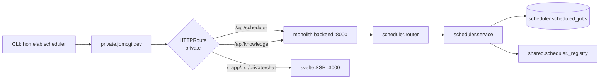

# Scheduler API + CLI + Skill — Design

**Author:** Joe McGinley
**Created:** 2026-04-25
**Branch:** `feat/scheduler-api`
**Related:** [ADR 003 — Spec-First CLI and Skills](../decisions/tooling/003-spec-first-cli-and-skills.md)
(future direction; this PR ships hand-written ahead of that work)

---

## Goal

Expose the existing Postgres-backed scheduler (`projects/monolith/shared/scheduler.py`)
behind the private (`private.jomcgi.dev`) HTTP surface so we can:

- Inspect registered jobs from a workstation without hitting the database.
- Kick a job to run on the next tick without redeploying the monolith.
- Drive both from the homelab CLI (`homelab scheduler …`) and from Claude Code
  via a dedicated skill.

Out of scope: pause/resume, live interval edits, history of past runs,
spec-first codegen (covered by ADR 003).

---

## Surface

### Endpoints (backend)

All routes mounted under the `scheduler` FastAPI tag, prefix `/api/scheduler`.

| Method | Path                                 | Description                                                    | Response model                      |
| ------ | ------------------------------------ | -------------------------------------------------------------- | ----------------------------------- |
| `GET`  | `/api/scheduler/jobs`                | List every row in `scheduler.scheduled_jobs`, sorted by name   | `list[SchedulerJobView]`            |
| `GET`  | `/api/scheduler/jobs/{name}`         | Fetch a single job by primary key                              | `SchedulerJobView` (404 if missing) |
| `POST` | `/api/scheduler/jobs/{name}/run-now` | Set `next_run_at = now()` so the next scheduler tick claims it | `SchedulerJobView` (404 if missing) |

#### View model

```python
class SchedulerJobView(BaseModel):
    name: str
    interval_secs: int
    ttl_secs: int
    next_run_at: datetime
    last_run_at: datetime | None
    last_status: str | None
    has_handler: bool   # True iff the running pod has a handler registered
                        # for this name (false ⇒ orphan row; purge on restart)
```

The lock columns (`locked_by`, `locked_at`) are intentionally **not** exposed
on the wire. They are an implementation detail of `_claim_next_job` and have
no operational value to a CLI consumer; surfacing them would invite tooling
that races against the SKIP LOCKED claim.

`has_handler` is computed from the in-memory `_registry` of the pod that
serves the request. Its value is best-effort across a multi-pod deployment
(any pod with the handler will return `true`); for our single-replica monolith
this is exact.

### CLI commands

A new `tools/cli/scheduler_cmd.py` mirroring `tasks_cmd.py`:

```text
homelab scheduler jobs list [--json]
homelab scheduler jobs get <name> [--json]
homelab scheduler jobs run-now <name> [--json]
```

Default output is a terse one-line-per-job table, matching the existing
`task_line`/`search_line` ergonomic in the rest of the CLI:

```
home.calendar_poll        every 900s   next 14:32  last ok at 14:17
knowledge.gardener        every 600s   next 14:18  last ok at 14:08
knowledge.vault_backup    every 3600s  next 15:08  last error: timeout (last at 14:08)
```

`--json` prints the raw API response for piping.

### Claude skill

A new `.claude/skills/scheduler/SKILL.md` that:

- Triggers on natural-language hints like "did the gardener run", "kick the
  calendar poll", "are any scheduled jobs failing".
- Documents the three CLI commands above with example output.
- **Does not re-explain auth** — the existing knowledge skill establishes
  that `homelab` CLI commands authenticate via Cloudflare Access and prompt
  for a token on first use. The scheduler skill points at the knowledge
  skill for first-time auth setup and otherwise assumes the token is cached.

The skill ships hand-written; ADR 003 will eventually replace it with a
generated version, at which point the hand-written file is deleted.

---

## Architecture

### Code layout

A new top-level `projects/monolith/scheduler/` domain package, mirroring the
shape of `home/`, `chat/`, and `knowledge/`. The shared scheduler primitives
stay where they are (`shared/scheduler.py` — they are imported by every
domain that registers a job). The new package is a thin shell:

```
projects/monolith/scheduler/
├── __init__.py        # register(app) — included from app/main.py
├── router.py          # APIRouter(prefix="/api/scheduler", tags=["scheduler"])
├── views.py           # Pydantic SchedulerJobView (response_model)
├── service.py         # list_jobs / get_job / mark_for_immediate_run
└── tests/
    ├── router_test.py
    └── service_test.py
```

`router.py` is intentionally thin — it just wires HTTP verbs to functions in
`service.py`. The service layer reads/writes via SQLModel sessions (same
pattern as `knowledge/store.py`) and consults the shared `_registry` for
`has_handler`. This split makes the service unit-testable without spinning
up FastAPI.

### Why a new package and not `home/scheduler_router.py`

Three reasons:

1. The scheduler is a _cross-domain_ concern — it runs jobs for `home`,
   `knowledge`, and `chat`. Filing it under `home/` would suggest scope
   it doesn't have.
2. The existing `home/schedule_router.py` is about **calendar** schedules
   (the `/api/home/schedule/today` endpoint). Putting a separate
   _scheduler_ (job runner) under the same prefix would be confusing.
3. The new package gives a clean home for future scheduler endpoints
   (history, alerts) without growing `home/`.

### Routing



### HTTPRoute change

`projects/monolith/chart/templates/httproute-private.yaml` gets a new rule
for `/api/scheduler`, mirroring the existing `/api/knowledge` rule (same
backend service, default timeouts — scheduler endpoints are read-fast,
write-fast, no LLM calls):

```yaml
# Scheduler API — pass through to backend without rewriting
- matches:
    - path:
        type: PathPrefix
        value: /api/scheduler
  backendRefs:
    - name: { { include "monolith.fullname" . } }
      port: { { .Values.service.apiPort | int } }
```

No `cfIngress.private` values change — the new path inherits the same
hostname, gateway, security policy, and CF-Access binding.

### `run-now` semantics

```python
def mark_for_immediate_run(session: Session, name: str) -> ScheduledJob | None:
    job = session.get(ScheduledJob, name)
    if job is None:
        return None
    job.next_run_at = datetime.now(timezone.utc)
    session.add(job)
    session.commit()
    return job
```

Two invariants worth calling out:

- **Concurrency-safe by construction.** The scheduler's `_claim_next_job`
  uses `SELECT ... FOR UPDATE SKIP LOCKED` (`scheduler.py:121-141`). If a
  tick is mid-flight on the same row when `run-now` lands, the UPDATE
  blocks until the tick's transaction commits, then runs against the
  freshly-released row. The endpoint never needs its own lock check.
- **Idempotent.** Calling `run-now` twice in a second is harmless: both
  calls set `next_run_at` to roughly `now()`, and the first scheduler tick
  to claim it advances `next_run_at` to `now() + interval_secs`, dropping
  the second call's effect.

### Lifespan / registration

Add one line to `projects/monolith/app/main.py`:

```python
import scheduler  # alongside existing `import home`, `import chat`, `import knowledge`
…
scheduler.register(app)  # alongside home.register(app), etc.
```

No lifespan changes — the scheduler loop is already started in `main.py`'s
existing `lifespan` context (see `scheduler.py:91`). The new package
contributes only HTTP routes, not background tasks.

---

## Implementation checklist

The PR lands as a single commit per logical layer (separate commits to make
review tractable, all on `feat/scheduler-api`):

### Layer 1 — Backend domain package

- [ ] `projects/monolith/scheduler/__init__.py` with `register(app: FastAPI)`
- [ ] `projects/monolith/scheduler/views.py` with `SchedulerJobView`
- [ ] `projects/monolith/scheduler/service.py` with three functions:
      `list_jobs(session)`, `get_job(session, name)`, `mark_for_immediate_run(session, name)`
- [ ] `projects/monolith/scheduler/router.py` with the three routes,
      `response_model=SchedulerJobView`, and proper 404 raising
- [ ] `projects/monolith/scheduler/BUILD` — `py_library` exposing the package,
      visibility `//projects/monolith:__pkg__`, deps on
      `//projects/monolith/shared:scheduler` and the standard fastapi/sqlmodel pip targets
- [ ] Wire registration into `projects/monolith/app/main.py`
      (alongside `home`/`chat`/`knowledge`)

### Layer 2 — HTTPRoute

- [ ] Add `/api/scheduler` PathPrefix rule to
      `projects/monolith/chart/templates/httproute-private.yaml`
      (mirroring `/api/knowledge`, default timeouts, backend port)
- [ ] Bump `projects/monolith/chart/Chart.yaml` version (`0.53.14` → `0.53.15`)
- [ ] Bump `projects/monolith/deploy/application.yaml` `targetRevision`
      to match (the chart-version-bot also does this, but doing it
      manually keeps the PR self-contained — the bot is idempotent on already-correct values)
- [ ] `helm template monolith projects/monolith/chart/ -f projects/monolith/deploy/values.yaml`
      to verify the rendered HTTPRoute is valid

### Layer 3 — CLI

- [ ] `tools/cli/scheduler_cmd.py` with the three subcommands; lift the
      `_client()` / `_request()` boilerplate from `tasks_cmd.py` for now
      (ADR 003 will deduplicate)
- [ ] `tools/cli/output.py` — add a `scheduler_line(job)` formatter
      mirroring `task_line` shape; keep it next to the others
- [ ] Wire `scheduler_app` into `tools/cli/main.py` via `app.add_typer`
- [ ] Update `tools/cli/BUILD`:
  - Add `scheduler_cmd.py` to the `:cli` `py_library` srcs
  - Add it to the `exports_files` list (used by `homelab_cli_tar`)

### Layer 4 — Tests

Tests run in CI on push (no local test loop):

- [ ] `projects/monolith/scheduler/tests/router_test.py` —
      list/get/run-now happy path + 404s, using the existing FastAPI test
      fixtures
- [ ] `projects/monolith/scheduler/tests/service_test.py` —
      `mark_for_immediate_run` advances `next_run_at`; concurrency assertion
      that a locked row still gets its `next_run_at` updated after the lock
      releases (this is a property of Postgres, not of our code, but worth
      pinning down to catch regressions if we ever change the locking model)
- [ ] `projects/monolith/scheduler/tests/views_test.py` — `SchedulerJobView`
      omits `locked_by`/`locked_at` from `model_dump()`
- [ ] `tools/cli/scheduler_test.py` — golden-output tests for each command
      (mock httpx responses, assert stdout)
- [ ] `tools/cli/BUILD` — register the new `py_test` target

### Layer 5 — Skill

- [ ] `.claude/skills/scheduler/SKILL.md` — frontmatter + body covering:
  - Triggers (natural-language)
  - Commands (with example output)
  - Pointer to the knowledge skill for first-time auth
  - "When to use vs. just look at logs" — short note that `run-now` is
    correct for "I want it to run _now_", but log inspection is better for
    "did it run when it should have"

### Layer 6 — Validation (manual, before merge)

- [ ] Push branch, monitor CI via `/buildbuddy` skill until green
- [ ] After merge: poll ArgoCD until `monolith` shows
      `targetRevision=0.53.15` synced and `Healthy`
- [ ] On the workstation: rebuild the homelab tools image (or wait for
      image-updater) and run:
  - [ ] `homelab scheduler jobs list` — confirm the four registered jobs
        (`home.calendar_poll`, `knowledge.gardener`, …) appear
  - [ ] `homelab scheduler jobs get home.calendar_poll` — confirm shape
  - [ ] `homelab scheduler jobs run-now home.calendar_poll` and watch
        SigNoz logs for the `Scheduler loop` line within ~30s

---

## Risks & open questions

| Risk                                                                                          | Mitigation                                                                                                 |
| --------------------------------------------------------------------------------------------- | ---------------------------------------------------------------------------------------------------------- |
| `has_handler=False` is misleading on a multi-pod deploy because each pod has its own registry | Document on the field; for current single-replica deployment it's exact. ADR 003 codegen-era can revisit   |
| `run-now` against an unknown job silently no-ops if we forget the existence check             | Service layer returns `None` → router raises 404; covered by `router_test.py`                              |
| New `/api/scheduler` prefix accidentally conflicts with a future svelte route                 | Vanishingly low — `/api/*` is reserved for the backend by convention; new routes go through codegen review |
| CLI image bloat from a new command file                                                       | Negligible; the new file is ~80 LOC and shares the existing `httpx`/`typer` deps                           |

### Open questions

1. **Should `run-now` 409 if `last_status` shows the previous run errored?**
   Probably not — the operator may _want_ to retry a failed job manually.
   Default to letting it through; document the behavior. Revisit if it
   bites.
2. **Should the list endpoint paginate?** No. The scheduler has on the
   order of ten jobs; pagination is YAGNI. Add it the day there are 50.
3. **Should we expose a streaming `/api/scheduler/events` for real-time
   tick observability?** No — that's logs/SigNoz territory, not a
   scheduler API responsibility.
