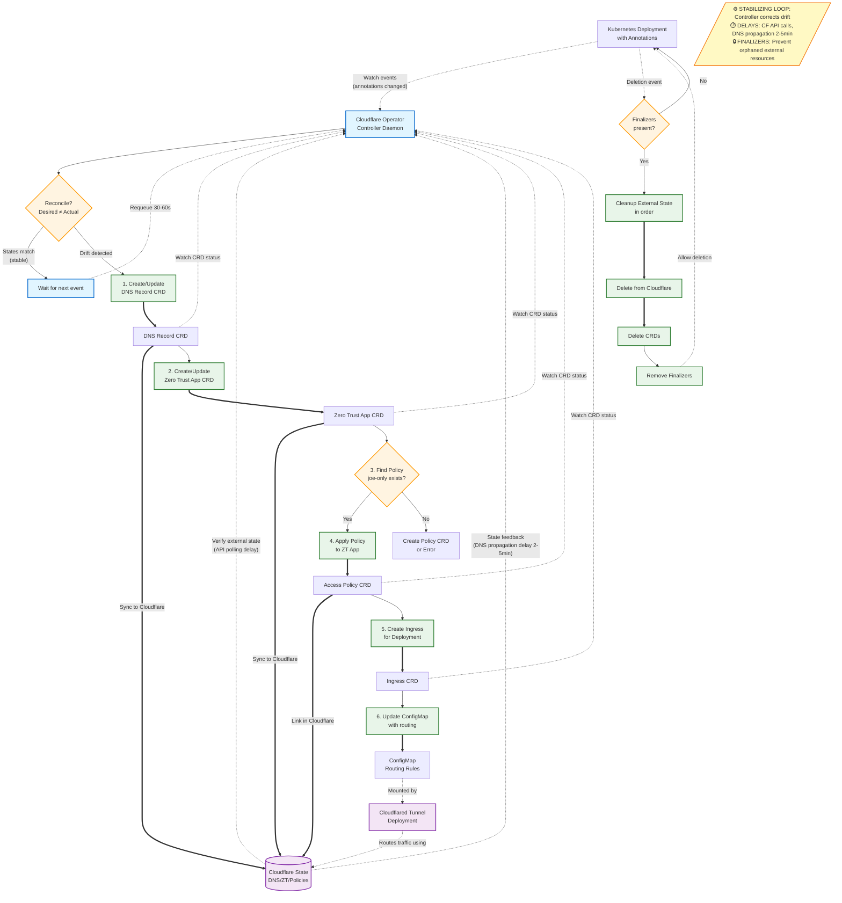

# cloudflare
Manage cluster ingress via annotations using cloudflare tunnels.

## Desired state (WIP)
Example annotations:
```
metadata:
  annotations:
    cloudflare.ingress.hostname: test-ingress.jomcgi.dev
    cloudflare.zero-trust.policy: joe-only
```

Control flow:


## TODO (missing features / tasks to complete)
