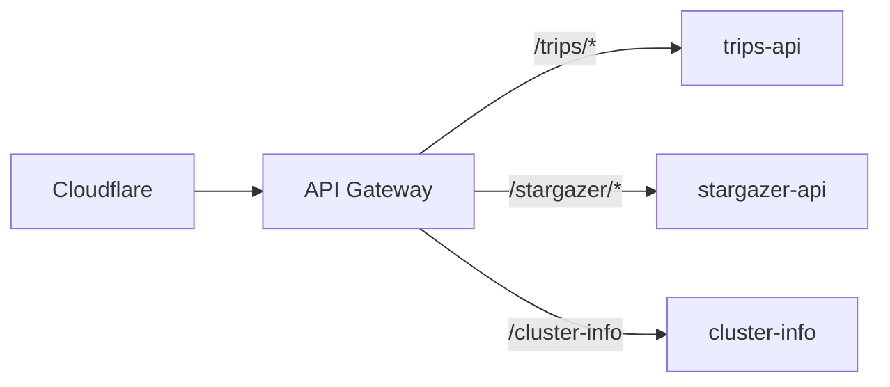

# API Gateway

Nginx-based API gateway with route-based backend selection for api.jomcgi.dev.

## Overview

Lightweight reverse proxy routing requests to backend services based on URL path. Includes a cluster status endpoint with CDN-friendly caching.



## Key Features

- **Path-based routing** - Route to backends by URL prefix
- **Cluster status** - `/cluster-info` endpoint with node/pod health (legacy: `/status.json`)
- **CDN caching** - Stale-while-revalidate for resilience during outages

## Configuration

| Value                      | Description                      | Default |
| -------------------------- | -------------------------------- | ------- |
| `replicaCount`             | Number of nginx replicas         | `1`     |
| `backends.<name>.host`     | Backend service hostname         | -       |
| `backends.<name>.port`     | Backend service port             | -       |
| `clusterInfo.enabled`      | Enable cluster status endpoint   | `true`  |
| `clusterInfo.interval`     | Status update interval (seconds) | `30`    |
| `clusterInfo.cache.maxAge` | CDN fresh cache duration         | `30`    |

## Adding a Backend

Add new backends in your overlay values:

```yaml
backends:
  myservice:
    host: myservice.namespace.svc.cluster.local
    port: 8080
```

Routes are automatically created as `/myservice/*` proxying to the backend.
