# GRIMOIRE

### A self-hosted D&D campaign manager with AI-assisted DMing

---

## Table of Contents

1. [Overview](#overview)
2. [Design Principles](#design-principles)
3. [System Architecture](#system-architecture)
4. [Voice Pipeline](#voice-pipeline)
5. [Data Model](#data-model)
6. [Service Specifications](#service-specifications)
7. [GCP Serverless Services](#gcp-serverless-services)
8. [RAG Pipeline](#rag-pipeline)
9. [Classification System](#classification-system)
10. [UI Specification](#ui-specification)
11. [Kubernetes Deployment](#kubernetes-deployment)
12. [GCP Bootstrap](#gcp-bootstrap)
13. [Security Model](#security-model)
14. [Cost Estimate](#cost-estimate)
15. [Implementation Phases](#implementation-phases)

---

## Overview

Grimoire is a campaign manager for tabletop RPGs — primarily D&D 5e — that combines real-time multiplayer session management with AI-powered voice transcription, rule lookup, and context tracking. The system is designed for a small group of friends (3-6 players + DM) playing regular sessions.

The architecture splits across two environments:

- **Homelab Kubernetes cluster**: Real-time communication, frontend hosting, voice proxy, and the thin API relay. Only credential: a Gemini API key synced from 1Password via External Secrets Operator, consumed server-side by the WebSocket gateway.
- **GCP serverless**: All persistence (Firestore), all intelligence (Gemini), all storage (Cloud Storage). Pay-per-request with no idle cost.

GCP infrastructure is provisioned once via authenticated CLI scripts from the operator's laptop. The homelab cluster syncs a Gemini API key from 1Password via External Secrets Operator, used server-side by the WebSocket gateway — it is never exposed to browsers.

**Reference UI**: `services/grimoire/example-ui.jsx` — interactive React component showing all four views (DM Live, DM Prep, Player Live, Player Character).

---

## Design Principles

**No persistent GCP servers.** Every GCP service bills per-request or per-document. Nothing runs when nobody is playing. Monthly cost target: under $3 for 4 sessions/month.

**No secrets in the browser.** Infrastructure provisioning happens from an authenticated laptop via `gcloud`. The Gemini API key is stored in 1Password and synced to the cluster via External Secrets Operator — consumed only by the WebSocket gateway, never exposed to browsers. All browser traffic is authenticated via Cloudflare Access (SSO).

**Voice is a first-class input.** Players speak naturally. Browser-side Voice Activity Detection (VAD) captures speech segments and streams them to the WebSocket gateway, which proxies audio to Gemini Live for transcription, classification, and tool calls. No separate STT pipeline. Silent audio is never sent, keeping costs low.

**Players never see the machinery.** Classification tags, confidence scores, RAG chunks, token budgets, and context management are DM-only. Players see a clean narrative feed.

**GitOps for cluster resources, scripts for cloud resources.** Homelab workloads deploy via ArgoCD. GCP resources are static infrastructure created once via Makefile.

---

## System Architecture

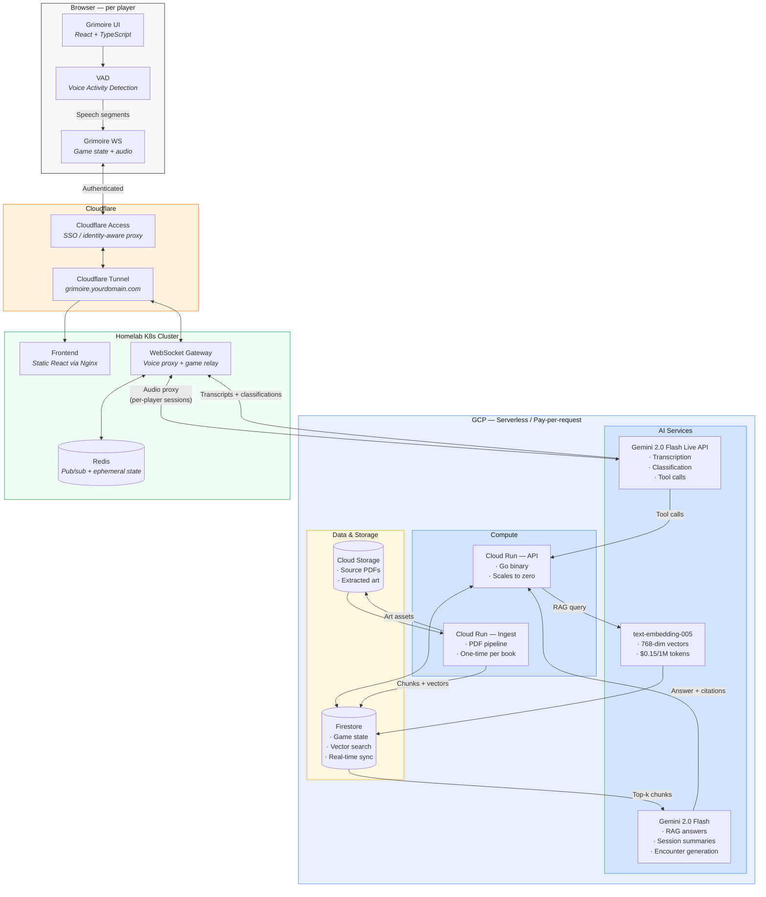

### Data Flow Summary

| Flow               | Path                                                                                         | Latency Target |
| ------------------ | -------------------------------------------------------------------------------------------- | -------------- |
| Voice → transcript | Browser (VAD) → WS Gateway → Gemini Live → WS Gateway → all clients                          | < 800ms        |
| Dice roll          | Browser → WS Gateway → Cloud Run API → Firestore → all clients                               | < 200ms        |
| Rule lookup        | Voice/UI → Cloud Run API → embed → Firestore vector search → Gemini Flash → DM context panel | < 2s           |
| Chat message       | Browser → WS Gateway → Cloud Run API → Firestore → all clients (real-time listener)          | < 300ms        |
| HP update          | DM UI → Cloud Run API → Firestore → all clients                                              | < 200ms        |
| Lore propagation   | Classification → Cloud Run API → Firestore lore collection → player real-time listener       | < 1s           |

---

## Voice Pipeline

Each player's browser captures audio via the Web Audio API with client-side Voice Activity Detection (VAD). When speech is detected, PCM audio segments are streamed over the single WebSocket connection to the homelab gateway. The gateway maintains one Gemini Live session per player and proxies audio server-side — the Gemini API key never leaves the cluster.

### Voice Activity Detection (VAD)

Browser-side VAD ensures silence is never sent to Gemini, which bills at ~25 tokens/second regardless of content. This reduces audio costs by ~70% compared to always-on streaming.

**Implementation:** Use a lightweight VAD library (e.g., `@ricky0123/vad-web` — a Silero VAD ONNX model running in a Web Worker). The browser captures PCM audio at 16kHz 16-bit, VAD segments speech, and only active speech frames are sent to the gateway.

```
Browser mic → Web Audio API → VAD (Silero ONNX) → speech segments → WS Gateway
                                    ↓
                              silence → dropped (no cost)
```

### Data Flow

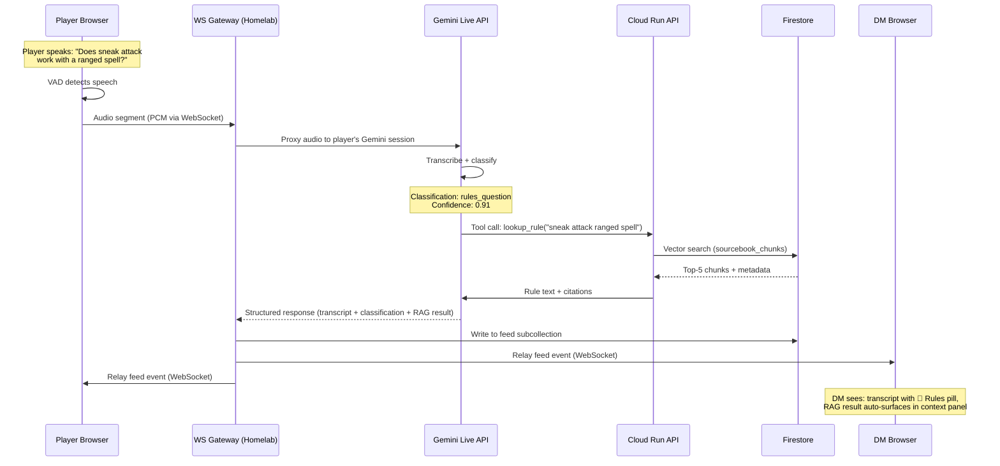

### Gemini Live Session Management

The WebSocket gateway maintains one Gemini Live session per connected player. Each session is initialized with a system prompt:

```
You are a D&D session transcription assistant.

CONTEXT:
- Campaign: {campaign_name}
- Current encounter: {encounter_description}
- Active characters: {character_list}
- DM name: {dm_name}
- Speaker: {player_name} ({character_name})

CLASSIFY every utterance into exactly one category:
- ic_action: In-character action declaration ("I attack the goblin")
- ic_dialogue: In-character speech ("Hail, innkeeper!")
- rules_question: Rules inquiry ("Does that provoke an opportunity attack?")
- dm_narration: DM describing scenes or NPC dialogue
- dm_ruling: DM making a rules call
- table_talk: Out-of-character chatter ("Anyone want pizza?")

TOOLS AVAILABLE:
- lookup_rule(query: string) → Search sourcebooks for rules
- roll_dice(formula: string) → Roll dice (e.g., "2d6+3", "1d20adv")
- update_hp(character: string, delta: int) → Adjust HP

Return structured JSON for each utterance:
{
  "transcript": "...",
  "classification": "ic_action",
  "confidence": 0.94,
  "tool_calls": [...]
}
```

### Session Reconnection

Gemini Live sessions are capped at ~10-15 minutes (audio-only). For a 4-hour D&D session, the gateway must reconnect ~16-24 times per player. The gateway handles this transparently:

1. Gemini sends a "going away" notification before session expiry
2. Gateway opens a new session with the same system prompt + recent context summary
3. Audio from the browser continues uninterrupted — reconnection is invisible to the player
4. A rolling buffer of recent transcripts (~2 minutes) is replayed into the new session for continuity

### Speaker Identification

No diarization needed. Each player has their own Gemini Live session on the gateway, so every audio chunk arrives pre-tagged with user identity. The gateway tags all Gemini responses with the originating player ID.

### Rate Limits

Gemini Live API concurrent session limits by tier:

| Tier       | Concurrent Sessions | Requirement                  |
| ---------- | ------------------- | ---------------------------- |
| Free       | 3                   | None                         |
| **Tier 1** | **~50**             | **Enable billing (instant)** |
| Tier 2     | ~1,000              | $250+ cumulative spend       |

**Grimoire requires Tier 1** (6 concurrent sessions for 5 players + DM). Upgrading is instant — just enable billing on the GCP project. New accounts receive $300 in free credits.

---

## Data Model

All persistent state lives in Firestore. Collections are organized by campaign.

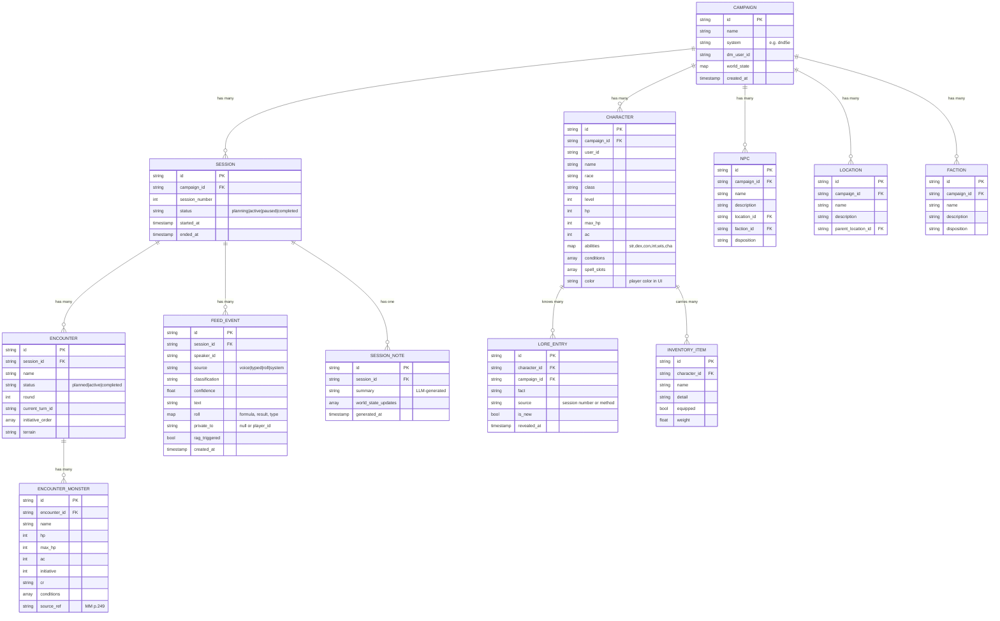

### Session State Machine

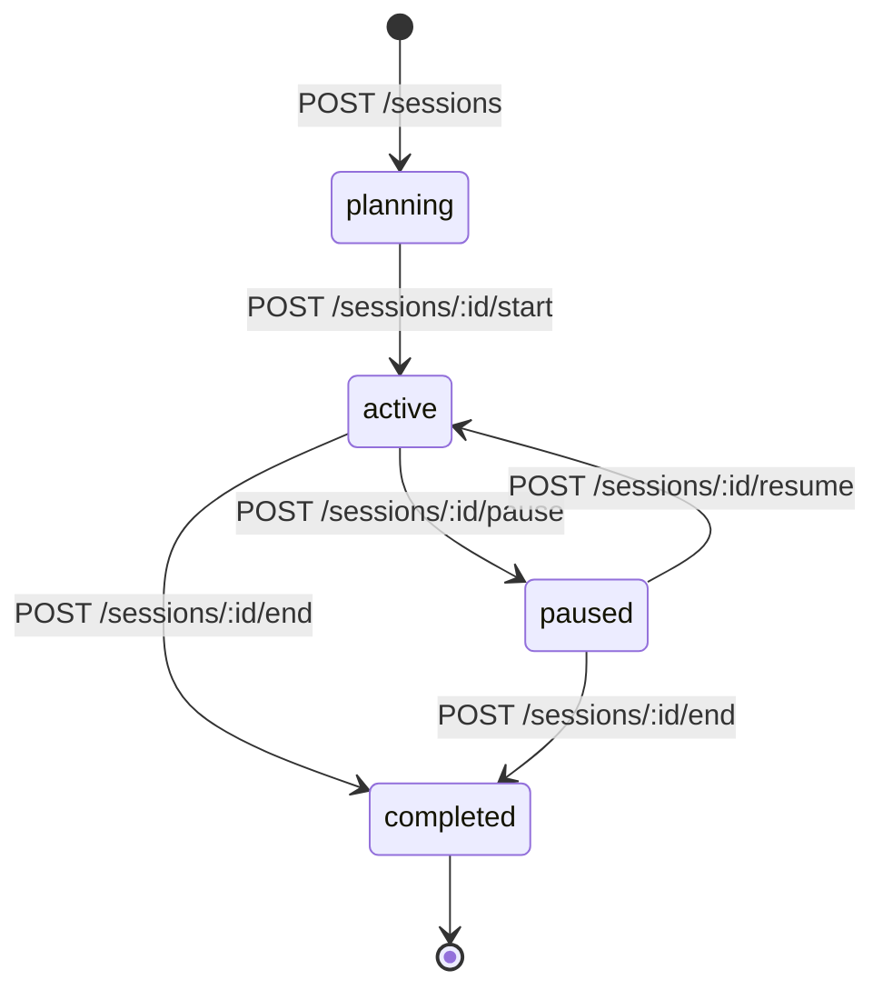

| Transition           | Trigger                         | Side Effects                                                      |
| -------------------- | ------------------------------- | ----------------------------------------------------------------- |
| `→ planning`         | DM creates session              | Session number auto-incremented, encounter slots available        |
| `planning → active`  | DM starts session               | `started_at` set, Gemini Live sessions opened, feed begins        |
| `active → paused`    | DM pauses (break, end of night) | Gemini Live sessions closed, voice bar shows "Paused"             |
| `paused → active`    | DM resumes                      | Gemini Live sessions re-opened, feed resumes                      |
| `active → completed` | DM ends session                 | `ended_at` set, summary generation triggered, world state updated |
| `paused → completed` | DM ends from paused state       | Same as above                                                     |

**Invariants:**

- A campaign can have at most one `active` or `paused` session at a time
- `completed` is terminal — sessions cannot be re-opened (start a new session instead)
- `planning` sessions can be deleted (draft encounters not yet played)
- Feed events can only be written to `active` sessions

### Encounter State Machine

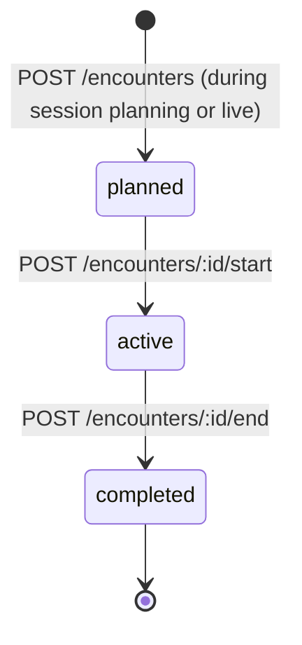

| Transition           | Side Effects                                                    |
| -------------------- | --------------------------------------------------------------- |
| `→ planned`          | Monsters added, initiative not yet rolled                       |
| `planned → active`   | Initiative rolled/entered, round set to 1, turn tracking begins |
| `active → completed` | Final round recorded, XP/loot available for summary             |

**Invariants:**

- A session can have at most one `active` encounter at a time
- Multiple `planned` encounters can exist (DM prep queue)
- `completed` is terminal

### Firestore Collection Structure

```
campaigns/
  {campaign_id}/
    characters/
      {character_id}/
        inventory/
          {item_id}
        lore/
          {lore_id}
    sessions/
      {session_id}/
        feed/
          {event_id}
        encounters/
          {encounter_id}/
            monsters/
              {monster_id}
        notes/
          {note_id}
    npcs/
      {npc_id}
    locations/
      {location_id}
    factions/
      {faction_id}

sourcebook_chunks/
  {chunk_id}
    - text: string
    - embedding: vector(768)
    - source_book: string
    - page: int
    - section: string
    - content_type: "monster" | "spell" | "item" | "rule" | "class" | "race"
    - metadata: map (CR, level, school, etc.)

art_assets/
  {asset_id}
    - gcs_uri: string
    - source_book: string
    - page: int
    - context_tag: string
    - description: string (Gemini Vision generated)
```

### Firestore Vector Index

```
Collection: sourcebook_chunks
Field path: embedding
Dimensions: 768
Distance measure: COSINE
```

Query pattern for RAG:

```go
vectorQuery := client.Collection("sourcebook_chunks").
    FindNearest("embedding", queryVector,
        firestore.DistanceMeasureCosine,
        &firestore.FindNearestOptions{Limit: 5}).
    Where("content_type", "==", "rule").
    Where("source_book", "in", allowedBooks)
```

---

## Service Specifications

### Cloud Run — grimoire-api (Go)

Single Go binary serving HTTP. Scales to zero. Handles all game logic and acts as the bridge between clients and Firestore/Gemini.

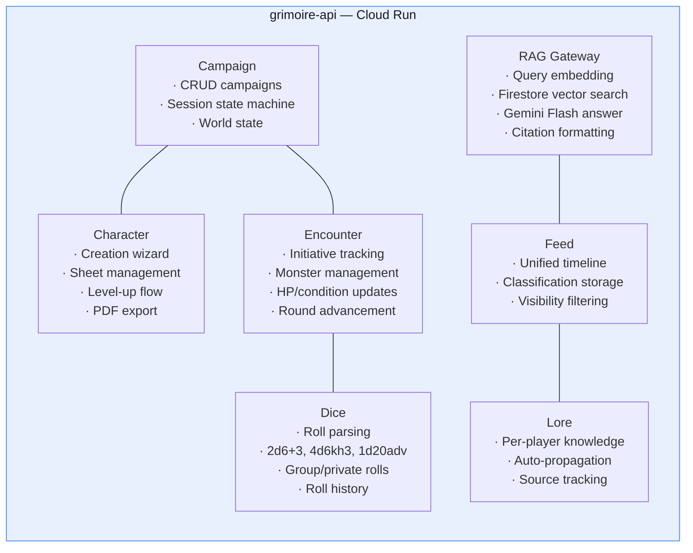

**Runtime requirements:**

- Go 1.22+
- Dependencies: `cloud.google.com/go/firestore`, `github.com/google/generative-ai-go/genai`, `cloud.google.com/go/storage`
- Environment variables: `GCP_PROJECT_ID`, `FIRESTORE_DATABASE`, `CF_ACCESS_TEAM`
- Authentication: Cloud Run service account (Firestore/GCS/Gemini Flash), Cloudflare Access JWT validation
- Memory: 256MB (Cloud Run minimum)
- CPU: 1 vCPU
- Concurrency: 80 (default)
- Min instances: 0 (scale to zero)
- Max instances: 2 (plenty for 5 players)
- Startup time: < 2s (Go cold start)

**API Routes:**

```
# Campaigns
GET    /api/campaigns
POST   /api/campaigns
GET    /api/campaigns/:id
PATCH  /api/campaigns/:id

# Sessions
GET    /api/campaigns/:id/sessions
POST   /api/campaigns/:id/sessions
PATCH  /api/campaigns/:cid/sessions/:sid
POST   /api/campaigns/:cid/sessions/:sid/start
POST   /api/campaigns/:cid/sessions/:sid/pause
POST   /api/campaigns/:cid/sessions/:sid/resume
POST   /api/campaigns/:cid/sessions/:sid/end

# Characters
GET    /api/campaigns/:id/characters
POST   /api/campaigns/:id/characters
GET    /api/characters/:id
PATCH  /api/characters/:id
GET    /api/characters/:id/lore
POST   /api/characters/:id/lore

# Encounters
POST   /api/sessions/:sid/encounters
PATCH  /api/encounters/:id
POST   /api/encounters/:id/next-turn
POST   /api/encounters/:id/end-round
PATCH  /api/encounters/:eid/monsters/:mid

# Dice
POST   /api/roll                    { formula, context, private }
GET    /api/sessions/:sid/rolls

# Feed
GET    /api/sessions/:sid/feed      ?classification=&speaker=&after=
POST   /api/sessions/:sid/feed      (write transcript/chat event)
PATCH  /api/feed/:id/reclassify     { new_classification }

# RAG
POST   /api/rag/query               { query, content_type?, books? }
GET    /api/rag/context/:session_id  (active context chunks)
POST   /api/rag/pin/:chunk_id
DELETE /api/rag/pin/:chunk_id

# Summaries
POST   /api/sessions/:sid/summarize  (end-of-session LLM summary)
```

### Cloud Run — grimoire-ingest (Python)

Runs as a Cloud Run Job (not a service). Triggered manually or via `gcloud` when a new sourcebook is added.

**Pipeline:**

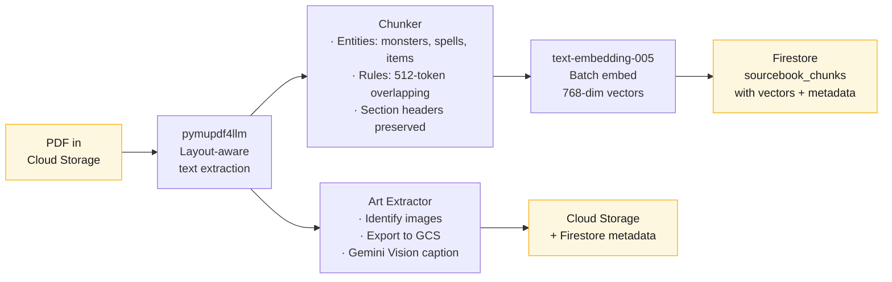

**Runtime requirements:**

- Python 3.12+
- Dependencies: `pymupdf4llm`, `google-cloud-firestore`, `google-cloud-storage`, `google-generativeai`
- Memory: 1GB (PDF processing)
- CPU: 2 vCPU
- Timeout: 15 minutes
- Execution: On-demand job, not always-running

**Chunking strategy by content type:**

| Content Type | Chunking Strategy                | Example                                  |
| ------------ | -------------------------------- | ---------------------------------------- |
| Monster      | One chunk per monster stat block | Owlbear: full stat block as single chunk |
| Spell        | One chunk per spell              | Fireball: description + at higher levels |
| Item         | One chunk per magic item         | Bag of Holding: properties + description |
| Class/Race   | One chunk per feature            | Extra Attack, Sneak Attack, Darkvision   |
| Rule         | 512-token overlapping windows    | Combat rules, spellcasting rules         |

### WebSocket Gateway (Homelab)

Central real-time hub running in the homelab cluster. Serves two roles: (1) game state relay for all clients, and (2) server-side Gemini Live proxy for voice transcription. The Gemini API key lives here — never in the browser.

**Responsibilities:**

- Maintain one Gemini Live WebSocket session per connected player
- Receive VAD-filtered PCM audio from browsers, proxy to Gemini Live
- Relay Gemini transcription/classification results back to all clients
- Handle Gemini Live session reconnection (every ~10-15 min) transparently
- Broadcast game state events (dice rolls, encounters, feed events)
- Track voice/presence status

**Runtime requirements:**

- Go (`nhooyr.io/websocket` for client connections, Gemini Live client for upstream)
- Redis for pub/sub across replicas
- Memory: 256MB (increased for Gemini session buffers)
- CPU: 200m
- Replicas: 1 (sufficient for 5-6 concurrent connections)
- Environment: `GOOGLE_API_KEY` from OnePasswordItem (1Password `grimoire` item)

**Event types (browser ↔ gateway):**

```typescript
type WSEvent =
  | { type: "audio_chunk"; data: ArrayBuffer } // browser → gateway (VAD-filtered PCM)
  | { type: "voice_status"; speaker_id: string; speaking: boolean }
  | { type: "transcript"; event: TranscriptEvent } // gateway → browsers (from Gemini)
  | { type: "feed_event"; event: FeedEvent }
  | { type: "roll_result"; roll: RollResult }
  | { type: "encounter_update"; encounter: Encounter }
  | { type: "dm_correction"; event_id: string; new_classification: string }
  | { type: "presence"; player_id: string; status: "online" | "offline" };
```

### Frontend (React + TypeScript)

Static build served via Nginx pod behind Cloudflare Tunnel.

**Stack:**

- React 18+ with TypeScript
- TanStack Router (file-based routing)
- TanStack Query (server state, Firestore real-time integration)
- Zustand (client state: active filters, UI mode, local preferences)
- Native WebSocket client (connection to gateway for game state + audio)
- `@ricky0123/vad-web` (Silero VAD for browser-side voice activity detection)

**Build:**

- Bazel `rules_js` / `rules_ts` for monorepo integration
- Output: static HTML/JS/CSS bundle
- Deployed as ConfigMap or baked into Nginx container image

---

## GCP Serverless Services

Summary of all GCP services used, their purpose, and pricing. **Requires Tier 1 (pay-as-you-go) for Gemini Live concurrent session limits.**

| Service                           | Purpose                                      | Pricing Model                                                              | Estimated Monthly Cost |
| --------------------------------- | -------------------------------------------- | -------------------------------------------------------------------------- | ---------------------- |
| **Firestore**                     | All game state, vectors, real-time sync      | $0.06/100K reads, $0.18/100K writes, free tier: 50K reads + 20K writes/day | ~$0.05                 |
| **Cloud Run (API)**               | Go API, scales to zero                       | Free tier: 2M requests/month, 360K vCPU-seconds                            | ~$0.00                 |
| **Cloud Run (Ingest)**            | PDF processing jobs                          | Per-job, ~$0.02 per sourcebook                                             | ~$0.03/book            |
| **Cloud Storage**                 | PDFs, extracted art                          | $0.020/GB/month, $0.004/10K operations                                     | ~$0.02                 |
| **Gemini 2.0 Flash Live**         | Voice transcription + classification + tools | $0.70/1M input tokens (audio ~25 tok/s), $0.40/1M output                   | ~$1.68                 |
| **Gemini 2.0 Flash**              | RAG answers, summaries, encounter gen        | $0.10/1M input, $0.40/1M output                                            | ~$0.25                 |
| **text-embedding-005**            | Vector embeddings (768-dim)                  | $0.15/1M tokens                                                            | ~$0.01                 |
| **Firebase Hosting** _(optional)_ | Static frontend alternative to homelab Nginx | Free tier: 10GB transfer/month                                             | $0.00                  |
|                                   |                                              | **Total**                                                                  | **~$2.01/month**       |

Assumes: 4 sessions/month, 4 hours each, 5 participants, ~30% talk time (VAD-filtered), ~50 RAG queries/session. New GCP accounts receive $300 in free credits, covering ~150 months of Grimoire usage.

---

## RAG Pipeline

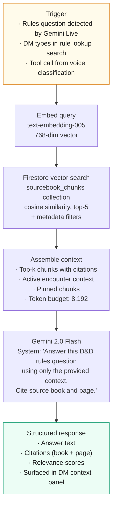

### Metadata Filters

Firestore vector queries support metadata filters to scope results:

| Filter            | Use Case                        | Example                               |
| ----------------- | ------------------------------- | ------------------------------------- |
| `content_type`    | Monster lookup vs rule lookup   | `content_type == "monster"`           |
| `source_book`     | Restrict to allowed sourcebooks | `source_book in ["PHB", "MM", "DMG"]` |
| `page`            | Narrow to specific section      | `page >= 189 AND page <= 211`         |
| `metadata.cr`     | Monster challenge rating        | `metadata.cr == "3"`                  |
| `metadata.level`  | Spell/feature level             | `metadata.level <= 3`                 |
| `metadata.school` | Spell school                    | `metadata.school == "evocation"`      |

### Context Panel (DM-only)

The DM's context panel shows what the LLM is "thinking about" — the active RAG chunks plus any pinned context. Each chunk displays:

- Source citation (book + page)
- Content title
- Relevance score (percentage)
- Pin/drop controls
- "Auto" badge if surfaced by voice classification

Token budget bar shows `{used} / 8,192` tokens. DM can pin critical context to ensure it's always included, or drop irrelevant chunks.

---

## Classification System

Six categories, each with a distinct visual treatment in the DM view.

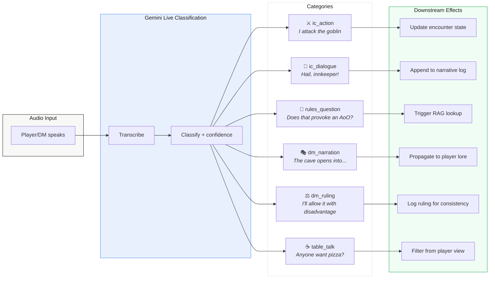

### Classification → Effect Matrix

| Classification   | Icon | Color            | DM View             | Player View    | Auto-Triggers             |
| ---------------- | ---- | ---------------- | ------------------- | -------------- | ------------------------- |
| `ic_action`      | ⚔    | Blue `#2563eb`   | Shown with pill     | Shown, no pill | Encounter state hints     |
| `ic_dialogue`    | 💬   | Purple `#7c3aed` | Shown with pill     | Shown, no pill | Narrative log             |
| `rules_question` | 📖   | Amber `#d97706`  | Shown + left border | Shown, no pill | RAG lookup, context panel |
| `dm_narration`   | 🎭   | Green `#059669`  | Shown with pill     | Shown, no pill | Lore propagation          |
| `dm_ruling`      | ⚖    | Teal `#0891b2`   | Shown with pill     | Shown, no pill | Ruling log                |
| `table_talk`     | ☕   | Grey `#9ca3af`   | Shown (filterable)  | **Hidden**     | None                      |

### Confidence & Reclassification

- Confidence ≥ 85%: classification pill only
- Confidence < 85%: amber "Low conf." warning pill in DM view
- DM can reclassify any event with one click (small icon buttons per feed item)
- Reclassification triggers re-evaluation of downstream effects (e.g., reclassifying table_talk → ic_action surfaces it in player feeds)

### Lore Propagation

When `dm_narration` or `dm_ruling` reveals new information:

1. Gemini extracts the factual content
2. Facts are tagged with which players were present (or whisper target)
3. Written to the character's lore subcollection
4. Player's "Known Lore" sidebar updates in real-time with "New" badge
5. DM can review/edit lore entries before or after propagation

---

## UI Specification

**Reference implementation**: `services/grimoire/example-ui.jsx`

### Design Language

| Token              | Value                                 |
| ------------------ | ------------------------------------- |
| Background         | `#fafaf8` (off-white)                 |
| Card background    | `#fff`                                |
| Muted background   | `#f0efed`                             |
| Foreground         | `#1a1a1a`                             |
| Muted text         | `#666`                                |
| Dim text           | `#999`                                |
| Border             | `#e5e4e2`                             |
| Accent             | `#2563eb` (blue)                      |
| OK                 | `#16a34a` (green)                     |
| Warning            | `#d97706` (amber)                     |
| Error              | `#dc2626` (red)                       |
| Private            | `#9333ea` (purple)                    |
| Prose font         | `Inter`, system-ui, sans-serif        |
| Data font          | ui-monospace, SF Mono, Cascadia Mono  |
| Base font size     | 14px                                  |
| Line height        | 1.55                                  |
| Card border radius | 4px                                   |
| Section headers    | 11px, uppercase, 1.2px letter-spacing |

**Typography rules**: Inter for all prose and UI chrome. Monospace only for: dice formulas, HP/AC values, timestamps, token counts, source citations, roll results.

### Four Views

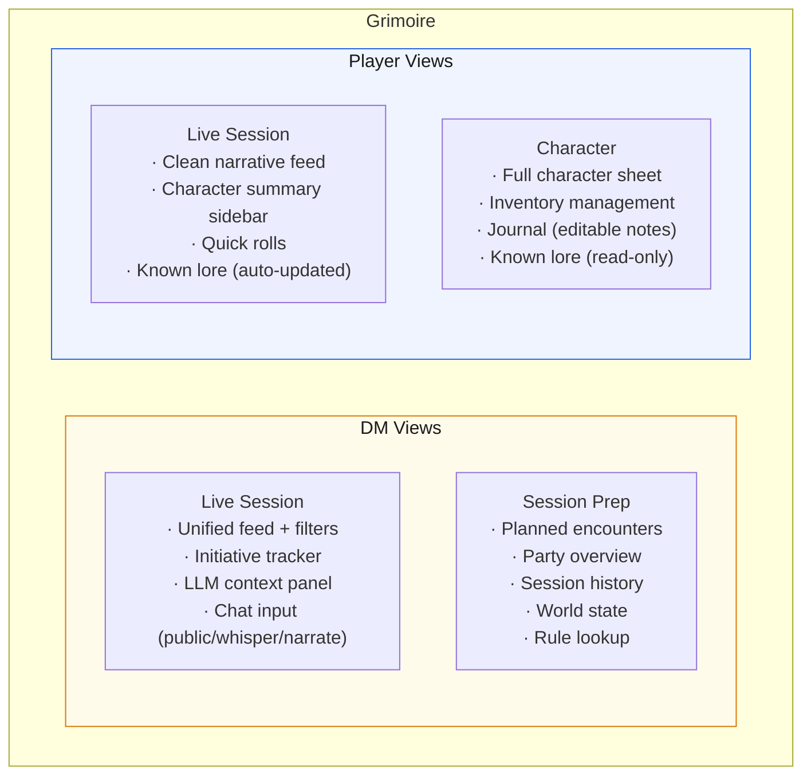

### DM — Live Session Layout

```
┌─────────────────────────────────────────────────┬────────────────────┐
│ Voice Bar: [● Connected] Kael Lyra Theron •Vex  │ Gemini Live ~280ms │
├─────────────────────────────────────────────────┼────────────────────┤
│ Filter: [⚔ Action 3] [💬 Dialogue 2] [📖 Rules │ INITIATIVE  Rd 2   │
│   2] [🎭 Narration 5] [⚖ Ruling 1] [☕ Table 2]│                    │
├─────────────────────────────────────────────────┤ 22  Vex      15/33 │
│                                                 │ 17  Kael     45/52 │
│  DM  19:42  🎙  🎭 Narration                   │ 15  Lyra     28/28 │
│  As you push through the undergrowth, the       │ 14  Gob Boss 11/21 │
│  forest goes quiet...                           │ 12  Theron   38/41 │
│                                                 │  8  Owlbear  42/59 │
│  Vex  19:42  🎙  ⚔ Action                      │  6  Goblin×3  7/7  │
│  I stop and hold up a fist. Perception check.   │                    │
│                                                 │ [Next Turn] [End]  │
│  ┌─ 19:42  Vex  Perception  1d20+3      18 ─┐  ├────────────────────┤
│                                                 │ LLM CONTEXT  Flash │
│  Lyra  19:43  🎙  📖 Rules   ↳ RAG triggered   │ 4,102 / 8,192      │
│  ██ Can I cast Bless before combat?             │                    │
│                                                 │ PHB p.203  Auto    │
│  DM  19:43  🎙  ⚖ Ruling                       │ Concentration      │
│  Vex spotted them, party not surprised.         │ Con save DC 10 or  │
│                                                 │ half damage...     │
│  ┌─────────────────────────────────────────┐    │                    │
│  │ 🟣 Private to vex          DM   19:44  │    │ MM p.249  📌       │
│  │ He's calling reinforcements. 2 rounds.  │    │ Owlbear            │
│  └─────────────────────────────────────────┘    │ Multiattack: beak  │
│                                                 │ + claws. Keen...   │
│ ┌─────────────────────────────────────────────┐ │                    │
│ │ [Public ▾] Message the table...             │ │ [Ask a rule...]    │
│ └─────────────────────────────────────────────┘ └────────────────────┘
```

### Player — Live Session Layout

```
┌─────────────────────────────────────────────────┬────────────────────┐
│ Voice Bar: [● Connected] Kael Lyra Theron •Vex  │ Gemini Live ~280ms │
├─────────────────────────────────────────────────┼────────────────────┤
│                                                 │ VEX  Rogue 5  AC15 │
│  DM  19:42                                      │ ████████░░░  19/33 │
│  As you push through the undergrowth, the       │ ⚠ Poisoned         │
│  forest goes quiet...                           │ STR DEX CON INT WIS│
│                                                 │  +0  +4  +1  +2  +0│
│  Vex  19:42                                     ├────────────────────┤
│  I stop and hold up a fist. Perception check.   │ QUICK ROLLS        │
│                                                 │ Shortsword   1d20+7│
│  ┌─ 19:42  Vex  Perception  1d20+3      18 ─┐  │ Damage        1d6+4│
│                                                 │ Sneak Attack    3d6│
│  DM  19:42                                      │ Stealth     1d20+10│
│  You spot movement in the canopy — a massive    │ Perception   1d20+3│
│  shape on a thick branch. Below, goblins.       │ [Custom: 2d6+3   ] │
│                                                 ├────────────────────┤
│  ┌─────────────────────────────────────────┐    │ KNOWN LORE         │
│  │ 🟣 From DM — Private          19:44    │    │                    │
│  │ You understand Goblin — he's calling    │    │ 🆕 Goblin boss     │
│  │ for reinforcements. Two rounds.         │    │ called for cave    │
│  └─────────────────────────────────────────┘    │ reinforcements.    │
│                                                 │ src: Overheard S4  │
│  DM  19:45                                      │                    │
│  First swing goes wide. The second catches it.  │ Cragmaw goblins    │
│  It screams.                                    │ serve 'Black Spider│
│                                                 │ src: Goblin prisoner│
│ ┌─────────────────────────────────────────────┐ │                    │
│ │ [Public ▾] Message the table...             │ └────────────────────┘
│ └─────────────────────────────────────────────┘
```

**Key difference**: Player feed has no classification pills, no confidence scores, no reclassification buttons. Table talk is filtered out. Private messages only show those addressed to this player.

---

## Kubernetes Deployment

The homelab runs a minimal footprint: static frontend, WebSocket gateway, and Redis. Follows the existing repo conventions — service code in `services/`, Helm chart in `charts/`, ArgoCD overlay in `overlays/dev/`.

```
# Service code
services/grimoire/
├── architecture.md                      # This document
├── example-ui.jsx                       # Reference UI mockup (all 4 views)
├── frontend/                            # React app
│   ├── BUILD
│   ├── src/
│   ├── package.json
│   └── tsconfig.json
├── ws-gateway/                          # Go WS relay + Gemini Live proxy
│   ├── BUILD
│   ├── main.go
│   └── go.mod
├── api/                                 # Go Cloud Run API
│   ├── BUILD
│   ├── main.go
│   └── go.mod
└── ingest/                              # Python PDF pipeline (Cloud Run job)
    ├── BUILD
    ├── main.py
    └── requirements.txt

# Helm chart
charts/grimoire/
├── BUILD
├── Chart.yaml
├── values.yaml
├── templates/
│   ├── _helpers.tpl
│   ├── frontend-deployment.yaml         # Nginx serving React build
│   ├── frontend-service.yaml
│   ├── ws-gateway-deployment.yaml       # Go WS relay + Gemini proxy
│   ├── ws-gateway-service.yaml
│   ├── redis-deployment.yaml            # Single replica, ephemeral
│   ├── redis-service.yaml
│   ├── externalsecret.yaml              # 1Password → gemini-api-key
│   └── tunnel.yaml                      # Cloudflare Tunnel CRD
└── tests/

# ArgoCD overlay
overlays/dev/grimoire/
├── BUILD
├── application.yaml                     # ArgoCD Application → charts/grimoire
├── kustomization.yaml                   # resources: [application.yaml]
└── values.yaml                          # Dev-specific Helm value overrides

# GCP bootstrap (outside K8s)
services/grimoire/gcp/
└── Makefile                             # GCP project + Cloud Run setup
```

**Conventions followed:**

- Images: `ghcr.io/jomcgi/homelab/projects/grimoire/frontend`, `ghcr.io/jomcgi/homelab/projects/grimoire/ws-gateway`
- ArgoCD Application points to `charts/grimoire` with value layering: chart defaults + `overlays/dev/grimoire/values.yaml`
- Bazel `py3_image` / `go_image` for container builds, `helm_chart` for chart packaging
- `argocd_app` BUILD rule in overlay for template rendering/testing

### Resource Requirements

| Workload          | CPU Request | Memory Request | Replicas | Node Affinity |
| ----------------- | ----------- | -------------- | -------- | ------------- |
| Frontend (Nginx)  | 50m         | 64Mi           | 1        | Any           |
| WS Gateway        | 200m        | 256Mi          | 1        | Any           |
| Redis             | 100m        | 128Mi          | 1        | Any           |
| **Total homelab** | **350m**    | **448Mi**      |          |               |

### Ingress & Authentication

All browser traffic routes through **Cloudflare Access** (SSO) before reaching the cluster. No anonymous access to any Grimoire endpoint.

**Cloudflare Access policy:**

- Application: `grimoire.yourdomain.com`
- Policy: Allow — email list (your D&D group) or identity provider (Google, GitHub, etc.)
- Session duration: 24 hours (covers a full session without re-auth)

Players authenticate once via Cloudflare's login page. The `Cf-Access-Jwt-Assertion` header is forwarded to the cluster, and the WebSocket gateway validates it to identify the player.

**Cloudflare Tunnel** via your custom operator:

```yaml
apiVersion: cloudflare.jomcgi.dev/v1alpha1
kind: Tunnel
metadata:
  name: grimoire
  namespace: grimoire
spec:
  hostname: grimoire.yourdomain.com
  service:
    name: frontend
    port: 80
  paths:
    - path: /ws
      service:
        name: ws-gateway
        port: 8080
```

All Cloud Run API calls go direct from the browser (CORS configured on Cloud Run, restricted to `grimoire.yourdomain.com` origin). The tunnel serves the frontend and WebSocket gateway. Cloud Run endpoints validate requests using the Cloudflare Access JWT or a shared origin token.

---

## GCP Bootstrap

One-time setup from your laptop using `gcloud` auth. No GCP credentials stored in the cluster.

### Prerequisites

- `gcloud` CLI installed and authenticated (`gcloud auth login`)
- A GCP billing account linked
- 1Password Connect Server deployed in cluster (via External Secrets Operator)

### Makefile

```makefile
PROJECT_ID    := grimoire-prod
REGION        := us-west1
FIRESTORE_DB  := grimoire
GCS_BUCKET    := grimoire-sourcebooks
API_IMAGE     := gcr.io/$(PROJECT_ID)/grimoire-api
INGEST_IMAGE  := gcr.io/$(PROJECT_ID)/grimoire-ingest

# ──────────────────────────────────────────────
# Bootstrap — run once
# ──────────────────────────────────────────────

.PHONY: setup
setup: setup-project setup-apis setup-firestore setup-storage setup-artifact-registry
	@echo ""
	@echo "✅ GCP infrastructure ready."
	@echo "Next steps:"
	@echo "  1. Create Gemini API key: https://aistudio.google.com/apikey"
	@echo "  2. Store Gemini API key in 1Password (vault: Homelab, item: grimoire-gemini-api-key)"
	@echo "  3. Deploy API: make deploy-api"
	@echo "  4. Ingest a sourcebook: make ingest PDF=gs://$(GCS_BUCKET)/phb.pdf"

setup-project:
	gcloud projects create $(PROJECT_ID) --name="Grimoire" 2>/dev/null || true
	gcloud config set project $(PROJECT_ID)
	@echo "⚠️  Link a billing account if not already done:"
	@echo "   https://console.cloud.google.com/billing/linkedaccount?project=$(PROJECT_ID)"

setup-apis:
	gcloud services enable \
		firestore.googleapis.com \
		run.googleapis.com \
		storage.googleapis.com \
		artifactregistry.googleapis.com \
		generativelanguage.googleapis.com \
		aiplatform.googleapis.com

setup-firestore:
	gcloud firestore databases create \
		--database=$(FIRESTORE_DB) \
		--location=$(REGION) \
		--type=firestore-native 2>/dev/null || true
	@echo "📦 Firestore database '$(FIRESTORE_DB)' ready in $(REGION)"
	@echo "⚠️  Create vector index manually in console or via gcloud alpha:"
	@echo "   Collection: sourcebook_chunks"
	@echo "   Field: embedding, Dimensions: 768, Distance: COSINE"

setup-storage:
	gcloud storage buckets create gs://$(GCS_BUCKET) \
		--location=$(REGION) \
		--uniform-bucket-level-access 2>/dev/null || true
	@echo "📦 Cloud Storage bucket '$(GCS_BUCKET)' ready"

setup-artifact-registry:
	gcloud artifacts repositories create grimoire \
		--repository-format=docker \
		--location=$(REGION) 2>/dev/null || true
	@echo "📦 Artifact Registry 'grimoire' ready"

# ──────────────────────────────────────────────
# Secrets — managed by 1Password + External Secrets Operator
# ──────────────────────────────────────────────
# The Gemini API key is stored in 1Password and synced to the cluster
# automatically by the External Secrets Operator. No manual secret
# creation needed — just store the key in 1Password:
#
#   Vault: Homelab
#   Item:  grimoire-gemini-api-key
#   Field: key
#
# The ExternalSecret resource (k8s/base/secrets/gemini-api-key.yaml)
# references this 1Password item and creates the K8s secret.

# ──────────────────────────────────────────────
# Deploy — push containers + update Cloud Run
# ──────────────────────────────────────────────

build-api:
	docker build -t $(API_IMAGE):latest apps/api/
	docker push $(API_IMAGE):latest

build-ingest:
	docker build -t $(INGEST_IMAGE):latest apps/ingest/
	docker push $(INGEST_IMAGE):latest

deploy-api: build-api
	gcloud run deploy grimoire-api \
		--image=$(API_IMAGE):latest \
		--region=$(REGION) \
		--platform=managed \
		--allow-unauthenticated \
		--set-env-vars="GCP_PROJECT_ID=$(PROJECT_ID),FIRESTORE_DATABASE=$(FIRESTORE_DB),CF_ACCESS_TEAM=your-team.cloudflareaccess.com" \
		--set-secrets="GOOGLE_API_KEY=google-api-key:latest" \
		--min-instances=0 \
		--max-instances=2 \
		--memory=256Mi \
		--cpu=1 \
		--concurrency=80
	@echo "🚀 API deployed to Cloud Run"
	@echo "   Note: Cloud Run uses GOOGLE_API_KEY for Gemini Flash (RAG) + embeddings"
	@echo "   The homelab WS Gateway uses a separate secret synced from 1Password"

# ──────────────────────────────────────────────
# Ingest — process a sourcebook PDF
# ──────────────────────────────────────────────

upload-pdf:
	@test -n "$(FILE)" || (echo "Usage: make upload-pdf FILE=./phb.pdf" && exit 1)
	gcloud storage cp $(FILE) gs://$(GCS_BUCKET)/

ingest:
	@test -n "$(PDF)" || (echo "Usage: make ingest PDF=gs://$(GCS_BUCKET)/phb.pdf" && exit 1)
	gcloud run jobs execute grimoire-ingest \
		--region=$(REGION) \
		--set-env-vars="PDF_URI=$(PDF),GCP_PROJECT_ID=$(PROJECT_ID),FIRESTORE_DATABASE=$(FIRESTORE_DB)" \
		--wait

# ──────────────────────────────────────────────
# Teardown — remove everything
# ──────────────────────────────────────────────

teardown:
	@echo "⚠️  This will delete all Grimoire GCP resources. Ctrl+C to cancel."
	@sleep 5
	gcloud run services delete grimoire-api --region=$(REGION) --quiet || true
	gcloud run jobs delete grimoire-ingest --region=$(REGION) --quiet || true
	gcloud storage rm -r gs://$(GCS_BUCKET) || true
	gcloud firestore databases delete --database=$(FIRESTORE_DB) --quiet || true
	gcloud artifacts repositories delete grimoire --location=$(REGION) --quiet || true
	@echo "🗑️  GCP resources deleted. Project $(PROJECT_ID) still exists."
```

### Workflow

```
1.  gcloud auth login                    ← authenticate on your laptop
2.  make setup                           ← creates GCP project, Firestore, GCS, etc.
3.  Create Gemini API key in browser     ← https://aistudio.google.com/apikey
4.  Store Gemini API key in 1Password    ← ESO syncs it to cluster automatically
5.  git add . && git push                ← ArgoCD syncs cluster workloads
6.  make deploy-api                      ← builds + deploys Cloud Run API
7.  make upload-pdf FILE=./phb.pdf       ← upload sourcebook
8.  make ingest PDF=gs://grimoire-sourcebooks/phb.pdf  ← process it
```

After initial setup, the only commands you run regularly are `make deploy-api` when you update the Go code, and `make ingest` when you add a new sourcebook.

---

## Security Model

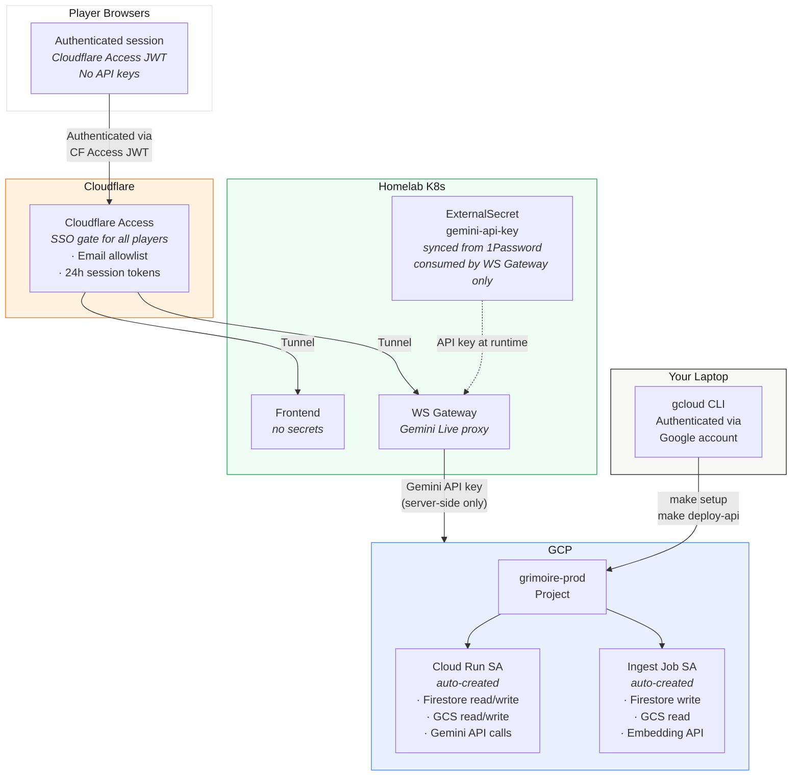

### Authentication Flow

1. Player navigates to `grimoire.yourdomain.com`
2. Cloudflare Access intercepts — player authenticates via SSO (Google, GitHub, or email OTP)
3. Cloudflare issues a signed JWT (`Cf-Access-Jwt-Assertion`) valid for 24 hours
4. All subsequent requests (HTTP and WebSocket) carry this JWT
5. WS Gateway validates the JWT against Cloudflare's public keys to identify the player
6. Cloud Run API validates the JWT or a shared origin token for direct browser requests

### Credential Inventory

| Credential                 | Stored Where                                    | Access                                                                       |
| -------------------------- | ----------------------------------------------- | ---------------------------------------------------------------------------- |
| Google account (yours)     | Your laptop                                     | `gcloud auth` — provisions infrastructure, deploys Cloud Run                 |
| Cloud Run service account  | GCP-managed                                     | Auto-created, accesses Firestore/GCS. Never leaves GCP.                      |
| Gemini API key (Cloud Run) | GCP Secret Manager → Cloud Run env var          | Used by Cloud Run API for Gemini Flash (RAG) + embeddings. Never leaves GCP. |
| Gemini API key (cluster)   | 1Password → ExternalSecret → WS Gateway env var | Used by WS Gateway for Gemini Live sessions. **Never exposed to browsers.**  |
| Cloudflare Tunnel token    | Cluster secret (existing infra)                 | Routes traffic to grimoire.yourdomain.com                                    |
| Cloudflare Access JWT      | Player's browser (cookie)                       | Signed by Cloudflare, validated by WS Gateway. Identifies player.            |

### What the browsers do NOT have

- No Gemini API key
- No GCP credentials of any kind
- No direct access to Firestore or Cloud Storage
- No ability to bypass Cloudflare Access

### What the homelab cluster does NOT have

- No GCP service account keys
- No `roles/owner` credentials
- No Firestore admin access
- No ability to provision or delete GCP resources

---

## Cost Estimate

**Tier 1 (pay-as-you-go) required** for Gemini Live concurrent sessions. Enable billing on the GCP project — instant upgrade, no approval.

### Per-Session Breakdown (4 hours, 5 players + DM, VAD-filtered)

| Cost Item                  | Calculation                                                              | Cost       |
| -------------------------- | ------------------------------------------------------------------------ | ---------- |
| Voice input (audio)        | 6 participants × 30% talk time × 4 hrs × 3600 s/hr × 25 tok/s × $0.70/1M | ~$0.45     |
| Voice output (transcripts) | ~120K response tokens × $0.40/1M                                         | ~$0.05     |
| RAG queries (50/session)   | 50 × embed + vector search + Flash answer                                | ~$0.05     |
| Feed writes                | ~2,000 events × $0.18/100K                                               | ~$0.004    |
| Feed reads                 | ~10,000 reads × $0.06/100K                                               | ~$0.006    |
| **Per-session total**      |                                                                          | **~$0.50** |

### Monthly (4 sessions)

| Category                      | Cost                             |
| ----------------------------- | -------------------------------- |
| Voice (Gemini 2.0 Flash Live) | ~$2.00                           |
| Inference (Gemini Flash)      | ~$0.25                           |
| Persistence (Firestore)       | ~$0.05                           |
| Storage (Cloud Storage)       | ~$0.02                           |
| Embedding                     | ~$0.01                           |
| Cloud Run compute             | ~$0.00 (free tier)               |
| Cloudflare Access             | ~$0.00 (free for up to 50 users) |
| **Monthly total**             | **~$2.33**                       |

### VAD Impact on Cost

Browser-side Voice Activity Detection is critical for cost control:

| Scenario                          | Audio tokens/session        | Voice cost/month |
| --------------------------------- | --------------------------- | ---------------- |
| **Always-on streaming** (no VAD)  | 6 × 4hr × 25 tok/s = 2.16M  | ~$6.05           |
| **VAD-filtered** (~30% talk time) | 6 × 1.2hr × 25 tok/s = 648K | ~$2.00           |
| **Push-to-talk** (~15% active)    | 6 × 0.6hr × 25 tok/s = 324K | ~$1.00           |

VAD saves ~$4/month vs. always-on. Push-to-talk saves another ~$1 but adds friction.

### One-Time Costs

| Item                                | Cost   |
| ----------------------------------- | ------ |
| Sourcebook PDF ingestion (per book) | ~$0.03 |
| Firestore vector index creation     | Free   |

### Free Credits

New GCP accounts receive **$300 in free credits**. At ~$2.33/month, this covers **~128 months** (~10 years) of Grimoire usage before any real charges apply.

---

## Implementation Phases

### Phase 1 — Playable Foundation

Get a working session running: characters, dice, chat, basic encounter management.

**GCP:**

- [ ] `make setup` (Firestore, Cloud Storage, Cloud Run)
- [ ] Deploy grimoire-api with Campaign, Character, Dice, Feed, and Encounter services
- [ ] Store Gemini API key in 1Password (ESO syncs to cluster)
- [ ] Configure Cloudflare Access application + email allowlist

**Homelab — scaffolded in this PR:**

- [x] Helm chart (`charts/grimoire/`) — frontend, ws-gateway, redis, ExternalSecret, Tunnel
- [x] ArgoCD overlay (`overlays/dev/grimoire/`) — application.yaml, kustomization.yaml, values.yaml
- [x] Go Cloud Run API (`services/grimoire/api/`) — all CRUD routes, session/encounter state machines, Firestore handlers, CF Access JWT middleware
- [x] Go WebSocket gateway (`services/grimoire/ws-gateway/`) — connection hub, Redis pub/sub, CF Access auth, event relay, Phase 3 audio stub
- [x] React frontend (`services/grimoire/frontend/`) — all 4 views (DM Live, DM Prep, Player Live, Player Character), design system, shared components, WebSocket client, TanStack Query hooks
- [x] GCP bootstrap Makefile (`services/grimoire/gcp/`)

**Remaining for Phase 1 (future PRs):**

- [ ] Wire frontend API calls to live Cloud Run endpoint (currently uses mock data)
- [ ] End-to-end WebSocket integration (frontend ↔ gateway ↔ Firestore)
- [ ] Dice rolling with Firestore persistence and real-time broadcast
- [ ] Initiative tracker with live encounter state sync
- [ ] Chat input writing to feed subcollection via API
- [ ] Deploy to cluster and validate with ArgoCD sync
- [ ] Bazel build validation (`bazel build //services/grimoire/...`, `bazel build //charts/grimoire/...`)

**Milestone:** DM can create a campaign, add characters, run an encounter with initiative tracking, dice rolling, and chat. Players can join, see the feed, roll dice, and chat.

### Phase 2 — Intelligence Layer

Add sourcebook ingestion, RAG, and rule lookup.

- [ ] PDF ingestion pipeline (Cloud Run job)
- [ ] Firestore vector index on sourcebook_chunks
- [ ] RAG query flow: embed → search → Flash → citation
- [ ] DM context panel showing active RAG chunks with pin/drop
- [ ] Rule lookup search bar in DM Prep view
- [ ] Encounter generation from sourcebook content

**Milestone:** DM can ingest the PHB/MM/DMG, search rules with citations, and get AI-generated encounter suggestions.

### Phase 3 — Voice Pipeline

Add voice capture, server-side Gemini Live proxy, and classification.

- [ ] Browser VAD integration (`@ricky0123/vad-web` / Silero ONNX)
- [ ] WebSocket gateway Gemini Live proxy (per-player sessions, server-side API key)
- [ ] Gemini Live session reconnection handler (transparent ~10-15 min rollovers)
- [ ] Classification system with six categories
- [ ] Voice bar with speaking indicators
- [ ] Unified feed with classification pills + filter bar
- [ ] Auto-RAG triggering from rules questions
- [ ] DM reclassification controls
- [ ] Tool calls: lookup_rule, roll_dice, update_hp

**Milestone:** Players speak naturally, VAD filters silence, audio is proxied server-side to Gemini Live, transcripts appear in the feed with classifications. Rules questions auto-trigger lookups. DM can filter and reclassify. No API keys exposed to browsers.

### Phase 4 — Context & Lore

Automate knowledge tracking and session continuity.

- [ ] Lore service with per-player knowledge
- [ ] Auto-propagation from dm_narration classification
- [ ] End-of-session summary generation (Gemini Flash)
- [ ] World state auto-updates
- [ ] Player journal (editable notes per session)
- [ ] Cross-session search via embedded session content
- [ ] DM Prep view: session history, world state, party overview

**Milestone:** After each session, Grimoire auto-generates a summary, updates world state, and propagates new lore to each player's journal.

### Phase 5 — Polish

- [ ] Art extraction from sourcebook PDFs + gallery
- [ ] Scene display with extracted art in player view
- [ ] Character creation wizard with sourcebook integration
- [ ] Character PDF export
- [ ] Mobile-responsive player view
- [ ] Session recording + replay

### Future

- [ ] Image generation (Imagen / Flux API) for scene backgrounds
- [ ] Character portrait compositing
- [ ] Battle maps with fog of war
- [ ] Multi-campaign support with campaign switching
