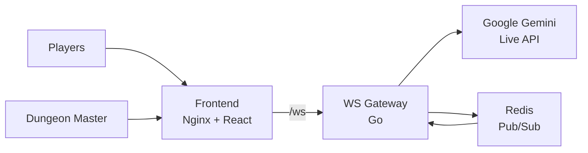

# Grimoire

Self-hosted D&D campaign manager with AI-assisted DMing via Google Gemini.

## Overview

A real-time tabletop RPG companion that connects players and a dungeon master through WebSockets, with AI assistance powered by Google Gemini Live. The frontend serves a React-based UI while the WebSocket gateway handles game state relay and AI interactions through Redis pub/sub.

## Architecture

The deployment consists of three components:

- **Frontend** - Nginx serving a static React build at port 8080. Runs as non-root (uid 65532) with a read-only root filesystem.
- **WebSocket Gateway** - Go service that proxies Gemini Live API connections and relays game events between players via Redis pub/sub. Authenticated with Cloudflare Access.
- **Redis** - Ephemeral in-memory store for pub/sub messaging and session state. Password-protected, accessible only from the WS gateway via NetworkPolicy.

Traffic is routed through Cloudflare Tunnel: static assets go to the frontend, `/ws` paths go to the WebSocket gateway.

## Key Features

- **AI-assisted DMing** - Real-time integration with Google Gemini Live for narrative generation
- **WebSocket multiplayer** - Players and DM connect via persistent WebSocket connections
- **Redis pub/sub relay** - Low-latency game event broadcasting between participants
- **NetworkPolicy isolation** - Redis locked down to accept connections only from the WS gateway
- **Cloudflare Access auth** - WebSocket gateway protected by Zero Trust team authentication
- **1Password secrets** - Google API key and Redis password managed via OnePasswordItem

## Configuration

| Value                                 | Description                               | Default                                             |
| ------------------------------------- | ----------------------------------------- | --------------------------------------------------- |
| `frontend.replicaCount`               | Number of frontend replicas               | `1`                                                 |
| `frontend.image.repository`           | Frontend container image                  | `ghcr.io/jomcgi/homelab/projects/grimoire/frontend` |
| `wsGateway.replicaCount`              | Number of WebSocket gateway replicas      | `1`                                                 |
| `wsGateway.cfAccessTeam`              | Cloudflare Access team name               | `""`                                                |
| `redis.image.tag`                     | Redis image tag                           | `7-alpine`                                          |
| `grimoireSecret.onepassword.itemPath` | 1Password item for API keys and passwords | `vaults/k8s-homelab/items/grimoire`                 |
| `networkPolicy.enabled`               | Enable Redis NetworkPolicy                | `true`                                              |
| `tunnel.enabled`                      | Enable Cloudflare Tunnel routing          | `false`                                             |
| `tunnel.hostname`                     | Public hostname for the tunnel            | `grimoire.jomcgi.dev`                               |

## Usage

Grimoire provides a collaborative D&D session interface. Players join a shared session through the web UI, where the dungeon master can run campaigns with AI-powered narrative assistance from Google Gemini. Game events (dice rolls, character actions, story beats) are broadcast in real time to all connected participants via WebSocket.
