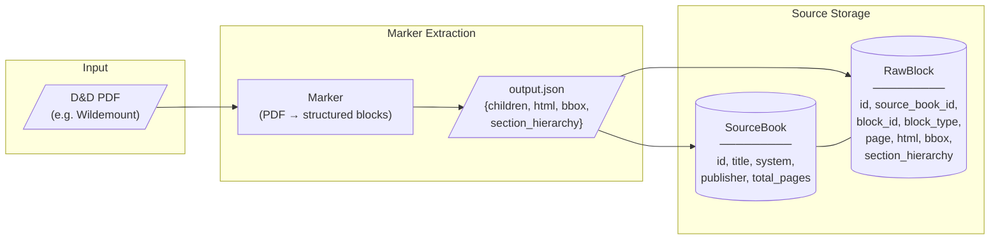
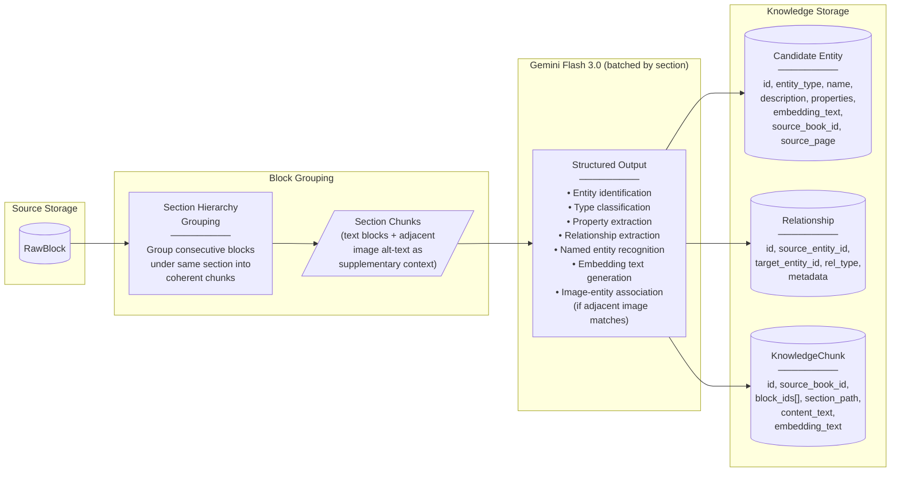
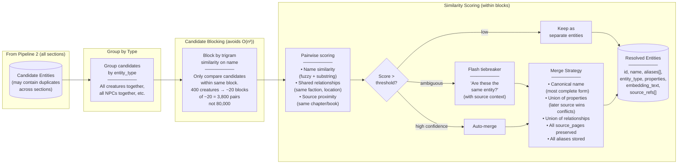
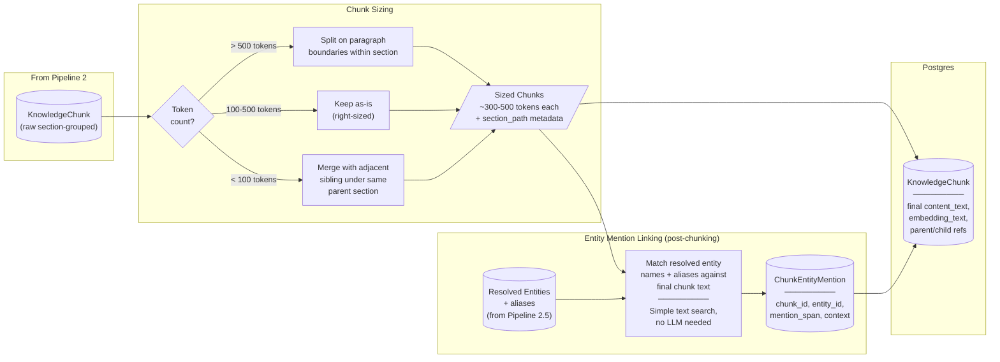
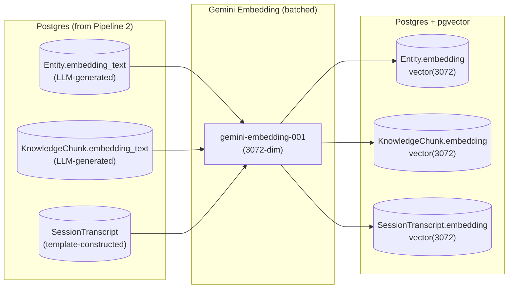
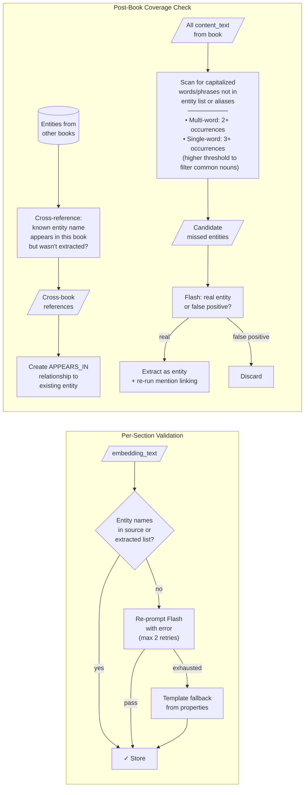
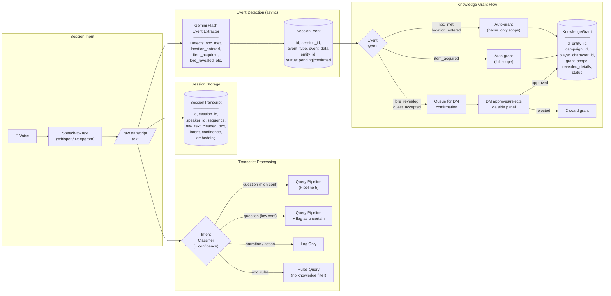
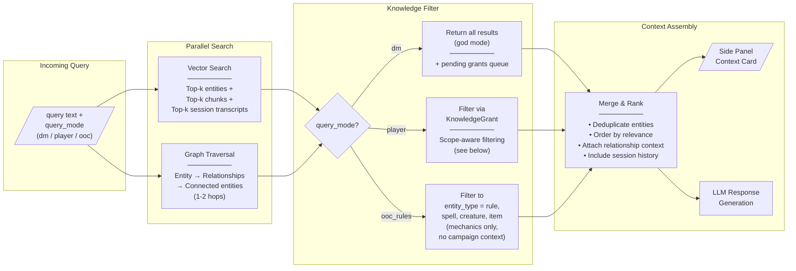
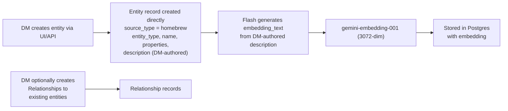

# Grimoire - Data Architecture

## Design Decisions

- **No spaCy NER, no heuristic classifier** - fine-tuning NER needs 2-5K labeled spans and still won't generalize to homebrew. Heuristics are premature before we've seen enough extraction variety. Gemini Flash across 1000s of pages costs cents. Send all section-grouped chunks to Flash for entity identification, structured extraction, and relationship extraction in a single pass. Heuristics can be derived later from Flash output patterns if needed for optimization.
- **Polymorphic Entity table** with `properties` jsonb - D&D entity types have wildly different schemas. One table with typed properties is simpler than 15 join tables.
- **KnowledgeGrant** gates player visibility - entities exist globally, surfaced only when granted.
- **Embeddings on both Entity and SessionTranscript** - search sourcebook knowledge and session history with the same vector query.
- **Single datastore: Postgres + pgvector** - graph queries are 1-2 hop JOINs on the Relationship table, no need for Neo4j. Local Postgres for dev, managed later if needed.
- **Gemini embedding model** (`gemini-embedding-001`, 3072-dim) for all embeddings - storage is negligible at our scale so maximize retrieval quality. ~4.8GB total with HNSW index for 100 books.
- **Chunking**: split on `h3`/subsection boundaries from section_hierarchy. Oversized chunks (>500 tokens) split on paragraph boundaries. Undersized (<100 tokens) merged with adjacent sibling. Section path kept as metadata, prepended at query time not embedding time.
- **Images as ambient context, not extraction targets** - adjacent images (via Marker alt-text) are included in the Flash prompt as supplementary context, same framing as section path. Flash can associate an image with an entity it's already identified from text, but must never create an entity from an image alone. Alt-text only for now (keeps prompts small, text-in text-out, easy to validate). Upgrade to multimodal later if alt-text loses critical info (maps are the likely candidate).
- **LLM-generated embedding text** - Flash produces `embedding_text` during extraction rather than template concatenation. Richer, more natural descriptions. Validated against source text (named entity + factual claim checks, 2 retries, template fallback). Raw `content_text` kept for display/citation.
- **Homebrew content path** - DM-created entities (custom NPCs, locations, items) skip the full extraction pipeline. They enter directly as `Entity` records with `source_type: "homebrew"`, get embedded via Pipeline 3, and are immediately grantable. No validation needed since the DM is the source of truth.

---

## Pipeline 1: PDF Ingestion



---

## Pipeline 2: Entity Extraction



---

## Pipeline 2.5: Entity Resolution

An NPC introduced in Chapter 2 and referenced in Chapter 7 produces two extraction attempts. "King Dwendal", "Bertrand Dwendal", and "the King" may all refer to the same entity. Pipeline 2 extracts per-section so it has no cross-section awareness. This pass merges duplicates.



**Merge strategy details:**

- **Canonical name**: most complete form wins ("Bertrand Dwendal" over "King Dwendal" over "the King")
- **Aliases**: all name variants stored in `aliases[]` on the entity (used for mention detection later)
- **Properties**: union, with later/more-specific source winning conflicts (e.g., stat block overrides brief mention)
- **Relationships**: union of all relationships from all mentions
- **Embedding text**: regenerated after merge from the combined information (one more Flash call per merged entity)
- **Cross-book resolution**: same process runs across books after each new book is ingested. Entity from Monster Manual should merge with same entity in Wildemount if properties + name overlap.
- **Homebrew entities are never merge candidates.** A DM-created "Essek" must not auto-merge with the canonical Essek from Wildemount. Entity resolution filters on `source_type: "extracted"` only. DMs link homebrew to sourcebook entities intentionally via Relationships, not by accident via merge.

**Cross-book ordering dependency:**

Cross-book reference detection runs on the newly ingested book against all existing entities. This means references are only detected _toward_ existing entities, not _from_ them. If Wildemount is ingested first and Monster Manual second, the MM scan catches references to Wildemount entities, but Wildemount won't retroactively detect references to MM entities that didn't exist at ingestion time.

This is acceptable for batch ingestion (DM loads 5 books at once, order doesn't matter much) and for incremental additions (new book references existing entities). To get full bidirectional coverage, you'd re-run the cross-reference scan on all books whenever a new book is added — correct but expensive. Defer this until it's a real problem; for now, document the limitation.

**What this doesn't catch (and that's OK for now):**

- Pronoun-only references ("the King" mid-paragraph with no prior name) - these are handled at the embedding_text level (Flash resolves pronouns during extraction)
- Entities that appear in narrative but are never named - these aren't extractable regardless
- Retroactive cross-book references from previously ingested books (see above)

---

## Pipeline 2.75: Chunking



**Why mentions come AFTER chunking:** Pipeline 2 originally produced ChunkEntityMentions, but chunking (split/merge) invalidates those chunk IDs and span offsets. Generating mentions post-chunking against resolved entities (with aliases) is both simpler and more accurate.

---

## Pipeline 3: Embedding Generation

All vectors stored in Postgres via pgvector. 3072-dim for maximum retrieval quality - storage is negligible at our scale (~400K vectors = ~4.8GB with index).

Entity and chunk `embedding_text` is **generated by Gemini Flash during Pipeline 2** rather than template-concatenated. This produces much richer embedding inputs because Flash can resolve pronouns, add contextual framing, clean OCR artifacts, and emphasize what makes each entity distinctive - all while reading the actual source text (low hallucination risk).

We keep both fields: `content_text` (raw source, for display/citation) and `embedding_text` (LLM-generated, for search only).



---

### Embedding Text Generation (Pipeline 2 prompt instructions)

The extraction prompt instructs Flash to produce `embedding_text` for each entity and chunk. The text should read like a **natural language description** someone would use to find the thing. This is what gets embedded - NOT raw stats, HTML, or metadata.

#### Prompt guidance for Flash (included in extraction prompt)

For each entity, generate an `embedding_text` field that:

1. **Leads with identity** - name, type, classification
2. **Describes in natural language** - what it is, what it does, what makes it distinctive
3. **Includes relational context** - where it's found, who it's connected to, what faction it belongs to
4. **Resolves pronouns** - never use "he", "it", "the city" without the name; embedding text must stand alone
5. **Omits raw numbers** - no stat dumps (AC, HP, ability scores). Describe _what they mean_ instead ("heavily armored", "extremely resilient", "exceptionally intelligent")
6. **Omits metadata** - no page numbers, source book IDs, block references

For each chunk, generate an `embedding_text` field that:

1. **Prepends section context** - `[Book > Chapter > Section > Subsection]`
2. **Resolves ambiguous references** - "the war" → "the war between the Kryn Dynasty and Dwendalian Empire"
3. **Preserves factual content** - do not embellish or add information not present in the source
4. **Cleans extraction artifacts** - fix OCR errors, broken sentences from column splits, HTML remnants

#### Example Flash output

```json
{
  "entities": [
    {
      "name": "Aeorian Absorber",
      "entity_type": "creature",
      "properties": {
        "size": "Large",
        "creature_type": "monstrosity",
        "armor_class": 15,
        "hit_points": 136,
        "challenge_rating": 10
      },
      "embedding_text": "Aeorian Absorber. Large monstrosity from the ancient ruins of Aeor beneath Eiselcross. Challenge rating 10. A predatory creature with innate magic resistance that pounces on prey and absorbs magical energy, making it particularly dangerous to spellcasters. Immune to radiant and necrotic damage. Lurks in the frozen ruins of the fallen flying city of Aeor."
    }
  ],
  "chunks": [
    {
      "section_path": "Explorer's Guide to Wildemount > Story of Wildemount > History > The Calamity",
      "content_text": "The explosions of artillery and the pounding of boots...",
      "embedding_text": "[Explorer's Guide to Wildemount > Story of Wildemount > History > The Calamity] The Calamity shattered civilizations across Exandria when the Betrayer Gods escaped their prisons and waged war against the Prime Deities. The resulting conflict devastated the continent of Wildemount, leveling cities and reshaping the landscape. Soldiers, commoners, and monsters alike were displaced by the upheaval, creating dangers that persist to this day."
    }
  ],
  "relationships": [
    {
      "source": "Aeorian Absorber",
      "target": "Aeor",
      "rel_type": "FOUND_IN"
    }
  ]
}
```

#### Image Handling in Extraction Prompt

Adjacent images from the Marker output are included in the prompt payload as supplementary context - same status as section path, not as primary content. The prompt frames them explicitly:

```
## Adjacent Images (may or may not relate to this section)
- [image_block_id: /page/24/Picture/3] "A circular pendant with a bronze frame, three stylized eyes..."
- [image_block_id: /page/24/Picture/5] "A dark circular symbol with a raven silhouette..."
```

Prompt constraints for image handling:

1. **Images can enrich, never create** - if Flash is extracting the Raven Queen and sees a raven symbol in adjacent images, it can note the association (e.g., add `image_block_id` to the entity output). But an orphaned image with no corresponding text entity gets skipped.
2. **No entity creation from images alone** - decorative art, chapter headers, and full-page illustrations that Marker extracted as standalone blocks must not generate entities.
3. **Alt-text only** - image bytes are not sent. Marker's generated alt-text descriptions are sufficient for D&D content (symbols, creature appearances, location illustrations). Maps may eventually need multimodal, but start text-only.

Entity output with image association:

```json
{
  "name": "The Raven Queen",
  "entity_type": "deity",
  "properties": { ... },
  "associated_images": ["/page/24/Picture/5"],
  "embedding_text": "The Raven Queen..."
}
```

#### Embedding Text Validation

The `embedding_text` must be grounded in the source `content_text`. Three categories of error, each with a different detection strategy:

**1. Hallucinated additions** (embedding text contains entities/facts not in source)

- **Detection**: check that every entity name in `embedding_text` appears in either the source `content_text`, the `section_path`, or the list of already-extracted entities from this section. This is a string match against the entity name list (from Pipeline 2 output), NOT a proper noun extractor (which would be noisy and require another model).
- **On failure**: re-prompt Flash with the specific error. Retry up to 2 times. Fall back to template construction from `properties` if exhausted.

**2. Misattribution** (correct entity name, wrong properties assigned)

- **Detection**: hard to catch automatically. Mitigated by prompt design (Flash reads source text directly) and by keeping `content_text` for display so users can verify.
- **Accepted risk**: this is rare when Flash is summarizing text it's literally reading. Not worth a second validation LLM call.

**3. Omissions** (entity present in source text but never extracted)

- **Detection**: post-extraction coverage check. After all sections of a book are processed, scan all `content_text` for capitalized phrases not in the entity list or aliases. Multi-word phrases flagged at 2+ occurrences, single-word at 3+ (higher threshold to filter common nouns). Flag these as candidate missed entities.
- **On failure**: batch the candidates and send to Flash: "These names appear repeatedly in the source but were not extracted. For each, determine if it's an entity worth extracting or a false positive (e.g., a common phrase, a generic title)."



#### SessionTranscript embedding (template-constructed, not LLM-generated)

Session transcripts are embedded at recording time (Pipeline 4) so they can't go through a batch LLM pass. These use a simple template:

```
[Session {n}, {speaker_name} ({role})]: {cleaned_text}
```

This is the one place we still use template construction. The speaker/role prefix gives context so DM narration and player dialogue embed differently.

#### What goes in `embedding_text` vs what stays in `properties`

|              | `embedding_text` (semantic search)              | `properties` jsonb (SQL filters)            |
| ------------ | ----------------------------------------------- | ------------------------------------------- |
| **Creature** | Name, type, description, key abilities, habitat | AC, HP, exact ability scores, CR number, XP |
| **Spell**    | Name, school, effect description, class list    | Level number, exact range, exact components |
| **Location** | Name, type, atmosphere, notable features        | Population number, exact coordinates        |
| **NPC**      | Name, role, personality, faction context        | Alignment code, exact race                  |
| **Item**     | Name, type, effect description, lore            | Rarity enum, attunement bool, weight        |

**Rule of thumb**: if someone would **describe** it in a natural language query, it goes in `embedding_text`. If someone would **filter** by it in a dropdown, it stays in `properties`.

---

## Pipeline 4: Live Session



**Intent classification failure modes:**

The danger is asymmetric: a false positive (narration routed as question) wastes a cheap vector search. A false negative (question routed as narration) means the player misses context. So **bias toward triggering search**:

- Low-confidence classifications default to "question" (better to search unnecessarily than miss)
- "I remember hearing about a temple to the east" — this is narration that _implies_ a knowledge check. The classifier should still trigger search if it detects entity references, regardless of intent label.
- `confidence` stored on `SessionTranscript` for debugging — if a session produces consistently wrong routing, tune the classifier threshold.
- **Everything gets logged regardless of intent** — the transcript is always recorded, intent only affects whether search is triggered.

**KnowledgeGrant auto-grant risk:**

Automatic grants from event detection risk revealing information the DM didn't intend to share. Tiered approach:

| Event Type         | Auto-grant?          | Scope       | Rationale                                      |
| ------------------ | -------------------- | ----------- | ---------------------------------------------- |
| `npc_met`          | Yes                  | `name_only` | Low risk - PCs obviously know they met someone |
| `location_entered` | Yes                  | `name_only` | Low risk - PCs know where they are             |
| `item_acquired`    | Yes                  | `full`      | PCs literally have the item, can inspect it    |
| `lore_revealed`    | **No - DM confirms** | varies      | High risk - DM controls what lore is shared    |
| `quest_accepted`   | **No - DM confirms** | varies      | May contain spoilers about quest details       |
| `death`            | Yes                  | `full`      | Observable event                               |
| `combat_start`     | Yes                  | `name_only` | PCs can see what they're fighting              |

DM reviews pending grants via the side panel between or during sessions. Pending grants are visible to DM but not surfaced to player queries until confirmed.

---

## Pipeline 5: Query & Context Assembly



**Player-mode query filtering with partial KnowledgeGrants:**

When a player query hits an entity, the response is shaped by `grant_scope`:

| `grant_scope` | What the player query returns                                                                                                                                                                                                                                          | Example                                                                                                                            |
| ------------- | ---------------------------------------------------------------------------------------------------------------------------------------------------------------------------------------------------------------------------------------------------------------------- | ---------------------------------------------------------------------------------------------------------------------------------- |
| `full`        | Full `embedding_text` + all `properties`                                                                                                                                                                                                                               | PC has the item, can inspect everything                                                                                            |
| `partial`     | Entity name + type + only the text in `revealed_details`                                                                                                                                                                                                               | PC heard the dragon's name and that it breathes fire, but doesn't know its CR or lair                                              |
| `name_only`   | **Recognition only, not retrieval.** Entity appears in relationship context ("you're currently in Zadash", "you met Essek") but is excluded from direct query results. A player searching "tell me about Zadash" with `name_only` gets no result — not a useless stub. | PC entered Zadash but hasn't explored it. The system acknowledges they know the name but doesn't pretend to have content for them. |
| No grant      | Entity is **excluded from results entirely**                                                                                                                                                                                                                           | PC has never encountered this entity                                                                                               |

For graph traversal results: a 1-hop query from a granted entity may reach entities the player has NO grant for. These are excluded from the player response but logged in `QueryLog.graph_results` so the DM can see what the player _almost_ found (useful for pacing reveals).

For chunks: `KnowledgeChunk` results are filtered by the **grant ratio** of their mentioned entities (via `ChunkEntityMention`):

| Grant ratio  | Behavior                                                   | Rationale                                                                                                                                   |
| ------------ | ---------------------------------------------------------- | ------------------------------------------------------------------------------------------------------------------------------------------- |
| 100% granted | Return chunk fully                                         | Safe, all entities known                                                                                                                    |
| >50% granted | Return chunk, flag ungranted entity names for LLM to avoid | Acceptable risk, mostly known context                                                                                                       |
| ≤50% granted | **Drop chunk entirely**                                    | Too much ungranted content to safely redact - asking the LLM to surgically avoid multiple entities is brittle and risks accidental spoilers |

**First-mention override:** even if the grant ratio is >50%, drop the chunk if its _first-mentioned entity_ is ungranted. First-mention position is a reasonable proxy for "subject of this chunk." Example: "The Bright Queen rules the Kryn Dynasty from Rosohna, where Essek serves as shadowhand." Player has grants for Kryn Dynasty and Rosohna but not the Bright Queen — ratio is 67% (above threshold), but the Bright Queen is the subject. Return this and the LLM will struggle to avoid her. Drop it.

Dropped chunks aren't lost - they'll surface once more grants are issued.

---

## Pipeline 6: Homebrew Content

DM-created content (custom NPCs, locations, items, plot hooks) bypasses the extraction pipeline entirely. The DM is the source of truth — no validation needed.



Homebrew entities:

- Are immediately available for vector search and graph traversal
- Can be granted to players like any extracted entity
- Can have relationships to extracted entities ("my custom NPC is MEMBER_OF Cobalt Soul")
- Have `source_type: "homebrew"` so they can be distinguished from sourcebook content
- Are scoped to a campaign (not global) unless the DM explicitly shares across campaigns

---

## Data Schema Reference

### Core Tables

| Table                  | Key Fields                                                                                                         | Notes                                                                                                                             |
| ---------------------- | ------------------------------------------------------------------------------------------------------------------ | --------------------------------------------------------------------------------------------------------------------------------- |
| **SourceBook**         | `id, title, system, publisher, total_pages`                                                                        | One per PDF                                                                                                                       |
| **RawBlock**           | `id, source_book_id, block_id, block_type, page, html, bbox, section_hierarchy`                                    | Verbatim from Marker output                                                                                                       |
| **Entity**             | `id, entity_type, name, aliases[], description, properties, embedding_text, source_type, source_refs[], embedding` | `source_type`: "extracted" or "homebrew". `aliases` from entity resolution. `source_refs` = [{book_id, page}] (null for homebrew) |
| **Relationship**       | `id, source_entity_id, target_entity_id, rel_type, metadata, source_book_id`                                       | Graph edges. `source_book_id` nullable for DM-created relationships (homebrew-to-extracted or homebrew-to-homebrew).              |
| **KnowledgeChunk**     | `id, source_book_id, block_ids[], section_path, content_text, embedding_text, embedding`                           | `content_text` is raw source for display, `embedding_text` is LLM-generated for search                                            |
| **ChunkEntityMention** | `id, chunk_id, entity_id, mention_span, context`                                                                   | Links chunks to entities they reference                                                                                           |

### Campaign & Session Tables

| Table                 | Key Fields                                                                                                 | Notes                                                                 |
| --------------------- | ---------------------------------------------------------------------------------------------------------- | --------------------------------------------------------------------- |
| **Campaign**          | `id, name, system, setting, source_book_ids, homebrew_rules`                                               | Top-level container                                                   |
| **Player**            | `id, campaign_id, name, role`                                                                              | DM or Player                                                          |
| **PlayerCharacter**   | `id, player_id, campaign_id, character_name, race, class, level, stats`                                    |                                                                       |
| **Session**           | `id, campaign_id, session_number, session_date, summary`                                                   | One per game session                                                  |
| **SessionTranscript** | `id, session_id, speaker_id, sequence, raw_text, cleaned_text, intent, confidence, embedding`              | `confidence` on intent classification for debugging                   |
| **SessionEvent**      | `id, session_id, event_type, event_data, entity_id, status`                                                | `status`: pending (awaiting DM confirm) or confirmed                  |
| **KnowledgeGrant**    | `id, entity_id, campaign_id, player_character_id, grant_scope, revealed_details, session_event_id, status` | `status`: pending or confirmed. `grant_scope`: full/partial/name_only |
| **QueryLog**          | `id, session_id, player_id, query_text, query_mode, vector_results, graph_results, surfaced_context`       | Audit trail                                                           |

### Entity Types & Their Properties (jsonb)

<details>
<summary>Creature</summary>

```json
{
  "size": "Large",
  "creature_type": "monstrosity",
  "alignment": "unaligned",
  "armor_class": 15,
  "ac_source": "natural armor",
  "hit_points": 136,
  "hp_formula": "16d10 + 48",
  "speed": { "walk": 40, "fly": 0, "swim": 0 },
  "ability_scores": {
    "STR": 18,
    "DEX": 14,
    "CON": 16,
    "INT": 3,
    "WIS": 12,
    "CHA": 7
  },
  "saving_throws": { "DEX": "+5", "CON": "+6" },
  "damage_immunities": ["radiant", "necrotic"],
  "senses": { "darkvision": 120, "passive_perception": 16 },
  "challenge_rating": 10,
  "xp": 5900,
  "traits": [{ "name": "Magic Resistance", "description": "..." }],
  "actions": [{ "name": "Bite", "attack_bonus": 7, "damage": "2d6+4 piercing" }]
}
```

</details>

<details>
<summary>Spell</summary>

```json
{
  "level": 8,
  "school": "conjuration",
  "casting_time": "1 action",
  "range": "60 feet",
  "components": { "V": true, "S": true, "M": "a crystal prism" },
  "duration": "Concentration, up to 1 minute",
  "concentration": true,
  "ritual": false,
  "effect_text": "You shatter the barriers between realities...",
  "class_lists": ["wizard"]
}
```

</details>

<details>
<summary>Location</summary>

```json
{
  "location_type": "city",
  "population": 89000,
  "government": "Starosta appointed by King Dwendal",
  "demographics": "predominantly human",
  "economy": "trade hub, mining"
}
```

</details>

<details>
<summary>Deity</summary>

```json
{
  "alignment": "CG",
  "province": "Change, freedom, luck",
  "suggested_domains": ["Nature", "Trickery"],
  "symbol": "Woman's profile embossed on a gold coin",
  "pantheon": "Prime Deities"
}
```

</details>

<details>
<summary>NPC / Faction / Item</summary>

```json
// NPC
{"role": "ruler", "alignment": "LN", "race": "human", "occupation": "king"}

// Faction
{"faction_type": "government", "alignment": "LN", "goals": "...", "influence_level": "continental"}

// Item
{"item_type": "wondrous", "rarity": "rare", "requires_attunement": true, "effect_text": "..."}
```

</details>

---

## Relationship Types

| rel_type       | Source → Target                | Example                                                         |
| -------------- | ------------------------------ | --------------------------------------------------------------- |
| `LOCATED_IN`   | NPC, Creature, Item → Location | Ferol → Salsvault                                               |
| `CONTAINS`     | Location → Location            | Wildemount → Zadash                                             |
| `MEMBER_OF`    | NPC → Faction                  | Essek → Kryn Dynasty                                            |
| `CONTROLS`     | Faction → Location             | Dwendalian Empire → Zadash                                      |
| `WORSHIPS`     | NPC, Faction → Deity           | Cobalt Soul → Ioun                                              |
| `HOSTILE_TO`   | Faction ↔ Faction              | Kryn Dynasty ↔ Dwendalian Empire                                |
| `ALLIED_WITH`  | Faction ↔ Faction              | symmetric                                                       |
| `AVAILABLE_TO` | Spell → Class                  | Reality Break → Wizard                                          |
| `FOUND_IN`     | Item, Creature → Location      | Aeorian Absorber → Aeorian ruins                                |
| `DROPS`        | Creature → Item                | loot tables                                                     |
| `CREATED_BY`   | Item → NPC, Deity              | Luxon Beacons → Luxon                                           |
| `RULES`        | NPC → Location, Faction        | King Dwendal → Empire                                           |
| `GUARDS`       | Creature, NPC → Location       | encounter placement                                             |
| `APPEARS_IN`   | Entity → SourceBook            | Cross-book reference: entity from one book mentioned in another |
| `RELATED_TO`   | any → any                      | catch-all for LLM-detected relationships                        |
