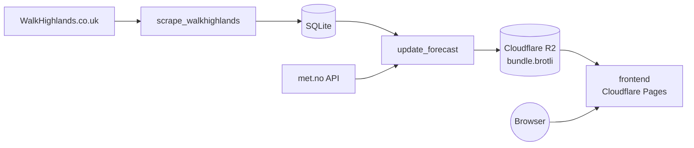

# Hikes

Scraper for Scottish hiking data from WalkHighlands.co.uk, with a browser-based frontend for finding routes with good weather conditions.

## Overview

Three components for collecting, enriching, and displaying hiking route data:

| Component                | Description                                                              |
| ------------------------ | ------------------------------------------------------------------------ |
| **scrape_walkhighlands** | Scrapes route metadata and walk details from WalkHighlands.co.uk         |
| **update_forecast**      | Enriches routes with weather forecast data and publishes to R2           |
| **frontend**             | Cloudflare Pages web app for filtering walks by weather and preferences  |

## How It Works



## Data Collected

- Route names and descriptions
- GPS coordinates
- Distance, elevation gain, and estimated duration
- Weather forecasts for route locations (hourly, 7-day horizon)

## Components

### scrape_walkhighlands

Crawls WalkHighlands.co.uk to extract route metadata. Walks are stored in a local `walks.db` SQLite database via Pydantic models.

### update_forecast

Loads walks from `walks.db`, fetches hourly 7-day forecasts from the met.no API for each route location, filters to daylight hours and viable weather windows, then serialises everything into a compact JSON bundle. The bundle is Brotli-compressed (quality 11) and uploaded to Cloudflare R2 as `bundle.brotli`.

### frontend

A static Cloudflare Pages app (`public/` directory) served from the `jomcgi-hikes` Pages project. On search it fetches and decompresses `bundle.brotli` from R2 in-browser using a WebAssembly Brotli module, then filters walks by:

- Geographic distance (haversine)
- Duration, distance, and ascent preferences
- Available dates and preferred start/finish times
- Weather thresholds (cloud cover, precipitation, wind speed, temperature)
- Daylight hours (7 am–7 pm UK time)

User preferences are persisted to `localStorage`. The app has no server-side component.

**Playwright tests** live in `frontend/tests/` and are configured in `playwright.config.js`. They run against a local static server with mocked `bundle.brotli` responses.

## Running Locally

```bash
# Scrape walk data
bazel run //projects/hikes/scrape_walkhighlands:scrape

# Update weather forecasts and upload bundle to R2
bazel run //projects/hikes/update_forecast:update

# Run frontend Playwright tests
cd projects/hikes/frontend
pnpm test
```

## Configuration

### update_forecast environment variables

| Variable                          | Description                | Default        |
| --------------------------------- | -------------------------- | -------------- |
| `CLOUDFLARE_S3_ENDPOINT`          | Cloudflare R2 endpoint URL | *(required)*   |
| `CLOUDFLARE_S3_ACCESS_KEY_ID`     | R2 access key ID           | *(required)*   |
| `CLOUDFLARE_S3_ACCESS_KEY_SECRET` | R2 access key secret       | *(required)*   |
| `R2_BUCKET_NAME`                  | R2 bucket name             | `jomcgi-hikes` |

### frontend configuration

The frontend reads `public/config.js` (not environment variables):

| Key            | Description                          | Default                                         |
| -------------- | ------------------------------------ | ----------------------------------------------- |
| `dataUrl`      | Base URL for the R2 bundle           | `https://hike-assets.jomcgi.dev/jomcgi-hikes/`  |
| `cacheMinutes` | How long to cache the bundle locally | `10`                                            |

## Architecture Notes

- Uses `requests-cache` for HTTP caching during development
- Pydantic models with SQLite persistence via `pydantic-sqlite`
- Retry decorators for network resilience in the scraper
- Performance logging for scrape operations
- Weather fetching is parallelised (up to 20 threads) to respect met.no rate limits
- `update_forecast` produces an OCI container image (`update_image`) for scheduled runs
- The frontend decompresses data entirely client-side via a WASM Brotli module — no backend API required
