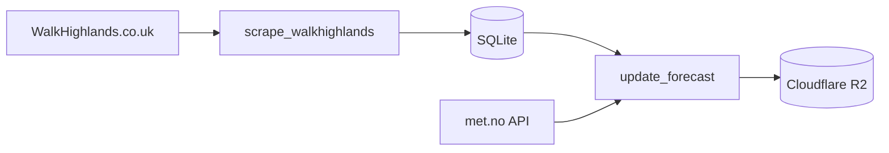

# Hikes

Scraper for Scottish hiking data from WalkHighlands.co.uk.

## Overview

Two components for collecting and enriching hiking route data:

| Component                | Description                                         |
| ------------------------ | --------------------------------------------------- |
| **scrape_walkhighlands** | Scrapes route metadata and walk details             |
| **update_forecast**      | Enriches routes with weather forecast data          |

## How It Works



## Data Collected

- Route names and descriptions
- GPS coordinates
- Distance, elevation gain, and estimated duration
- Weather forecasts for route locations

## Running Locally

```bash
# Scrape walk data
bazel run //projects/hikes/scrape_walkhighlands:scrape

# Update weather forecasts
bazel run //projects/hikes/update_forecast:update
```

## Configuration

Environment variables:

| Variable                          | Description                | Default                           |
| --------------------------------- | -------------------------- | --------------------------------- |
| `CLOUDFLARE_S3_ENDPOINT`          | Cloudflare R2 endpoint URL | *(required for update_forecast)*  |
| `CLOUDFLARE_S3_ACCESS_KEY_ID`     | R2 access key ID           | *(required for update_forecast)*  |
| `CLOUDFLARE_S3_ACCESS_KEY_SECRET` | R2 access key secret       | *(required for update_forecast)*  |
| `R2_BUCKET_NAME`                  | R2 bucket name             | `jomcgi-hikes`                    |

## Architecture Notes

- Uses `requests-cache` for HTTP caching during development
- Pydantic models with SQLite persistence via `pydantic-sqlite`
- Retry decorators for network resilience
- Performance logging for scrape operations
