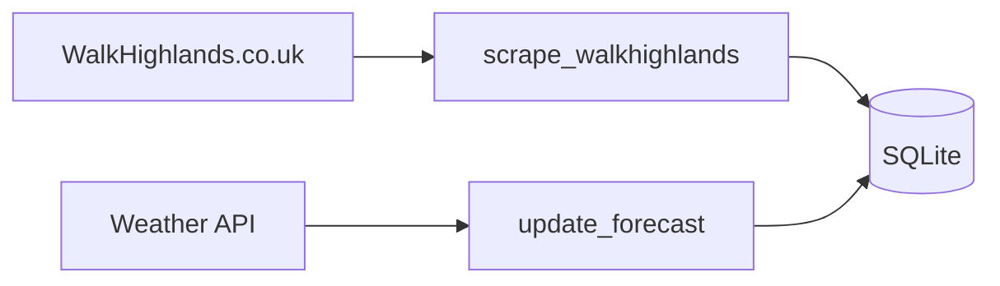

# Hikes

Scraper for Scottish hiking data from WalkHighlands.co.uk.

## Overview

Two components for collecting and enriching hiking route data:

| Component                | Description                                         |
| ------------------------ | --------------------------------------------------- |
| **scrape_walkhighlands** | Scrapes route metadata, GPX files, and walk details |
| **update_forecast**      | Enriches routes with weather forecast data          |

## How It Works



## Data Collected

- Route names, descriptions, and difficulty ratings
- GPS coordinates and GPX tracks
- Distance, elevation gain, and estimated duration
- Area/region classification
- Weather forecasts for route locations

## Running Locally

```bash
# Scrape walk data
bazel run //projects/hikes/scrape_walkhighlands

# Update weather forecasts
bazel run //projects/hikes/update_forecast
```

## Configuration

Environment variables:

| Variable    | Description       | Default |
| ----------- | ----------------- | ------- |
| `LOG_LEVEL` | Logging verbosity | `INFO`  |

## Architecture Notes

- Uses `requests-cache` for HTTP caching during development
- Pydantic models with SQLite persistence via `pydantic-sqlite`
- Retry decorators for network resilience
- Performance logging for scrape operations
