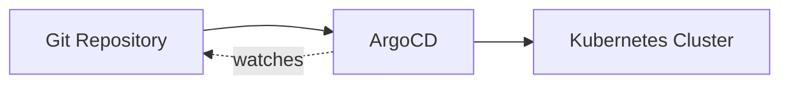

# ArgoCD

GitOps continuous deployment controller. Syncs Kubernetes manifests from Git to cluster.

## Overview

Wrapper chart around the official [argo-cd](https://argoproj.github.io/argo-helm) Helm chart with local defaults.



## Key Features

- **Auto-sync** - Automatically applies changes pushed to Git
- **Self-healing** - Reverts manual cluster changes to match Git state
- **Application discovery** - Finds apps via Kustomize overlays

## Configuration

| Value       | Description           | Default                                                                             |
| ----------- | --------------------- | ----------------------------------------------------------------------------------- |
| `argo-cd.*` | Upstream chart values | See [argo-cd chart](https://github.com/argoproj/argo-helm/tree/main/charts/argo-cd) |

## Application Discovery Pattern

ArgoCD discovers applications through the `projects/home-cluster/` auto-discovery pattern:

```
projects/home-cluster/kustomization.yaml (auto-generated)
  → projects/{service}/deploy/application.yaml
```

Each `application.yaml` points to its colocated Helm chart in `projects/{service}/chart/`.
