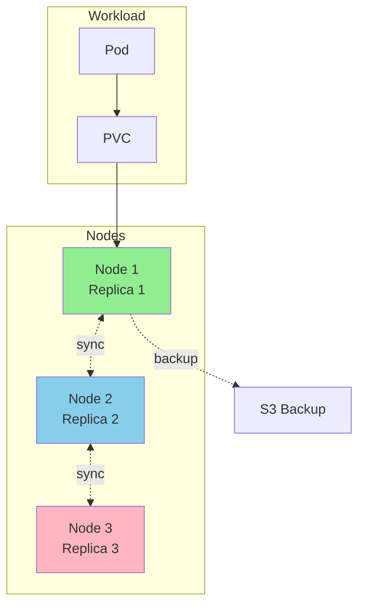

# Longhorn

Distributed block storage system for Kubernetes persistent volumes.

## Overview

Longhorn provides cloud-native distributed block storage with built-in replication, snapshots, and backups. It transforms locally-attached storage on Kubernetes nodes into a highly available distributed storage system.



## Key Features

- **Distributed replication** - Data automatically replicated across nodes for high availability
- **Automatic recovery** - Self-healing from node failures, rebuilds replicas on healthy nodes
- **Backup/restore** - S3-compatible backup targets for disaster recovery
- **Snapshots** - Point-in-time volume snapshots with instant restore
- **Volume resize** - Expand PVCs without downtime
- **ReadWriteMany** - RWX volumes via NFS for multi-pod access

## Use Cases

### Database Persistence

```yaml
# PostgreSQL with 3-replica storage
apiVersion: v1
kind: PersistentVolumeClaim
metadata:
  name: postgres-data
  labels:
    app: postgres
spec:
  accessModes: [ReadWriteOnce]
  storageClassName: longhorn
  resources:
    requests:
      storage: 20Gi
```

**Configuration:**

- 3 replicas for high availability
- Automatic failover if node goes down
- Snapshot before upgrades

### Shared Configuration Data

```yaml
# Config files shared across multiple pods
apiVersion: v1
kind: PersistentVolumeClaim
metadata:
  name: shared-config
spec:
  accessModes: [ReadWriteMany] # Multiple pods can read/write
  storageClassName: longhorn-rwx
  resources:
    requests:
      storage: 1Gi
```

**Use when:**

- Multiple pods need to access the same files
- Read-heavy workloads
- Configuration management across services

### Stateful Application Data

```yaml
# SigNoz ClickHouse storage
apiVersion: v1
kind: PersistentVolumeClaim
metadata:
  name: clickhouse-data
  labels:
    app: signoz
spec:
  accessModes: [ReadWriteOnce]
  storageClassName: longhorn-fast
  resources:
    requests:
      storage: 100Gi
```

**Configuration:**

- Fast storage class with higher IOPS
- 2 replicas for performance (less overhead than 3)
- Daily backups to S3

## Replica Configuration

### Default Replica Count

```yaml
# Implicit in all PVCs using longhorn StorageClass
kind: PersistentVolumeClaim
spec:
  storageClassName: longhorn
  # Inherits numberOfReplicas from StorageClass (homelab uses 1 via values-prod.yaml)
```

**Tolerance:** Can lose 2 nodes before data loss

**Trade-offs:**

- ✅ Maximum availability
- ✅ Survives multiple node failures
- ❌ 3x storage overhead
- ❌ Higher write latency (3-way sync)

### Reduced Replica Count (2)

```yaml
# Custom StorageClass for performance
apiVersion: storage.k8s.io/v1
kind: StorageClass
metadata:
  name: longhorn-fast
provisioner: driver.longhorn.io
parameters:
  numberOfReplicas: "2"
  staleReplicaTimeout: "30"
```

**Tolerance:** Can lose 1 node

**Use when:**

- Data can be rebuilt from source (caches, logs)
- Performance is critical
- Storage space is limited

### Single Replica (1)

```yaml
# Non-critical ephemeral data
apiVersion: storage.k8s.io/v1
kind: StorageClass
metadata:
  name: longhorn-ephemeral
provisioner: driver.longhorn.io
parameters:
  numberOfReplicas: "1"
  dataLocality: "strict-local"
```

**Tolerance:** No redundancy - data lost if node fails

**Use when:**

- Temporary data only
- Data is disposable or easily recreated
- Maximum performance needed (no replication overhead)

## Backup Configuration

### S3 Backup Target

Configure in Longhorn UI or via values:

```yaml
# values.yaml
defaultSettings:
  backupTarget: s3://longhorn-backups@us-east-1/
  backupTargetCredentialSecret: longhorn-s3-credentials
```

**Secret:**

```yaml
apiVersion: v1
kind: Secret
metadata:
  name: longhorn-s3-credentials
  namespace: longhorn-system
stringData:
  AWS_ACCESS_KEY_ID: <access-key>
  AWS_SECRET_ACCESS_KEY: <secret-key>
```

### Manual Backup

Via Longhorn UI:

1. Navigate to **Volume** → Select volume
2. Click **Create Backup**
3. Backup uploaded to S3

Via CLI:

```bash
kubectl -n longhorn-system exec -it deploy/longhorn-manager -- \
  longhorn-manager backup create <volume-name>
```

### Scheduled Backups

Create recurring backup job:

```yaml
apiVersion: longhorn.io/v1beta2
kind: RecurringJob
metadata:
  name: daily-backup
  namespace: longhorn-system
spec:
  task: backup
  cron: "0 2 * * *" # 2 AM daily
  retain: 7 # Keep 7 backups
  concurrency: 2
  labels:
    app: postgres # Only volumes with this label
```

**Apply to volumes:**

```yaml
apiVersion: v1
kind: PersistentVolumeClaim
metadata:
  name: postgres-data
  labels:
    app: postgres # Matches RecurringJob selector
```

### Restore from Backup

1. List available backups:

   ```bash
   kubectl -n longhorn-system get backupvolumes
   ```

2. Create PVC from backup:
   ```yaml
   apiVersion: v1
   kind: PersistentVolumeClaim
   metadata:
     name: restored-data
   spec:
     accessModes: [ReadWriteOnce]
     storageClassName: longhorn
     dataSource:
       kind: VolumeSnapshot
       apiGroup: longhorn.io
       name: backup-<timestamp>
     resources:
       requests:
         storage: 20Gi
   ```

## Storage Classes

### Default StorageClass

```bash
kubectl get storageclass longhorn
```

```yaml
apiVersion: storage.k8s.io/v1
kind: StorageClass
metadata:
  name: longhorn
  annotations:
    storageclass.kubernetes.io/is-default-class: "true"
provisioner: driver.longhorn.io
allowVolumeExpansion: true
parameters:
  numberOfReplicas: "3"
  staleReplicaTimeout: "30"
  fromBackup: ""
  fsType: "ext4"
```

### Create Custom StorageClass

```yaml
apiVersion: storage.k8s.io/v1
kind: StorageClass
metadata:
  name: longhorn-ssd
provisioner: driver.longhorn.io
allowVolumeExpansion: true
parameters:
  numberOfReplicas: "3"
  dataLocality: "best-effort"
  diskSelector: "ssd,fast" # Only use nodes with these tags
  nodeSelector: "storage,high-performance"
  fsType: "ext4"
```

**Tag nodes:**

```bash
kubectl label nodes node1 storage=true
kubectl label nodes node1 high-performance=true
```

## Volume Operations

### Expand Volume

1. Edit PVC:

   ```bash
   kubectl patch pvc postgres-data -p '{"spec":{"resources":{"requests":{"storage":"50Gi"}}}}'
   ```

2. Verify expansion:
   ```bash
   kubectl get pvc postgres-data
   ```

No pod restart required (online expansion).

### Create Snapshot

```yaml
apiVersion: snapshot.storage.k8s.io/v1
kind: VolumeSnapshot
metadata:
  name: postgres-snapshot-20260203
spec:
  volumeSnapshotClassName: longhorn
  source:
    persistentVolumeClaimName: postgres-data
```

### Clone Volume

```yaml
apiVersion: v1
kind: PersistentVolumeClaim
metadata:
  name: postgres-clone
spec:
  accessModes: [ReadWriteOnce]
  storageClassName: longhorn
  dataSource:
    kind: VolumeSnapshot
    apiGroup: snapshot.storage.k8s.io
    name: postgres-snapshot-20260203
  resources:
    requests:
      storage: 20Gi
```

## Monitoring

### Check Volume Health

```bash
kubectl -n longhorn-system get volumes
```

**Volume states:**

- `attached` - Mounted to a pod
- `detached` - Not in use
- `degraded` - Missing replicas (rebuilding)
- `faulted` - Critical error, data may be lost

### Replica Status

```bash
kubectl -n longhorn-system get replicas
```

**Replica states:**

- `running` - Healthy
- `rebuilding` - Recovering from failure
- `error` - Failed, needs attention

### Check Backup Status

```bash
kubectl -n longhorn-system get backupvolumes
kubectl -n longhorn-system get backups
```

## Troubleshooting

### Volume Stuck in "Attaching"

**Symptom:** Pod pending, volume shows "Attaching" state

**Solution:**

```bash
# Check Longhorn manager logs
kubectl -n longhorn-system logs deploy/longhorn-manager

# Force detach and reattach
kubectl -n longhorn-system annotate volume/<volume-name> \
  longhorn.io/force-detach=true
```

### Replica Rebuild Stuck

**Symptom:** Volume degraded for extended period

**Solution:**

```bash
# Check instance-manager logs
kubectl -n longhorn-system logs deploy/instance-manager-<node>

# Delete stuck replica
kubectl -n longhorn-system delete replica <replica-name>
```

### Out of Space

**Symptom:** Cannot create new volumes, "insufficient storage" error

**Solution:**

1. Check node storage:

   ```bash
   kubectl -n longhorn-system get nodes -o wide
   ```

2. Increase node disk size or add new nodes

3. Clean up old backups/snapshots:
   ```bash
   kubectl -n longhorn-system delete backups --all
   ```

## Configuration

| Value                                               | Description                 | Default  |
| --------------------------------------------------- | --------------------------- | -------- |
| `defaultSettings.backupTarget`                      | S3 bucket URL for backups   | `""`     |
| `defaultSettings.defaultReplicaCount`               | Default replica count       | `1`      |
| `defaultSettings.storageMinimalAvailablePercentage` | Min free space %            | `25`     |
| `defaultSettings.upgradeChecker`                    | Check for updates           | `true`   |
| `persistence.defaultClass`                          | Set as default StorageClass | `true`   |
| `persistence.reclaimPolicy`                         | PV reclaim policy           | `Delete` |

Full configuration: See [longhorn chart values](https://github.com/longhorn/charts/tree/master/charts/longhorn)

## Access UI

```bash
kubectl -n longhorn-system port-forward svc/longhorn-frontend 8080:80
```

Navigate to http://localhost:8080

**UI Features:**

- Volume management
- Backup/restore
- Node/disk management
- Recurring job configuration
- Event logs

## Related Documentation

- [Longhorn Official Docs](https://longhorn.io/docs/)
- [Backup and Restore](https://longhorn.io/docs/latest/snapshots-and-backups/backup-and-restore/)
- [Volume Snapshots](https://longhorn.io/docs/latest/snapshots-and-backups/csi-snapshot-support/)
