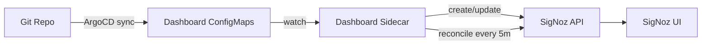

# SigNoz Dashboard Sidecar

GitOps sidecar for syncing SigNoz dashboards from Kubernetes ConfigMaps.

## Overview

A lightweight controller that watches for ConfigMaps labeled with `signoz.io/dashboard=true` and syncs their embedded dashboard JSON to SigNoz via its API. This enables GitOps-managed dashboards -- define dashboards as ConfigMaps in Git and the sidecar ensures SigNoz stays in sync with periodic drift correction.

## Architecture

The chart deploys a single-replica Deployment plus bundled dashboard ConfigMaps:

- **Dashboard Sidecar** - A Go controller that watches ConfigMaps across all namespaces (or a specific namespace), detects dashboard JSON, and syncs it to SigNoz via the query-service API. Runs a reconciliation loop every 5 minutes to correct drift.
- **Dashboard ConfigMaps** - Bundled Kubernetes infrastructure dashboards (cluster metrics, pod metrics overall + detailed, node metrics overall + detailed, PVC metrics, host metrics, SigNoz ingestion analysis) deployed as labeled ConfigMaps

State is tracked in a ConfigMap within the release namespace to detect which dashboards need creation vs. update.

## Key Features

- **GitOps dashboards** - Define dashboards as ConfigMaps, version-controlled in Git
- **Drift correction** - Periodic reconciliation ensures SigNoz matches desired state
- **Bundled dashboards** - Ships with 8 pre-built Kubernetes infrastructure dashboards
- **Custom tagging** - All managed dashboards tagged with `iac-managed`; custom tags via annotations
- **Namespace scoping** - Watch all namespaces or restrict to a specific one
- **Metrics endpoint** - Prometheus metrics on port 9090 with health/readiness probes
- **Hardened security** - Non-root (uid 65534), read-only filesystem, all capabilities dropped

## Configuration

| Value                         | Description                      | Default                                       |
| ----------------------------- | -------------------------------- | --------------------------------------------- |
| `signoz.url`                  | SigNoz query-service URL         | `http://signoz.signoz.svc.cluster.local:8080` |
| `signoz.apiKeySecret.enabled` | Use a Secret for SigNoz API key  | `false`                                       |
| `watch.namespace`             | Namespace to watch (empty = all) | `""`                                          |
| `reconcile.interval`          | Drift correction interval        | `5m`                                          |
| `metrics.enabled`             | Enable Prometheus metrics        | `true`                                        |
| `metrics.port`                | Metrics listen port              | `9090`                                        |
| `dashboards.<name>.enabled`   | Enable bundled dashboard         | `true` (per dashboard)                        |
| `dashboards.<name>.tags`      | Custom tags for a dashboard      | Varies by dashboard                           |
| `imagePullSecret.enabled`     | Create GHCR image pull secret    | `false`                                       |
