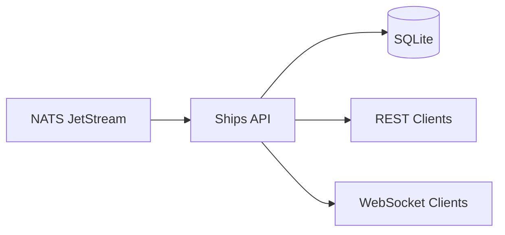
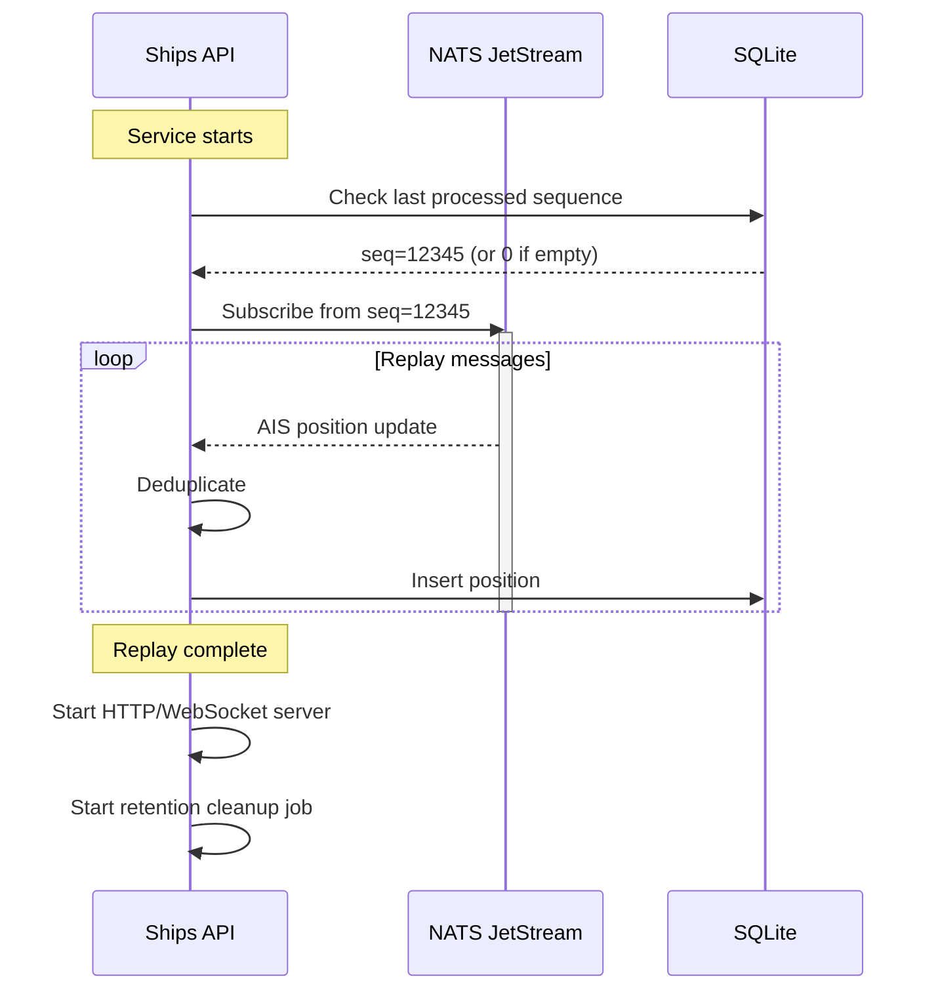
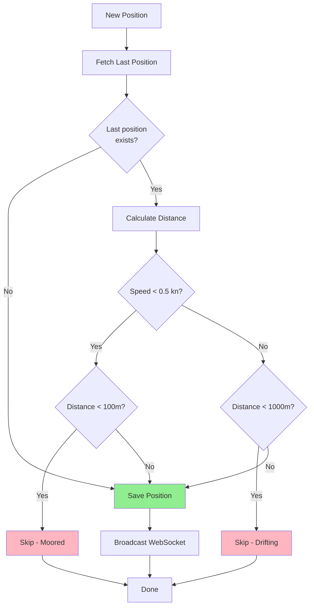

# Ships API

REST and WebSocket API for AIS vessel data with SQLite persistence.

## Overview

Consumes vessel positions from NATS JetStream, stores them in SQLite, and serves data via REST API and WebSocket for real-time updates.



## Key Features

- **Stream replay** - Rebuilds database from NATS on startup
- **Position deduplication** - Skips redundant updates for stationary vessels
- **7-day retention** - Automatic cleanup of old position history
- **Moored detection** - Identifies vessels anchored in one location
- **Batch processing** - High-throughput message handling

## Stream Replay on Startup

Similar to trips_api, ships_api replays the NATS JetStream on startup to rebuild the SQLite database.



**Why SQLite instead of in-memory?**

- Position history retained (7 days)
- Faster startup on restarts (only replay new messages)
- Supports complex queries (bounding box, time range)

## Position Deduplication Logic

Ships often send redundant AIS updates when moored or stationary. Deduplication reduces database size and API noise.



**Deduplication rules:**

| Condition         | Distance Threshold | Action                           |
| ----------------- | ------------------ | -------------------------------- |
| Speed < 0.5 knots | < 100m             | **Skip** - Moored at dock        |
| Speed < 0.5 knots | ≥ 100m             | **Save** - Moved to new mooring  |
| Speed ≥ 0.5 knots | < 1000m            | **Skip** - Normal drift/movement |
| Speed ≥ 0.5 knots | ≥ 1000m            | **Save** - Significant movement  |

**Why these thresholds?**

- 100m: Typical dock/mooring area size
- 1000m: Minimum distance for meaningful position updates
- 0.5 knots: AIS speed below this is often GPS noise

**Configuration:**

```yaml
# Environment variables
DEDUP_DISTANCE_METERS: 100 # Moored threshold
DEDUP_SPEED_THRESHOLD: 0.5 # Knots
```

## API Endpoints

### GET /api/vessels

List all known vessels.

**Response:**

```json
{
  "vessels": [
    {
      "mmsi": 316001234,
      "name": "VESSEL NAME",
      "callsign": "CG1234",
      "ship_type": 70,
      "ship_type_name": "Cargo",
      "dimension_a": 100,
      "dimension_b": 20,
      "dimension_c": 10,
      "dimension_d": 10,
      "last_seen": "2024-01-15T12:00:00Z",
      "current_position": {
        "lat": 49.2827,
        "lng": -123.1207,
        "speed": 12.5,
        "course": 180.0,
        "heading": 182,
        "timestamp": "2024-01-15T12:00:00Z"
      }
    }
  ],
  "count": 1
}
```

**Query parameters:**

- `limit` (optional) - Max vessels to return (default: 100)
- `active_since` (optional) - ISO timestamp, only vessels seen since this time

**Examples:**

```bash
# Get all vessels
curl https://ships-api.jomcgi.dev/api/vessels

# Get vessels seen in last hour
curl https://ships-api.jomcgi.dev/api/vessels?active_since=$(date -u -d '1 hour ago' +%Y-%m-%dT%H:%M:%SZ)

# Get top 50 vessels
curl https://ships-api.jomcgi.dev/api/vessels?limit=50
```

### GET /api/vessels/{mmsi}

Get vessel details and current position.

**Response:**

```json
{
  "mmsi": 316001234,
  "name": "VESSEL NAME",
  "callsign": "CG1234",
  "imo": 9123456,
  "ship_type": 70,
  "ship_type_name": "Cargo",
  "dimensions": {
    "dimension_a": 100,
    "dimension_b": 20,
    "dimension_c": 10,
    "dimension_d": 10,
    "length": 120,
    "width": 20
  },
  "current_position": {
    "lat": 49.2827,
    "lng": -123.1207,
    "speed": 12.5,
    "course": 180.0,
    "heading": 182,
    "nav_status": 0,
    "nav_status_name": "Under way using engine",
    "timestamp": "2024-01-15T12:00:00Z"
  },
  "first_seen": "2024-01-10T08:00:00Z",
  "last_seen": "2024-01-15T12:00:00Z"
}
```

**Example:**

```bash
curl https://ships-api.jomcgi.dev/api/vessels/316001234
```

**Error responses:**

- `404 Not Found` - MMSI not in database

### GET /api/vessels/{mmsi}/track

Get position history for a vessel.

**Response:**

```json
{
  "mmsi": 316001234,
  "track": [
    {
      "lat": 49.2827,
      "lng": -123.1207,
      "speed": 12.5,
      "course": 180.0,
      "heading": 182,
      "nav_status": 0,
      "timestamp": "2024-01-15T12:00:00Z"
    }
  ],
  "count": 1
}
```

**Query parameters:**

- `limit` (optional) - Max positions to return (default: 1000)
- `since` (optional) - Duration like `1h`, `30m`, `2d`

**Examples:**

```bash
# Get all positions (last 7 days)
curl https://ships-api.jomcgi.dev/api/vessels/316001234/track

# Get positions from last hour
curl https://ships-api.jomcgi.dev/api/vessels/316001234/track?since=1h

# Get last 100 positions
curl https://ships-api.jomcgi.dev/api/vessels/316001234/track?limit=100
```

### WS /ws/live

WebSocket endpoint for real-time position updates.

**Message format:**

```json
{
  "type": "position_update",
  "data": {
    "mmsi": 316001234,
    "name": "VESSEL NAME",
    "lat": 49.2827,
    "lng": -123.1207,
    "speed": 12.5,
    "course": 180.0,
    "heading": 182,
    "timestamp": "2024-01-15T12:00:00Z"
  }
}
```

**Example client:**

```javascript
const ws = new WebSocket("wss://ships-api.jomcgi.dev/ws/live");

ws.onmessage = (event) => {
  const msg = JSON.parse(event.data);
  if (msg.type === "position_update") {
    console.log(`${msg.data.name} at ${msg.data.lat}, ${msg.data.lng}`);
    updateMapMarker(msg.data);
  }
};
```

### GET /health

Health check endpoint.

**Response:**

```json
{
  "status": "healthy",
  "nats_connected": true,
  "database_size_mb": 124.5,
  "vessels_tracked": 523,
  "positions_stored": 18392,
  "websocket_clients": 2
}
```

## Database Schema

### vessels

Vessel metadata from AIS Type 5 messages.

| Column         | Type      | Description                  |
| -------------- | --------- | ---------------------------- |
| `mmsi`         | INTEGER   | Primary key, MMSI identifier |
| `name`         | TEXT      | Vessel name                  |
| `callsign`     | TEXT      | Radio callsign               |
| `imo`          | INTEGER   | IMO number                   |
| `ship_type`    | INTEGER   | AIS ship type code           |
| `dimension_a`  | INTEGER   | Meters to bow                |
| `dimension_b`  | INTEGER   | Meters to stern              |
| `dimension_c`  | INTEGER   | Meters to port               |
| `dimension_d`  | INTEGER   | Meters to starboard          |
| `first_seen`   | TIMESTAMP | First AIS message received   |
| `last_seen`    | TIMESTAMP | Most recent AIS message      |

### positions

Position history from AIS Type 1/2/3 messages.

| Column       | Type      | Description                  |
| ------------ | --------- | ---------------------------- |
| `id`         | INTEGER   | Primary key, auto-increment  |
| `mmsi`       | INTEGER   | Foreign key to vessels       |
| `lat`        | REAL      | Latitude                     |
| `lng`        | REAL      | Longitude                    |
| `speed`      | REAL      | Speed over ground (knots)    |
| `course`     | REAL      | Course over ground (degrees) |
| `heading`    | INTEGER   | True heading (degrees)       |
| `nav_status` | INTEGER   | Navigational status code     |
| `timestamp`  | TIMESTAMP | Position timestamp           |

**Indexes:**

- `idx_positions_mmsi` - Fast lookups by vessel
- `idx_positions_timestamp` - Time range queries
- `idx_positions_mmsi_timestamp` - Composite for history queries

### latest_positions

Materialized view of current vessel positions.

| Column       | Type      | Description       |
| ------------ | --------- | ----------------- |
| `mmsi`       | INTEGER   | Primary key       |
| `lat`        | REAL      | Current latitude  |
| `lng`        | REAL      | Current longitude |
| `speed`      | REAL      | Current speed     |
| `course`     | REAL      | Current course    |
| `heading`    | INTEGER   | Current heading   |
| `nav_status` | INTEGER   | Current status    |
| `timestamp`  | TIMESTAMP | Last update time  |

**Updated via trigger on positions table.**

## Data Retention

Position history is automatically cleaned up to prevent unbounded growth.

**Retention policy:**

- Keep positions for 7 days
- Run cleanup every 24 hours
- Delete in batches of 10,000

**Configuration:**

```yaml
POSITION_RETENTION_DAYS: 7
```

**Manual cleanup:**

```bash
# Via API (requires admin auth)
curl -X POST https://ships-api.jomcgi.dev/admin/cleanup

# Via database
sqlite3 ships.db "DELETE FROM positions WHERE timestamp < datetime('now', '-7 days')"
```

## Configuration

Environment variables:

| Variable                  | Description                         | Default                 | Required |
| ------------------------- | ----------------------------------- | ----------------------- | -------- |
| `NATS_URL`                | NATS server URL                     | `nats://localhost:4222` | Yes      |
| `NATS_STREAM`             | JetStream stream name               | `ships`                 | No       |
| `NATS_SUBJECT`            | Subject for AIS messages            | `ships.ais`             | No       |
| `CORS_ORIGINS`            | Allowed CORS origins                | `http://localhost:3000` | No       |
| `DB_PATH`                 | SQLite database path                | `/tmp/ships.db`         | No       |
| `POSITION_RETENTION_DAYS` | Days to keep positions              | `7`                     | No       |
| `DEDUP_DISTANCE_METERS`   | Deduplication threshold             | `100`                   | No       |
| `DEDUP_SPEED_THRESHOLD`   | Speed below which to dedupe (knots) | `0.5`                   | No       |

## Running Locally

```bash
# Start dependencies
docker run -d --name nats -p 4222:4222 nats:latest -js

# Run service
export NATS_URL=nats://localhost:4222
export DB_PATH=/tmp/ships.db
bazel run //projects/ships/backend:main

# Test endpoints
curl http://localhost:8000/health
curl http://localhost:8000/api/vessels
```

## Deployment

Deployed via ArgoCD to Kubernetes cluster.

**Resources:**

- Helm chart: `projects/ships/chart/`
- Overlay: `projects/ships/deploy/`
- Service URL: https://ships-api.jomcgi.dev

**Persistent storage:**

- Longhorn PVC mounted at `/data`
- Database path: `/data/ships.db`

## Observability

### Metrics

Exposed at `/metrics` (Prometheus format):

- `ships_vessels_tracked` - Total unique vessels in database
- `ships_positions_stored` - Total positions in database
- `ships_positions_deduped` - Positions skipped (deduplication)
- `ships_websocket_connections` - Active WebSocket connections
- `ships_nats_messages_total` - NATS messages processed
- `ships_database_size_bytes` - SQLite file size

### Traces

Instrumented with OpenTelemetry (auto-injected by Kyverno):

- HTTP request traces
- NATS message processing
- SQLite queries
- WebSocket connections

View in SigNoz: https://signoz.jomcgi.dev

### Logs

Structured JSON logs via `logging.structlog`:

```json
{
  "timestamp": "2024-01-15T12:00:00Z",
  "level": "info",
  "event": "position_update",
  "mmsi": 316001234,
  "lat": 49.2827,
  "lng": -123.1207,
  "deduped": false
}
```

## Ship Type Codes

Common AIS ship type codes:

| Code  | Description       |
| ----- | ----------------- |
| 30    | Fishing           |
| 31-32 | Towing            |
| 36    | Sailing           |
| 37    | Pleasure Craft    |
| 40-49 | High Speed Craft  |
| 50    | Pilot Vessel      |
| 51    | Search and Rescue |
| 52    | Tug               |
| 60-69 | Passenger         |
| 70-79 | Cargo             |
| 80-89 | Tanker            |

Full list: [AIS Ship Type Codes](https://api.vtexplorer.com/docs/ref-aistypes.html)

## Navigational Status Codes

| Code | Description                |
| ---- | -------------------------- |
| 0    | Under way using engine     |
| 1    | At anchor                  |
| 2    | Not under command          |
| 3    | Restricted manoeuvrability |
| 5    | Moored                     |
| 8    | Under way sailing          |
| 15   | Not defined                |

## Related Services

- **ships.jomcgi.dev** - Frontend map viewer (WebSocket client)
- **ais-ingest** - Receives AIS messages from SDR and publishes to NATS
- **trips_api** - Similar architecture for GPS trip tracking
