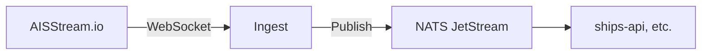

# AIS Ingest

Real-time AIS vessel data ingestion from AISStream.io to NATS JetStream.

## Overview

WebSocket client that subscribes to [AISStream.io](https://aisstream.io/), filters position reports within a geographic bounding box, and publishes them to NATS for downstream consumers.



## Key Features

- **Bounding box filtering** - Only process vessels in configured region
- **Auto-reconnect** - Exponential backoff on connection failures
- **ETA parsing** - Converts AIS ETA format to ISO timestamps
- **Health endpoint** - FastAPI `/health` for Kubernetes probes

## Configuration

Environment variables:

| Variable            | Description              | Default                               |
| ------------------- | ------------------------ | ------------------------------------- |
| `NATS_URL`          | NATS server URL          | `nats://localhost:4222`               |
| `AISSTREAM_API_KEY` | AISStream.io API key     | (required)                            |
| `AISSTREAM_URL`     | WebSocket endpoint       | `wss://stream.aisstream.io/v0/stream` |
| `BOUNDING_BOX`      | Geographic filter (JSON) | Pacific Northwest                     |

## Running Locally

```bash
export AISSTREAM_API_KEY="your-key"
bazel run //services/ais_ingest
```

## NATS Stream

Messages are published to `ais.positions` subject with 24-hour retention. Message format:

```json
{
  "mmsi": "123456789",
  "lat": 48.123,
  "lon": -123.456,
  "speed": 12.5,
  "course": 180,
  "timestamp": "2024-01-15T12:00:00Z"
}
```
