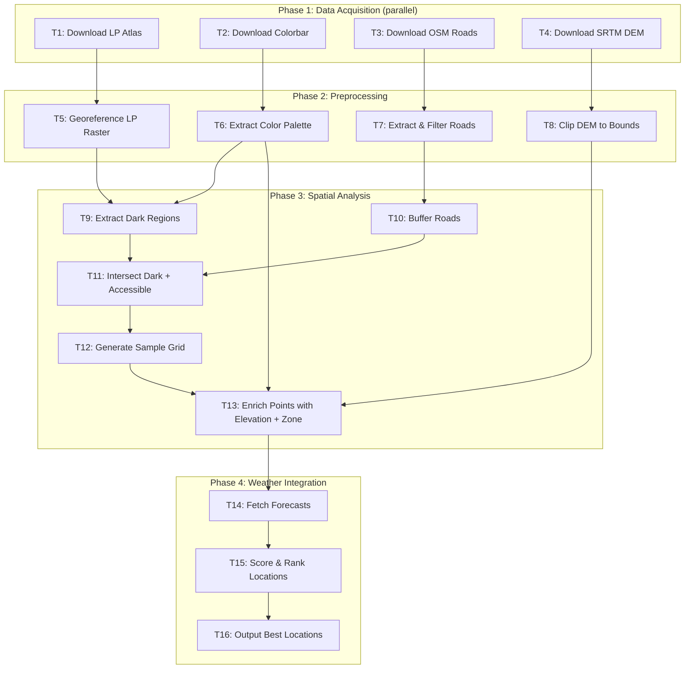
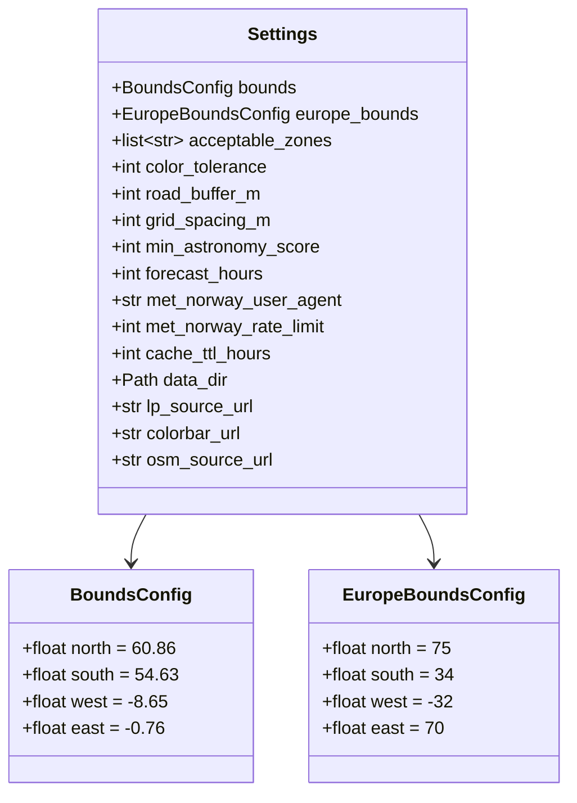
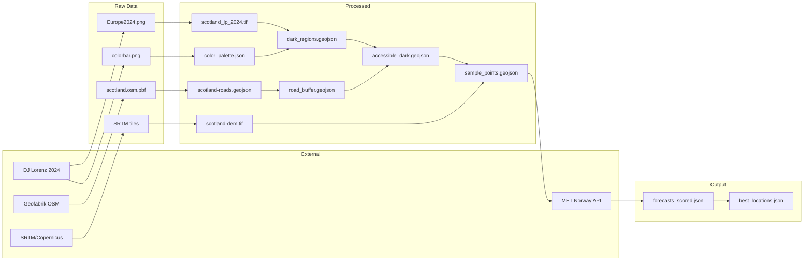

# Dark Sky Location Finder - Scotland

## Goal

Surface the best stargazing locations in Scotland for the next 72 hours by combining light pollution data, road accessibility, and weather forecasts.

---

## Task Dependency Graph



---

## Task Tracker

### Phase 1: Data Acquisition (`acquisition.py`)

- [x] **T1**: Download LP Atlas → `data/raw/Europe2024.png`
- [x] **T2**: Download Colorbar → `data/raw/colorbar.png`
- [x] **T3**: Download OSM Roads → `data/raw/scotland-latest.osm.pbf`
- [ ] **T4**: Download SRTM DEM → `data/raw/srtm_tiles/` _(placeholder - needs SRTM tile fetching)_

### Phase 2: Preprocessing (`preprocessing.py`)

- [x] **T5**: Georeference LP Raster → `data/processed/scotland_lp_2024.tif`
- [x] **T6**: Extract Color Palette → `data/processed/color_palette.json`
- [x] **T7**: Extract & Filter Roads → `data/processed/scotland-roads.geojson`
- [ ] **T8**: Clip DEM to Bounds → `data/processed/scotland-dem.tif` _(placeholder - depends on T4)_

### Phase 3: Spatial Analysis (`spatial.py`)

- [x] **T9**: Extract Dark Regions → `data/processed/dark_regions.geojson`
- [x] **T10**: Buffer Roads → `data/processed/road_buffer.geojson`
- [x] **T11**: Intersect Dark + Accessible → `data/processed/accessible_dark.geojson`
- [x] **T12**: Generate Sample Grid → `data/processed/sample_points.geojson`
- [x] **T13**: Enrich Points → `data/processed/sample_points_enriched.geojson`

### Phase 4: Weather Integration (`weather.py`)

- [x] **T14**: Fetch Forecasts → `data/cache/*.json`
- [x] **T15**: Score & Rank Locations → `data/output/forecasts_scored.json`
- [x] **T16**: Output Best Locations → `data/output/best_locations.json`

### Validation (requires running pipeline)

- [ ] Galloway Forest DSP included
- [ ] Cairngorms DSP included
- [ ] Glasgow excluded
- [ ] Edinburgh excluded
- [ ] Isle of Coll included
- [ ] Shetland included (elevation fallback working)
- [ ] Zone classification spot-checked
- [ ] Forecast scores compared with Clear Outside

---

## Parallelization Summary

| Phase | Parallel Tasks                                    | Blocking Dependency                                |
| ----- | ------------------------------------------------- | -------------------------------------------------- |
| 1     | T1, T2, T3, T4 (all parallel)                     | None                                               |
| 2     | T5+T6 parallel, T7 parallel, T8 parallel          | T5 needs T1, T6 needs T2, T7 needs T3, T8 needs T4 |
| 3     | T9, T10 parallel → T11 → T12 → T13                | Sequential after T9+T10                            |
| 4     | T14 (can batch/parallelize API calls) → T15 → T16 | Sequential                                         |

---

## Configuration Schema

All parameters configurable via environment variables (Pydantic BaseSettings).



### Default Values

| Parameter             | Default               | Description              |
| --------------------- | --------------------- | ------------------------ |
| `BOUNDS_NORTH`        | 60.86                 | Shetland                 |
| `BOUNDS_SOUTH`        | 54.63                 | Scottish Borders         |
| `BOUNDS_WEST`         | -8.65                 | Outer Hebrides           |
| `BOUNDS_EAST`         | -0.76                 | Aberdeenshire coast      |
| `ACCEPTABLE_ZONES`    | "0,1a,1b,2a,2b,3a,3b" | LP zones where LPI < 1.0 |
| `ROAD_BUFFER_M`       | 1000                  | Accessibility radius     |
| `GRID_SPACING_M`      | 5000                  | Sample point density     |
| `MIN_ASTRONOMY_SCORE` | 60                    | Weather score threshold  |
| `COLOR_TOLERANCE`     | 15                    | RGB matching tolerance   |

---

## Task Specifications

### T1: Download Light Pollution Atlas

**Intent**: Fetch DJ Lorenz 2024 Europe light pollution map

| Property   | Value                                                |
| ---------- | ---------------------------------------------------- |
| Input      | `$LP_SOURCE_URL` (default: DJ Lorenz Europe2024.png) |
| Output     | `data/raw/Europe2024.png`                            |
| Method     | HTTP GET                                             |
| Size       | ~15MB                                                |
| Idempotent | Yes (skip if exists)                                 |

---

### T2: Download Colorbar

**Intent**: Fetch color scale reference for zone classification

| Property | Value                   |
| -------- | ----------------------- |
| Input    | `$COLORBAR_URL`         |
| Output   | `data/raw/colorbar.png` |
| Method   | HTTP GET                |
| Size     | ~5KB                    |

---

### T3: Download OSM Roads

**Intent**: Fetch OpenStreetMap road network for Scotland

| Property | Value                                      |
| -------- | ------------------------------------------ |
| Input    | `$OSM_SOURCE_URL` (Geofabrik Scotland PBF) |
| Output   | `data/raw/scotland-latest.osm.pbf`         |
| Method   | HTTP GET                                   |
| Size     | ~120MB                                     |

---

### T4: Download SRTM DEM

**Intent**: Fetch elevation data for the target bounds

| Property | Value                                                                                         |
| -------- | --------------------------------------------------------------------------------------------- |
| Input    | Bounds from config                                                                            |
| Output   | `data/processed/scotland-dem.tif`                                                             |
| Method   | `elevation` Python package or direct SRTM tile fetch                                          |
| Size     | ~200MB                                                                                        |
| Note     | SRTM coverage ends at 60°N; Shetland (60.86°N) needs Copernicus DEM fallback or 0m assumption |

---

### T5: Georeference LP Raster

**Intent**: Add spatial reference to the PNG so it can be used in GIS operations

| Property | Value                                                         |
| -------- | ------------------------------------------------------------- |
| Input    | `data/raw/Europe2024.png`, `$EUROPE_BOUNDS_*`                 |
| Output   | `data/processed/europe_lp_2024.tif` (EPSG:4326)               |
| Method   | `gdal_translate -a_srs EPSG:4326 -a_ullr {W} {N} {E} {S}`     |
| Then     | Clip to target bounds → `data/processed/scotland_lp_2024.tif` |

**Validation**: Inspect in QGIS; known locations (Glasgow, Edinburgh) should fall in bright zones.

---

### T6: Extract Color Palette

**Intent**: Map RGB values from colorbar to zone names for classification

| Property | Value                                                                                      |
| -------- | ------------------------------------------------------------------------------------------ |
| Input    | `data/raw/colorbar.png`                                                                    |
| Output   | `data/processed/color_palette.json`                                                        |
| Format   | `{"rgb": [R,G,B], "zone": "2a", "lpi_range": [0.11, 0.19], "mpsas_range": [21.81, 21.89]}` |

**Zone Reference** (from DJ Lorenz):

| Zone | LPI       | mpsas       | Include? |
| ---- | --------- | ----------- | -------- |
| 0    | <0.01     | ≥21.99      | ✅       |
| 1a   | 0.01-0.06 | 21.93-21.99 | ✅       |
| 1b   | 0.06-0.11 | 21.89-21.93 | ✅       |
| 2a   | 0.11-0.19 | 21.81-21.89 | ✅       |
| 2b   | 0.19-0.33 | 21.69-21.81 | ✅       |
| 3a   | 0.33-0.58 | 21.51-21.69 | ✅       |
| 3b   | 0.58-1.00 | 21.25-21.51 | ✅       |
| 4a+  | ≥1.00     | <21.25      | ❌       |

**Threshold**: LPI < 1.0 means natural sky brightness still dominates artificial light.

---

### T7: Extract & Filter Roads

**Intent**: Extract drivable roads from OSM, excluding private access

| Property | Value                                                                           |
| -------- | ------------------------------------------------------------------------------- |
| Input    | `data/raw/scotland-latest.osm.pbf`                                              |
| Output   | `data/processed/scotland-roads.geojson`                                         |
| Include  | motorway, trunk, primary, secondary, tertiary, unclassified, residential, track |
| Exclude  | footway, path, cycleway, service, access=private                                |
| Tools    | `osmium tags-filter` → `ogr2ogr`                                                |

---

### T8: Clip DEM to Bounds

**Intent**: Ensure DEM covers exactly the target region

| Property | Value                             |
| -------- | --------------------------------- |
| Input    | Downloaded SRTM tiles             |
| Output   | `data/processed/scotland-dem.tif` |
| Method   | `gdalwarp -te {bounds}`           |

---

### T9: Extract Dark Regions

**Intent**: Identify areas with acceptable light pollution levels

| Property | Value                                                                                           |
| -------- | ----------------------------------------------------------------------------------------------- |
| Input    | `scotland_lp_2024.tif`, `color_palette.json`, `$ACCEPTABLE_ZONES`, `$COLOR_TOLERANCE`           |
| Output   | `data/processed/dark_regions.geojson` (MultiPolygon)                                            |
| Method   | For each pixel, check if RGB matches any acceptable zone (within tolerance). Polygonize result. |

**Algorithm**:

1. Load raster as RGB array
2. For each acceptable zone's RGB, create mask where `|pixel - target| <= tolerance` for all channels
3. Union all masks
4. Convert mask to vector polygons (`rasterio.features.shapes`)
5. Simplify geometry to reduce complexity

---

### T10: Buffer Roads

**Intent**: Create accessibility zone around road network

| Property | Value                                                                      |
| -------- | -------------------------------------------------------------------------- |
| Input    | `scotland-roads.geojson`, `$ROAD_BUFFER_M`                                 |
| Output   | `data/processed/road_buffer.geojson` (MultiPolygon)                        |
| Method   | Reproject to metric CRS (EPSG:27700), buffer, dissolve, reproject to WGS84 |

---

### T11: Intersect Dark + Accessible

**Intent**: Find areas that are both dark AND accessible

| Property | Value                                         |
| -------- | --------------------------------------------- |
| Input    | `dark_regions.geojson`, `road_buffer.geojson` |
| Output   | `data/processed/accessible_dark.geojson`      |
| Method   | Geometric intersection                        |

---

### T12: Generate Sample Grid

**Intent**: Create evenly-spaced sample points within accessible dark areas

| Property | Value                                                                |
| -------- | -------------------------------------------------------------------- |
| Input    | `accessible_dark.geojson`, `$GRID_SPACING_M`                         |
| Output   | `data/processed/sample_points.geojson` (Points)                      |
| Method   | Generate regular grid in metric CRS, filter to points within polygon |
| Expected | ~500-1000 points at 5km spacing                                      |

---

### T13: Enrich Points with Elevation + Zone

**Intent**: Add metadata to each sample point

| Property | Value                                                                                     |
| -------- | ----------------------------------------------------------------------------------------- |
| Input    | `sample_points.geojson`, `scotland-dem.tif`, `scotland_lp_2024.tif`, `color_palette.json` |
| Output   | `data/processed/sample_points_enriched.geojson`                                           |
| Fields   | `id`, `lat`, `lon`, `altitude_m`, `lp_zone`                                               |

---

### T14: Fetch Forecasts

**Intent**: Get weather forecasts for all sample points

| Property        | Value                                                                                 |
| --------------- | ------------------------------------------------------------------------------------- |
| Input           | `sample_points_enriched.geojson`                                                      |
| Output          | `data/cache/{point_id}.json` (per point), `data/output/forecasts_raw.json` (combined) |
| API             | MET Norway Locationforecast 2.0                                                       |
| Rate Limit      | 20 req/sec (use 15 for safety)                                                        |
| Caching         | Respect `Expires` header, use `If-Modified-Since`                                     |
| Parallelization | Batch async requests with semaphore                                                   |

**Required Headers**:

- `User-Agent`: Must identify app + contact (e.g., `darksky-scotland/1.0 you@email.com`)

**Request**: `GET /weatherapi/locationforecast/2.0/complete?lat={lat}&lon={lon}&altitude={alt}`

---

### T15: Score & Rank Locations

**Intent**: Calculate astronomy suitability score for each forecast hour

| Property | Value                                                            |
| -------- | ---------------------------------------------------------------- |
| Input    | Raw forecasts                                                    |
| Output   | `data/output/forecasts_scored.json`                              |
| Filter   | Only hours during astronomical darkness (sun >18° below horizon) |
| Filter   | Only hours with score ≥ `$MIN_ASTRONOMY_SCORE`                   |

**Scoring Formula** (0-100):

```
cloud_score     = f(cloud_area_fraction)      weight: 50%
humidity_score  = f(relative_humidity)        weight: 15%
fog_score       = f(fog_area_fraction)        weight: 10%
wind_score      = f(wind_speed)               weight: 10%
dew_score       = f(temp - dew_point)         weight: 15%
pressure_bonus  = +0-10 if pressure > 1015hPa
```

**Thresholds**:

| Parameter  | Good   | Marginal | Poor    |
| ---------- | ------ | -------- | ------- |
| Cloud      | <20%   | 20-50%   | >50%    |
| Humidity   | <70%   | 70-85%   | >85%    |
| Wind       | <5 m/s | 5-10 m/s | >10 m/s |
| Dew spread | >5°C   | 2-5°C    | <2°C    |
| Fog        | <5%    | 5-20%    | >20%    |

---

### T16: Output Best Locations

**Intent**: Produce final ranked list of viewing opportunities

| Property | Value                             |
| -------- | --------------------------------- |
| Input    | Scored forecasts                  |
| Output   | `data/output/best_locations.json` |
| Filter   | Score ≥ 70                        |
| Sort     | By score descending               |
| Limit    | Top 20                            |

**Output Schema**:

```json
{
  "id": "scotland_0142",
  "coordinates": { "lat": 55.123, "lon": -4.567 },
  "altitude_m": 320,
  "lp_zone": "2b",
  "best_hours": [
    {
      "time": "2025-01-15T22:00:00Z",
      "score": 87.2,
      "cloud_area_fraction": 8.0,
      "wind_speed": 2.8,
      "symbol": "clearsky_night"
    }
  ]
}
```

---

## Data Flow Diagram



---

## Validation Checklist

| Check                        | Method                                              |
| ---------------------------- | --------------------------------------------------- |
| Galloway Forest DSP included | Query sample_points for lat ~55.0, lon ~-4.5        |
| Cairngorms DSP included      | Query sample_points for lat ~57.0, lon ~-3.7        |
| Glasgow excluded             | No points within 10km of 55.86, -4.25               |
| Edinburgh excluded           | No points within 10km of 55.95, -3.19               |
| Isle of Coll included        | Points present near 56.62, -6.55                    |
| Shetland included            | Points present >60°N (check elevation fallback)     |
| Zone classification accurate | Spot-check 5 points against lightpollutionmap.info  |
| Forecast scores sensible     | Compare top location vs Clear Outside for same time |

---

## Dependencies

### System (via apko.yaml container image)

- `gdal` + `gdal-tools` (gdal_translate, gdalwarp)
- `osmium-tool` (osmium tags-filter)
- `proj` + `geos` (geospatial libraries)

### Python (via pyproject.toml + Bazel @pip//)

Dependencies are managed in the workspace root `pyproject.toml` and resolved
via `rules_uv`. Reference in BUILD files as `@pip//package_name`.

- `pydantic-settings~=2.1` - Configuration management
- `rasterio~=1.3` - Raster I/O and processing
- `geopandas~=0.14` - Vector operations
- `shapely~=2.0` - Geometry operations
- `pillow~=10.0` - Image processing (colorbar extraction)
- `httpx~=0.26` - Async HTTP client
- `astral~=3.2` - Sun position calculations
- `opentelemetry-*` - Tracing (auto-injected by Kyverno)

### Deployment

- **CronJob**: Runs every 6 hours (configurable via `schedule` in values.yaml)
- **Storage**: Longhorn PVC (5Gi) mounted at `/data`
- **Container**: apko Alpine image with GDAL/osmium system deps

---

## File Structure

**Note:** This structure follows the homelab codebase patterns with Bazel BUILD files,
Helm charts, and ArgoCD GitOps deployment.

```
# Python service code
services/stargazer/
├── __init__.py
├── BUILD                    # Bazel py_library
├── apko.yaml               # Container image config (GDAL, osmium-tool)
└── app/
    ├── __init__.py
    ├── BUILD               # Bazel py_binary + py_library per module
    ├── main.py             # Entry point with OTEL tracing
    ├── config.py           # Pydantic BaseSettings
    ├── scoring.py          # Astronomy score calculation
    ├── acquisition.py      # Phase 1: download_lp_atlas(), download_colorbar(), etc.
    ├── preprocessing.py    # Phase 2: georeference_raster(), extract_palette(), etc.
    ├── spatial.py          # Phase 3: extract_dark_regions(), buffer_roads(), etc.
    └── weather.py          # Phase 4: fetch_forecasts(), score_locations(), etc.

# Helm chart for Kubernetes deployment
charts/stargazer/
├── Chart.yaml
├── values.yaml
├── BUILD
└── templates/
    ├── _helpers.tpl
    ├── cronjob.yaml        # CronJob (not Deployment)
    ├── pvc.yaml            # Longhorn persistent storage
    ├── configmap.yaml
    └── serviceaccount.yaml

# ArgoCD GitOps overlay
overlays/dev/stargazer/
├── application.yaml        # ArgoCD Application
├── kustomization.yaml
├── values.yaml             # Environment overrides
├── BUILD
└── manifests/
    └── all.yaml            # Rendered manifests (git-tracked)

# Data directory (on Longhorn PVC at /data)
/data/
├── raw/
│   ├── Europe2024.png
│   ├── colorbar.png
│   ├── scotland-latest.osm.pbf
│   └── srtm_tiles/
├── processed/
│   ├── scotland_lp_2024.tif
│   ├── color_palette.json
│   ├── scotland-roads.geojson
│   └── ...
├── cache/
│   └── *.json              # MET Norway API cache
└── output/
    ├── forecasts_scored.json
    └── best_locations.json
```

---

## Progress Log

<!-- Add dated entries as tasks are completed -->

| Date       | Task(s)        | Status      | Notes                                                            |
| ---------- | -------------- | ----------- | ---------------------------------------------------------------- |
| 2025-11-30 | Project setup  | Complete    | Directory structure, BUILD files, config.py, main.py, scoring.py |
| 2025-11-30 | Helm chart     | Complete    | CronJob + PVC + ConfigMap templates                              |
| 2025-11-30 | ArgoCD overlay | Complete    | overlays/dev/stargazer/ with Application                         |
| 2025-11-30 | Dependencies   | Complete    | Added to pyproject.toml, ran bazel requirements update           |
| 2025-11-30 | T1-T3          | Complete    | acquisition.py - download functions implemented                  |
| 2025-11-30 | T5-T7          | Complete    | preprocessing.py - GDAL/Pillow operations                        |
| 2025-11-30 | T9-T13         | Complete    | spatial.py - geopandas/rasterio operations                       |
| 2025-11-30 | T14-T16        | Complete    | weather.py - MET Norway API + scoring                            |
| 2026-02-03 | T4, T8         | Deferred    | DEM download/clip - Shetland above 60°N requires Copernicus DEM  |
| 2026-02-03 | Initial deploy | In Progress | Testing CronJob execution, debugging PVC mount issues            |

---

## Validation Results

### Expected Locations Coverage

| Location           | Expected | Status     | Notes                                        |
| ------------------ | -------- | ---------- | -------------------------------------------- |
| Galloway Forest    | ✅       | Not tested | Awaiting pipeline run (~55.0°N, -4.5°W)      |
| Cairngorms         | ✅       | Not tested | Awaiting pipeline run (~57.0°N, -3.7°W)      |
| Isle of Coll       | ✅       | Not tested | Awaiting pipeline run (~56.6°N, -6.5°W)      |
| Shetland           | ✅       | Not tested | Elevation fallback needed (>60°N SRTM limit) |
| Glasgow (excluded) | ❌       | Not tested | Should have no points within 10km            |
| Edinburgh (excl.)  | ❌       | Not tested | Should have no points within 10km            |

### Zone Classification

Zone classification accuracy pending manual spot-check against [lightpollutionmap.info](https://lightpollutionmap.info).

### Weather Forecast Scoring

Forecast scores pending comparison with [Clear Outside](https://clearoutside.com) for same timestamps and locations.

**Next Steps:**

1. Complete first successful CronJob run
2. Verify output files exist in PVC (`data/output/best_locations.json`)
3. Spot-check 5 sample points for zone classification accuracy
4. Compare top location weather score with Clear Outside forecast
