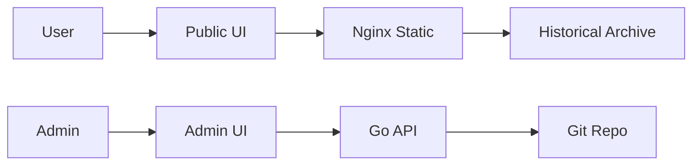

# TODO

Minimalist, git-backed todo tracker with weekly focus and daily top 3.

## Overview

A focused task management system that enforces simplicity: one weekly goal and up to three daily tasks. All state is persisted to a Git repository with automatic archival of completed work.



## Architecture

The deployment consists of two containers:

- **nginx** - Serves the public read-only interface at `/` with 14-day historical archive
- **API server** - Go service providing REST API, admin UI, and internal scheduler for automatic daily/weekly resets

State is persisted to a Git repository, enabling version-controlled task history and off-cluster backups.

## Key Features

- **Weekly + Daily focus** - One weekly goal, max three daily tasks
- **Git-backed persistence** - All changes committed to repository
- **Automatic archival** - Daily/weekly resets triggered by internal scheduler (PST timezone)
- **Historical view** - Browse previous 14 days via static files
- **Dual access** - Public read-only view + admin edit interface
- **Zero Trust protected admin** - Admin UI secured via Cloudflare Access

## Configuration

| Value                 | Description                       | Default               |
| --------------------- | --------------------------------- | --------------------- |
| `git.repository`      | Git repository URL (SSH)          | `""` (required)       |
| `git.branch`          | Branch for commits                | `main`                |
| `git.sshSecretName`   | Secret containing SSH deploy key  | `todo-git-ssh`        |
| `persistence.enabled` | Enable PVC for git data           | `true`                |
| `persistence.size`    | PVC size                          | `1Gi`                 |
| `scheduler.timezone`  | Timezone for daily/weekly resets  | `America/Los_Angeles` |
| `public.enabled`      | Enable public read-only interface | `true`                |
| `admin.enabled`       | Enable admin edit interface       | `true`                |

## Deployment

### Prerequisites

1. Create SSH deploy key for Git repository:

```bash
ssh-keygen -t ed25519 -f todo-deploy-key -N ""
```

2. Add public key to repository (GitHub: Settings → Deploy keys → Add deploy key, check "Allow write access")

3. Create Kubernetes secret:

```bash
kubectl create secret generic todo-git-ssh \
  --from-file=id_ed25519=todo-deploy-key \
  --from-file=id_ed25519.pub=todo-deploy-key.pub \
  -n todo
```

### Install

```bash
helm install todo ./charts/todo \
  --namespace todo \
  --create-namespace \
  --set git.repository=git@github.com:username/todo-data.git
```

### Configure Ingress

For public access:

```yaml
# Public read-only view
apiVersion: networking.k8s.io/v1
kind: Ingress
metadata:
  name: todo-public
  namespace: todo
spec:
  rules:
    - host: todo.example.com
      http:
        paths:
          - path: /
            pathType: Prefix
            backend:
              service:
                name: todo
                port:
                  name: public
```

For admin access (protected by Cloudflare Access):

```yaml
# Admin edit interface (requires Zero Trust)
apiVersion: networking.k8s.io/v1
kind: Ingress
metadata:
  name: todo-admin
  namespace: todo
  annotations:
    external-dns.alpha.kubernetes.io/cloudflare-proxied: "true"
spec:
  rules:
    - host: todo-admin.example.com
      http:
        paths:
          - path: /
            pathType: Prefix
            backend:
              service:
                name: todo
                port:
                  name: admin
```

## Usage

### Public Interface

Navigate to `https://todo.example.com` to view:

- Current weekly goal
- Today's three tasks (strikethrough indicates completed)
- Historical archive (use arrow keys to navigate previous 14 days)

### Admin Interface

Navigate to `https://todo-admin.example.com` to:

- Edit weekly goal and daily tasks
- Check/uncheck completion status
- Manually trigger daily or weekly resets

Changes auto-save after 500ms of inactivity.

### Automatic Resets

The internal scheduler automatically triggers:

- **Daily reset** (midnight PST, Sunday-Friday) - Archives current day, clears daily tasks
- **Weekly reset** (Saturday midnight PST) - Archives current day, clears both weekly and daily tasks

## API Reference

See [IMPLEMENTATION.md](./IMPLEMENTATION.md) for complete API documentation and implementation details.

### Quick Reference

| Endpoint            | Method | Purpose                        |
| ------------------- | ------ | ------------------------------ |
| `/api/weekly`       | GET    | Get current weekly goal        |
| `/api/daily`        | GET    | Get current daily tasks        |
| `/api/todo`         | PUT    | Update full state              |
| `/api/reset/daily`  | POST   | Trigger daily reset            |
| `/api/reset/weekly` | POST   | Trigger weekly reset           |
| `/api/dates`        | GET    | Get available historical dates |

## Troubleshooting

### Check Git sync status

```bash
kubectl logs -n todo deploy/todo -c api | grep -i git
```

### Verify scheduler

```bash
kubectl logs -n todo deploy/todo -c api | grep -i scheduler
```

### Manual reset

```bash
# Trigger daily reset
curl -X POST https://todo-admin.example.com/api/reset/daily

# Trigger weekly reset
curl -X POST https://todo-admin.example.com/api/reset/weekly
```

### Access git repository directly

```bash
kubectl exec -it deploy/todo -n todo -c api -- sh
cd /data
git log --oneline
```

## Development

See [IMPLEMENTATION.md](./IMPLEMENTATION.md) for:

- Detailed architecture diagrams
- Data contract specifications
- Design system (Catppuccin Latte theme)
- Frontend/backend implementation details
- Build process
- Development checklist
