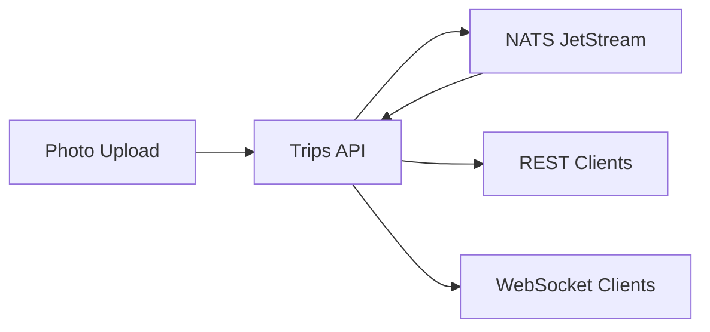
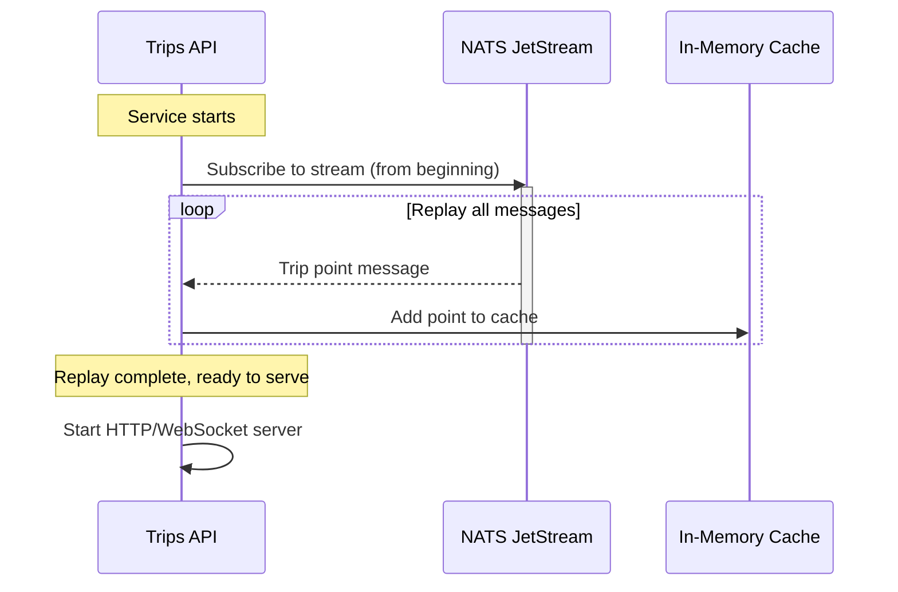

# Trips API

GPS trip tracking API with photo locations and real-time updates.

## Overview

Serves GPS waypoints from travel photos via REST API and WebSocket. Points are stored in NATS JetStream and replayed on startup to build an in-memory cache.



## Key Features

- **Photo geolocation** - Extract GPS coordinates from image EXIF
- **EXIF metadata** - Capture camera settings (ISO, shutter, aperture)
- **Elevation data** - Enrich with NRCan CDEM elevation API
- **Real-time sync** - WebSocket broadcasts for live viewer updates
- **Stream replay** - Rebuilds state from NATS on startup
- **Viewer count** - Track connected WebSocket clients

## Stream Replay on Startup

On startup, the service replays all messages from the NATS JetStream to rebuild its in-memory cache of trip points.



**Why stream replay?**

- No database needed - NATS JetStream is the source of truth
- Fast startup - rebuilds entire dataset in seconds
- Crash recovery - always starts with consistent state
- Simplified architecture - no dual-write to DB + NATS

**JetStream configuration:**

```yaml
# Stream retention: 1 year
Retention: LimitsPolicy
MaxAge: 8760h # 365 days
```

**Startup sequence:**

1. Connect to NATS
2. Subscribe to `trips.points` stream from sequence 0
3. Process all existing messages (add to cache)
4. Continue consuming new messages in real-time
5. Start HTTP server when replay complete

## WebSocket Protocol

### Connection

```javascript
const ws = new WebSocket("wss://trips-api.jomcgi.dev/ws");
```

**Authentication:** None (public read-only endpoint)

### Message Types

#### Server → Client: New Point

Sent when a new trip point is added (photo upload).

```json
{
  "type": "point_added",
  "data": {
    "id": "abc123def456",
    "lat": 49.2827,
    "lng": -123.1207,
    "timestamp": "2024-01-15T12:00:00Z",
    "image": "photo.jpg",
    "source": "gopro",
    "tags": ["car"],
    "elevation": 125.5,
    "light_value": 8.6,
    "iso": 393,
    "shutter_speed": "1/240",
    "aperture": 2.5
  }
}
```

#### Server → Client: Viewer Count Update

Sent when the number of connected WebSocket clients changes.

```json
{
  "type": "viewer_count",
  "count": 3
}
```

#### Client → Server: Ping

Optional heartbeat to keep connection alive.

```json
{
  "type": "ping"
}
```

#### Server → Client: Pong

Response to client ping.

```json
{
  "type": "pong"
}
```

### Example Client

```javascript
const ws = new WebSocket("wss://trips-api.jomcgi.dev/ws");

ws.onopen = () => {
  console.log("Connected to trip updates");
};

ws.onmessage = (event) => {
  const msg = JSON.parse(event.data);

  switch (msg.type) {
    case "point_added":
      console.log("New location:", msg.data.lat, msg.data.lng);
      // Update map marker
      addMarker(msg.data.lat, msg.data.lng);
      break;

    case "viewer_count":
      console.log("Active viewers:", msg.count);
      // Update UI badge
      updateViewerCount(msg.count);
      break;

    case "pong":
      console.log("Server alive");
      break;
  }
};

ws.onerror = (error) => {
  console.error("WebSocket error:", error);
};

ws.onclose = () => {
  console.log("Connection closed, reconnecting...");
  // Implement exponential backoff reconnect
};

// Optional: Send heartbeat every 30s
setInterval(() => {
  if (ws.readyState === WebSocket.OPEN) {
    ws.send(JSON.stringify({ type: "ping" }));
  }
}, 30000);
```

## API Endpoints

### GET /points

Get all trip points.

**Response:**

```json
{
  "points": [
    {
      "id": "abc123def456",
      "lat": 49.2827,
      "lng": -123.1207,
      "timestamp": "2024-01-15T12:00:00Z",
      "image": "photo.jpg",
      "source": "gopro",
      "tags": ["car"],
      "elevation": 125.5,
      "light_value": 8.6,
      "iso": 393,
      "shutter_speed": "1/240",
      "aperture": 2.5
    }
  ],
  "count": 1
}
```

**Query parameters:**

- `limit` (optional) - Max points to return (default: all)
- `since` (optional) - ISO timestamp, only points after this time
- `source` (optional) - Filter by source (`gopro`, `camera`, `phone`)

**Examples:**

```bash
# Get all points
curl https://trips-api.jomcgi.dev/points

# Get last 100 points
curl https://trips-api.jomcgi.dev/points?limit=100

# Get points since 2024-01-01
curl https://trips-api.jomcgi.dev/points?since=2024-01-01T00:00:00Z

# Get only GoPro photos
curl https://trips-api.jomcgi.dev/points?source=gopro
```

### POST /upload

Upload geotagged photo.

**Headers:**

- `Authorization: Bearer <API_KEY>` (required)
- `X-Image-Source: <source>` (optional, default: `gopro`)

**Body:** `multipart/form-data` with image file

**Response:**

```json
{
  "id": "abc123def456",
  "lat": 49.2827,
  "lng": -123.1207,
  "timestamp": "2024-01-15T12:00:00Z",
  "image": "photo.jpg",
  "source": "gopro",
  "elevation": 125.5
}
```

**Example:**

```bash
curl -X POST https://trips-api.jomcgi.dev/upload \
  -H "Authorization: Bearer $TRIP_API_KEY" \
  -H "X-Image-Source: gopro" \
  -F "file=@/path/to/photo.jpg"
```

**Error responses:**

- `401 Unauthorized` - Missing or invalid API key
- `400 Bad Request` - Not an image or missing GPS data
- `413 Payload Too Large` - Image exceeds 10MB

### GET /health

Health check endpoint.

**Response:**

```json
{
  "status": "healthy",
  "nats_connected": true,
  "points_cached": 1523,
  "websocket_clients": 3
}
```

### WS /ws

WebSocket endpoint for real-time updates (see WebSocket Protocol section above).

## Data Model

### Trip Point

| Field           | Type   | Description                 | Required | Example                    |
| --------------- | ------ | --------------------------- | -------- | -------------------------- |
| `id`            | string | Unique identifier (UUID v5) | Yes      | `abc123def456`             |
| `lat`           | float  | Latitude                    | Yes      | `49.2827`                  |
| `lng`           | float  | Longitude                   | Yes      | `-123.1207`                |
| `timestamp`     | string | ISO 8601 timestamp          | Yes      | `2024-01-15T12:00:00Z`     |
| `image`         | string | Image filename              | Yes      | `photo.jpg`                |
| `source`        | string | Image source                | Yes      | `gopro`, `camera`, `phone` |
| `tags`          | array  | Classification tags         | No       | `["car", "highway"]`       |
| `elevation`     | float  | Elevation (meters)          | No       | `125.5`                    |
| `light_value`   | float  | Exposure value              | No       | `8.6`                      |
| `iso`           | int    | ISO sensitivity             | No       | `393`                      |
| `shutter_speed` | string | Shutter speed               | No       | `1/240`                    |
| `aperture`      | float  | F-stop                      | No       | `2.5`                      |

**ID generation:**

```python
import uuid

# Deterministic ID based on source + timestamp + filename
id = uuid.uuid5(
    namespace=uuid.NAMESPACE_URL,
    name=f"{source}:{timestamp}:{filename}"
)
```

### EXIF Extraction

Extracted from image metadata:

```python
from PIL import Image
from PIL.ExifTags import TAGS, GPSTAGS

image = Image.open("photo.jpg")
exif = image._getexif()

# GPS coordinates
gps_info = exif[34853]  # GPSInfo tag
lat = gps_info[2]  # GPSLatitude
lng = gps_info[4]  # GPSLongitude

# Camera settings
iso = exif[34855]  # ISOSpeedRatings
shutter = exif[33434]  # ExposureTime
aperture = exif[33437]  # FNumber
```

### Elevation Enrichment

Queries NRCan CDEM API for elevation:

```python
import httpx

async def get_elevation(lat: float, lng: float) -> float:
    url = "https://geogratis.gc.ca/services/elevation/cdem/altitude"
    params = {"lat": lat, "lon": lng}

    async with httpx.AsyncClient() as client:
        response = await client.get(url, params=params)
        data = response.json()
        return data["altitude"]
```

**Fallback:** If API fails, elevation is `null`.

## Configuration

Environment variables:

| Variable            | Description             | Default                 | Required          |
| ------------------- | ----------------------- | ----------------------- | ----------------- |
| `NATS_URL`          | NATS server URL         | `nats://localhost:4222` | Yes               |
| `NATS_STREAM`       | JetStream stream name   | `trips`                 | No                |
| `NATS_SUBJECT`      | Subject for trip points | `trips.points`          | No                |
| `CORS_ORIGINS`      | Allowed CORS origins    | `http://localhost:5173` | No                |
| `TRIP_API_KEY`      | API key for uploads     | (none)                  | Yes (for uploads) |
| `ELEVATION_API_URL` | NRCan CDEM API URL      | (see above)             | No                |
| `MAX_IMAGE_SIZE_MB` | Max upload size         | `10`                    | No                |

## Running Locally

```bash
# Start dependencies
docker run -d --name nats -p 4222:4222 nats:latest -js

# Run service
export NATS_URL=nats://localhost:4222
export TRIP_API_KEY=test-key
bazel run //services/trips_api

# Test endpoints
curl http://localhost:8000/health
curl http://localhost:8000/points
```

## Deployment

Deployed via ArgoCD to Kubernetes cluster.

**Resources:**

- Helm chart: `/charts/trips-api/`
- Overlay: `/overlays/prod/trips-api/`
- Service URL: https://trips-api.jomcgi.dev

**Dependencies:**

- NATS JetStream (deployed via ArgoCD)
- Cloudflare Access (authentication for production)

## Observability

### Metrics

Exposed at `/metrics` (Prometheus format):

- `trips_points_total` - Total points in cache
- `trips_uploads_total` - Total photo uploads
- `trips_websocket_connections` - Active WebSocket connections
- `trips_nats_messages_total` - NATS messages processed
- `trips_elevation_api_failures` - Elevation API failures

### Traces

Instrumented with OpenTelemetry (auto-injected by Kyverno):

- HTTP request traces
- NATS message processing
- Elevation API calls
- WebSocket connections

View in SigNoz: https://signoz.jomcgi.dev

### Logs

Structured JSON logs via `logging.structlog`:

```json
{
  "timestamp": "2024-01-15T12:00:00Z",
  "level": "info",
  "event": "point_added",
  "point_id": "abc123def456",
  "lat": 49.2827,
  "lng": -123.1207,
  "source": "gopro"
}
```

## Related Services

- **trips.jomcgi.dev** - Frontend map viewer (WebSocket client)
- **publish-trip-images** - Local script for bulk photo uploads
- **ships_api** - Similar pattern for AIS vessel tracking
