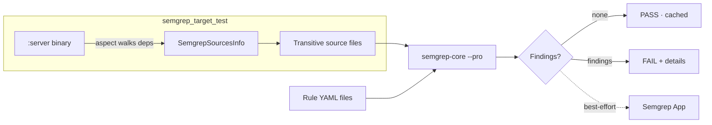
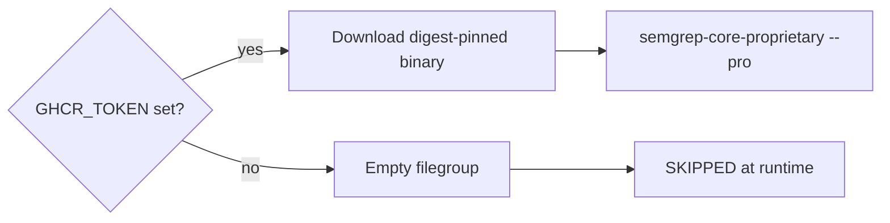

# rules_semgrep

Hermetic Semgrep scanning as native Bazel tests. Pro rules on your own infrastructure. Cache invalidation on your own terms.

Scans re-run only when source files or rule definitions change. No pip install, no registry fetches, no Python wrapper — just a digest-pinned OCaml binary.

## How It Works



The test scripts invoke `semgrep-core` directly, bypassing the Python wrapper entirely. Source files are copied to a temp directory preserving relative paths so cross-file analysis works correctly. The engine, rules, and sources are all Bazel dependencies — changing any of them invalidates the cache.

## Rules

| Rule | Purpose | Best For |
|---|---|---|
| `semgrep_test` | Scan a flat list of source files | Libraries, individual files, packages without a binary target |
| `semgrep_manifest_test` | Render Helm chart with `helm template`, scan the YAML | ArgoCD overlays (auto-generated by `argocd_app` macro) |
| `semgrep_target_test` | Scan a target's full transitive source tree via aspect | Binary targets — enables cross-file `--pro` analysis |

### `semgrep_test`

```starlark
load("//rules_semgrep:defs.bzl", "semgrep_test")

semgrep_test(
    name = "semgrep_test",
    srcs = ["main.py", "utils.py"],
    rules = ["//semgrep_rules:python_rules"],
)
```

### `semgrep_manifest_test`

```starlark
load("//rules_semgrep:defs.bzl", "semgrep_manifest_test")

semgrep_manifest_test(
    name = "semgrep_test",
    chart = "charts/myapp",
    chart_files = "//charts/myapp:chart",
    release_name = "myapp",
    namespace = "prod",
    values_files = ["//charts/myapp:values.yaml", "values.yaml"],
)
```

### `semgrep_target_test`

```starlark
load("//rules_semgrep:defs.bzl", "semgrep_target_test")

semgrep_target_test(
    name = "semgrep_test",
    target = ":server",
    rules = ["//semgrep_rules:python_rules"],
)
```

## Common Attributes

| Attribute | Type | Default | Description |
|---|---|---|---|
| `rules` | `label_list` | (required) | Filegroups containing Semgrep rule YAML files |
| `exclude_rules` | `string_list` | `[]` | Rule filenames or `check_id` suffixes to exclude |
| `pro_engine` | `label` | `//third_party/semgrep_pro:engine` | Pro engine binary (set to `None` to disable) |

## Gazelle

The Gazelle extension auto-generates `semgrep_test` and `semgrep_target_test` targets when you run `bazel run gazelle`.

| Directive | Example | Effect |
|---|---|---|
| `# gazelle:semgrep disabled` | | Stop generating semgrep targets in this directory tree |
| `# gazelle:semgrep_exclude_rules` | `no-requests,no-eval` | Set `exclude_rules` on all generated targets |
| `# gazelle:semgrep_target_kinds` | `py_venv_binary,py3_image=binary` | Which rule kinds trigger `semgrep_target_test` |
| `# gazelle:semgrep_languages` | `py,go` | Which language rule configs to apply |

All directives inherit from parent directories.

## Rule Files

| Category | Target | Contents |
|---|---|---|
| Python | `//semgrep_rules:python_rules` | Custom rules + Semgrep Pro Python pack |
| Go | `//semgrep_rules:golang_rules` | Semgrep Pro Go pack |
| JavaScript | `//semgrep_rules:javascript_rules` | Semgrep Pro JavaScript pack |
| Kubernetes | `//semgrep_rules:kubernetes_rules` | Custom rules + Semgrep Pro Kubernetes pack |
| Shell | `//semgrep_rules:shell_rules` | Custom rules (no-kubectl-mutate, no-direct-test) |
| Bazel | `//semgrep_rules:bazel_rules` | Custom rules (no-rules-python) |
| Dockerfile | `//semgrep_rules:dockerfile_rules` | Custom rules (no-dockerfile) |

## Pro Engine

The Pro engine (`semgrep-core-proprietary`) enables cross-file taint analysis via `--pro`. It degrades gracefully: no GHCR token → empty filegroup → engine not found at runtime → test exits with SKIP (not FAIL).



## Platform Support

| Platform | Engine Source |
|---|---|
| Linux x86_64 | PyPI manylinux wheel extraction |
| Linux aarch64 | PyPI manylinux wheel extraction |
| macOS x86_64 | PyPI macOS wheel extraction |
| macOS aarch64 | PyPI macOS wheel extraction |

Resolved at analysis time via `config_setting` + `select()` in `//third_party/semgrep:engine`.
