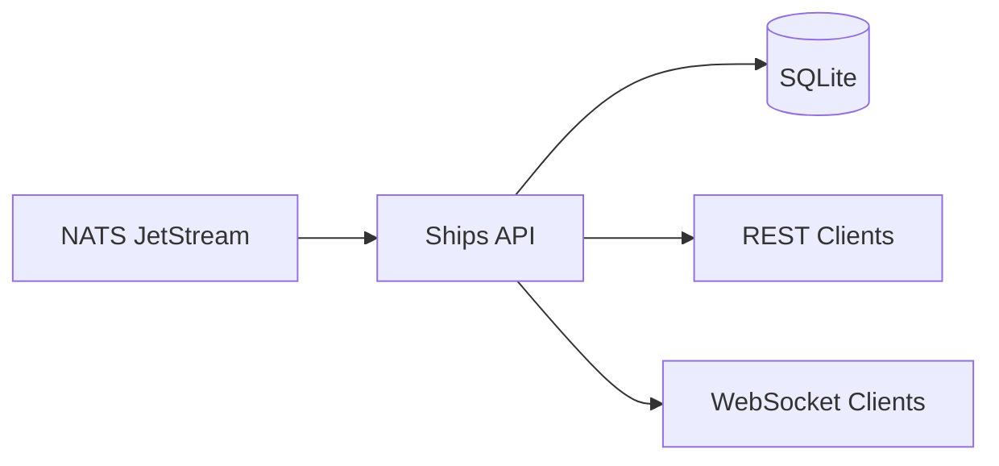

# Ships API

REST and WebSocket API for AIS vessel data with SQLite persistence.

## Overview

Consumes vessel positions from NATS JetStream, stores them in SQLite, and serves data via REST API and WebSocket for real-time updates.



## Key Features

- **Stream replay** - Rebuilds database from NATS on startup
- **Position deduplication** - Skips redundant updates for stationary vessels
- **7-day retention** - Automatic cleanup of old position history
- **Moored detection** - Identifies vessels anchored in one location
- **Batch processing** - High-throughput message handling

## API Endpoints

| Method | Endpoint | Description |
| ------ | -------- | ----------- |
| `GET` | `/vessels` | List all known vessels |
| `GET` | `/vessels/{mmsi}` | Get vessel details |
| `GET` | `/positions/{mmsi}` | Get position history |
| `WS` | `/ws` | Real-time position updates |

## Configuration

Environment variables:

| Variable | Description | Default |
| -------- | ----------- | ------- |
| `NATS_URL` | NATS server URL | `nats://localhost:4222` |
| `CORS_ORIGINS` | Allowed CORS origins | `http://localhost:3000` |
| `DB_PATH` | SQLite database path | `/tmp/ships.db` |
| `POSITION_RETENTION_DAYS` | Days to keep positions | `7` |
| `DEDUP_DISTANCE_METERS` | Deduplication threshold | `100` |
| `DEDUP_SPEED_THRESHOLD` | Speed below which to dedupe (knots) | `0.5` |

## Running Locally

```bash
bazel run //services/ships-api
```

## Database Schema

- **vessels** - Vessel metadata (MMSI, name, type, dimensions)
- **positions** - Position history (lat, lon, speed, course, timestamp)
- **latest_positions** - Current position cache for fast lookups
