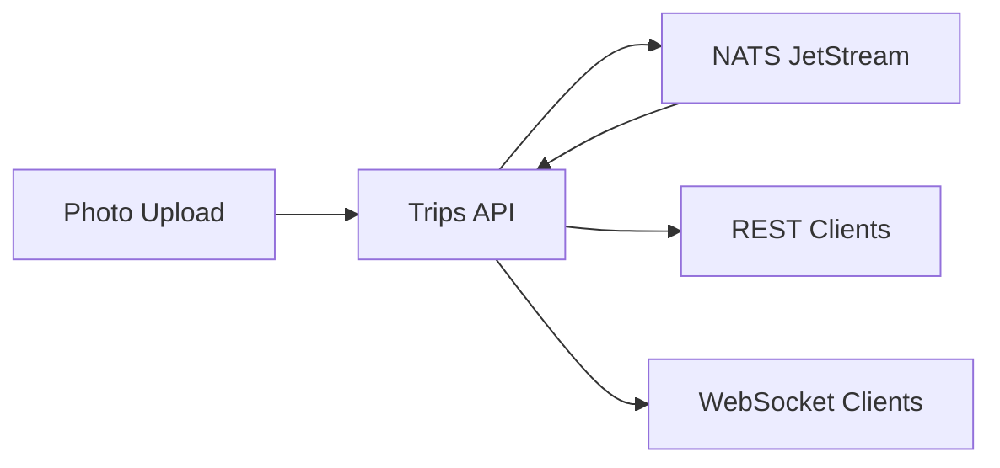

# Trips API

GPS trip tracking API with photo locations and real-time updates.

## Overview

Serves GPS waypoints from travel photos via REST API and WebSocket. Points are stored in NATS JetStream and replayed on startup to build an in-memory cache.



## Key Features

- **Photo geolocation** - Extract GPS coordinates from image EXIF
- **EXIF metadata** - Capture camera settings (ISO, shutter, aperture)
- **Elevation data** - Enrich with NRCan CDEM elevation API
- **Real-time sync** - WebSocket broadcasts for live viewer updates
- **Viewer count** - Track connected clients

## API Endpoints

| Method | Endpoint | Description |
| ------ | -------- | ----------- |
| `GET` | `/points` | Get all trip points |
| `POST` | `/upload` | Upload geotagged photo |
| `WS` | `/ws` | Real-time point updates |

## Data Model

```json
{
  "id": "abc123def456",
  "lat": 49.2827,
  "lng": -123.1207,
  "timestamp": "2024-01-15T12:00:00Z",
  "image": "photo.jpg",
  "source": "gopro",
  "tags": ["car"],
  "elevation": 125.5,
  "light_value": 8.6,
  "iso": 393,
  "shutter_speed": "1/240",
  "aperture": 2.5
}
```

## Configuration

Environment variables:

| Variable | Description | Default |
| -------- | ----------- | ------- |
| `NATS_URL` | NATS server URL | `nats://localhost:4222` |
| `CORS_ORIGINS` | Allowed CORS origins | `http://localhost:5173` |
| `TRIP_API_KEY` | API key for uploads | (required for uploads) |

## Running Locally

```bash
bazel run //services/trips_api
```
