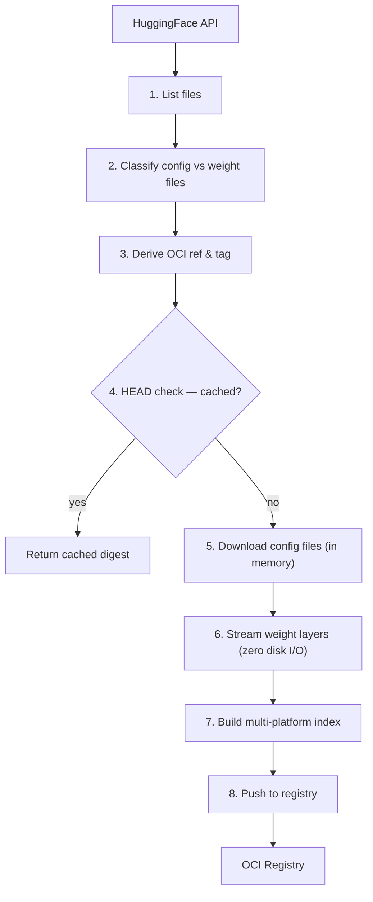
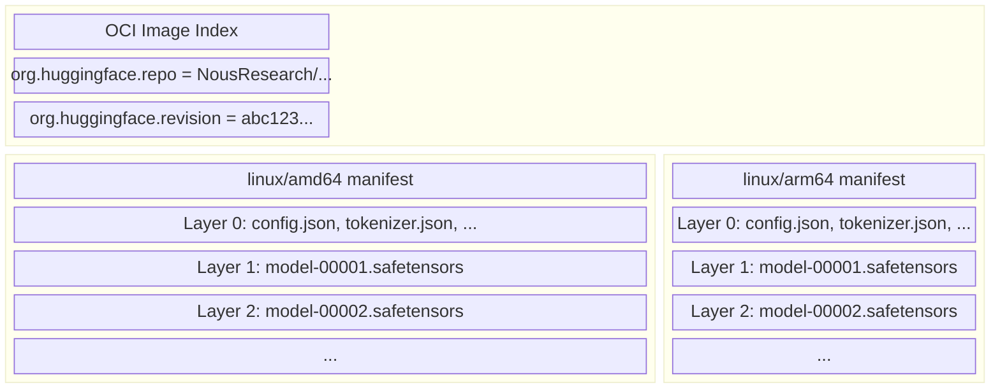

# hf2oci

Copy HuggingFace model repositories to OCI container registries.

Weight files are streamed directly into OCI layers via `io.Pipe` — no temporary
files touch disk, regardless of model size.

## Usage

```bash
# Copy a public model
hf2oci copy NousResearch/Hermes-4.3-Llama-3-36B-AWQ -r ghcr.io/jomcgi/models

# Copy at a specific revision
hf2oci copy Qwen/Qwen2.5-0.5B-Instruct-GGUF -r ghcr.io/jomcgi/models --revision 9217f5db79a2

# Dry run — list files without downloading or pushing
hf2oci copy NousResearch/Hermes-4.3-Llama-3-36B-AWQ -r ghcr.io/jomcgi/models --dry-run

# Check if a model already exists in the registry
hf2oci resolve Qwen/Qwen2.5-0.5B-Instruct-GGUF -r ghcr.io/jomcgi/models

# JSON output for automation
hf2oci copy ... -o json
hf2oci resolve ... -o json

# Write JSON to file (useful for Kubernetes termination messages)
hf2oci copy ... -o json -O /dev/termination-log
```

## Pipeline



Config files are downloaded into memory (they're small — tokenizer, config JSON,
etc.), while weight files are piped directly from the HuggingFace CDN into the
registry upload with zero disk I/O.

## OCI image layout



All files are placed at `/models/{repo-name}/` inside each layer. Both platforms
share identical layers since model weights are architecture-independent — `docker
pull` works on amd64 and arm64 without the caller needing to know.

## Supported formats

| Format      | Extensions     | Config files bundled             |
| ----------- | -------------- | -------------------------------- |
| Safetensors | `.safetensors` | config.json, tokenizer.json, ... |
| GGUF        | `.gguf`        | config.json, tokenizer.json, ... |

Repos with mixed formats (both `.safetensors` and `.gguf`) are rejected.

## Tag derivation

By default, the OCI tag is `rev-{revision[:12]}`. Override with `--tag`:

```
# Default: ghcr.io/jomcgi/models/qwen-qwen2.5-0.5b-instruct-gguf:rev-9217f5db79a2
hf2oci copy Qwen/Qwen2.5-0.5B-Instruct-GGUF -r ghcr.io/jomcgi/models

# Override: ghcr.io/jomcgi/models/qwen-qwen2.5-0.5b-instruct-gguf:latest
hf2oci copy Qwen/Qwen2.5-0.5B-Instruct-GGUF -r ghcr.io/jomcgi/models --tag latest
```

## Smart naming (derivative models)

When a model has a `baseModels` relationship on HuggingFace (quantization, finetune,
adapter, merge), hf2oci groups it under the base model's OCI repository:

| Model | Base model | OCI ref |
|-------|-----------|---------|
| `facebook/nllb-200-distilled-1.3B` | (none) | `registry/facebook/nllb-200-distilled-1.3b:rev-main` |
| `Emilio407/nllb-200-distilled-1.3B-4bit` | `facebook/nllb-200-distilled-1.3B` | `registry/facebook/nllb-200-distilled-1.3b:emilio407-nllb-200-distilled-1.3b-4bit` |

This enables OCI blob deduplication — config files and tokenizers shared between
base and derivative models are stored once.

## Exit codes

| Code | Meaning                                                              |
| ---- | -------------------------------------------------------------------- |
| 0    | Success                                                              |
| 1    | Transient error (network timeout, 5xx) — safe to retry               |
| 2    | Permanent error (404, 401, bad format, mixed weights) — do not retry |

## Environment

| Variable   | Purpose                                       |
| ---------- | --------------------------------------------- |
| `HF_TOKEN` | HuggingFace API token for private/gated repos |

Docker registry credentials are read from `~/.docker/config.json` via the
default keychain.

## Package structure

```
tools/hf2oci/
├── cmd/hf2oci/          CLI entrypoint
│   └── cmd/             Cobra commands (copy, resolve, output formatting)
└── pkg/
    ├── copy/            Orchestration: list → classify → build → push
    ├── hf/              HuggingFace API client (Tree, Download, ModelInfo)
    ├── oci/             OCI image building and registry push
    └── ociref/          Shared OCI ref naming (DeriveTag, ResolveRef)
```
